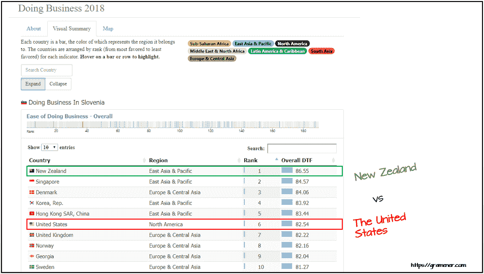

# 视觉数据在决策中的价值

> 原文：<https://devops.com/the-value-of-visual-data-in-decision-making/>

直觉是商业决策主要驱动力的日子已经一去不复返了。很长一段时间以来，本能一直主宰着商业领袖的思维，但随着公司在全球范围内拓展业务，本能应该让位于数据，成为保持竞争力的最佳手段。

我们生活在一个数据驱动的世界。如今，数字运算算法决定了我们应该雇佣谁，应该在哪里投资，甚至应该和谁约会。事实上，利用洞察力创造竞争优势的数据驱动型组织正在快速增长，平均每年增长 30%。此外，数据驱动型组织有望在 2021 年实现 1.8 万亿美元的收入。

## 企业中的数据

技术隐藏在现代商业的每一个角落。聪明的领导者使用生成的数据来了解组织中正在发生的事情，这种分析有助于他们为业务带来敏捷性。

[全球顶级公司](https://www.icas.com/ca-today-news/10-companies-using-big-data)利用数据为其业务增值。他们通过充分利用数据(而非直觉)获得了超越竞争对手的战略优势。

数据驱动提供了多种优势:

*   数据是新的黄金。与数据的长期关系有助于组织设定趋势。
*   数据驱动的决策提供了更好的客户体验。数据揭示了客户模式及其产品之旅。
*   数据驱动型组织通过创新的解决方案更好地响应市场需求。
*   数据驱动的决策磨练关键业务领域，如财务和运营。

数据提供见解，高管将这些见解转化为关键决策。但是你不能忽视数据是复杂事实，更不用说对它的分析了。我们都熟悉充满数千行和数百列数字的 excel 表格。那么，这如何转化为洞察力呢？这就是数据可视化发挥作用的地方。

## 数据可视化使隐藏的洞察力显而易见

解读海量数据以获得可操作的见解是很困难的。数据可视化使海量数据变得可访问和全面。怎么会？

数据即通常所说的，是任何非结构化数据到视觉效果的转换。视觉增加了人类理解的一个组成部分。

例如，世界银行每年都会发布其[营商环境](http://www.doingbusiness.org/)项目数据，为具备创业条件的国家提供见解。它于 2002 年推出，用于衡量适用于各种中小型组织的法规。

共有 190 个经济体接受了 12 个主题的调查，包括雇用工人、税收优惠和解决破产问题。2018 年营商数据的[可视化摘要旨在让企业能够消化这些重要的见解，然后将它们付诸实践。](https://gramener.com/doingbusiness/)

创建可视化的数据科学公司获取了数据，并将其绘制在世界地图上。它增加了从红色到绿色的阴影，以表示做生意最不喜欢和最喜欢的经济体。数据变得简单、吸引人和全面。任何企业经理或高管都可以很容易地找到投资的新兴经济体。

使用可视化数据，诸如最佳和最差营商国家和经济排名等见解现在显而易见。此外，公司可以将这些见解转化为关于跨境拓展业务的关键决策。

看看上面的例子:美国是经济强国；然而，数据显示，新西兰在 2018 年以 86.55 的 DTF*排名第一。包括新加坡、丹麦、韩国和香港在内的许多国家在该指数中也排名靠前。

数据可视化对任何数据驱动型组织都至关重要的三个主要原因是:

1.  数据可视化通过图片和视觉效果放大了一个故事。它对受众的影响比平淡无奇的数字和文字更有力量。此外，人类的大脑天生就能记住视觉。数据可视化利用图片优势推动管理层决策。
2.  **数据可视化使困难的数据变得容易理解**。企业高管和关键决策者并不是每个领域的大师。他们需要比较的方法来推动他们的决策。数据可视化正好提供了这一点。
3.  数据可视化有助于决策分析。它提供了一个与事实互动的平台。[杰夫·贝索斯](https://www.entrepreneur.com/article/237326)说并不是所有的决定都是通过事实分析做出的。但无论哪一个决定是基于事实做出的，都应该如此。

## 结论

数据应该对任何重大商业决策产生影响。因此，数据可视化是给组织带来巨大变化的强大工具。它可以提供许多关键问题的答案，并使数据在视觉上吸引人，易于使用和有趣的探索。首席执行官和经理应该强调数据民主化的重要性，以增加流程的价值。

DTF:到边境的距离。这是一个 0 到 100 分之间的分数，它说明了在每个《营商环境报告》参数上观察到的一个经济体的最差和最佳表现。

— [纳文·加图](https://devops.com/author/naveen-gattu/)