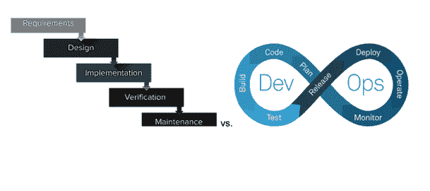

# 过去和现在:DevOps 文化的演变

> 原文：<https://devops.com/then-and-now-the-evolution-of-devops-culture/>

有许多可用的资源致力于更快地交付更好的业务价值。基于这个建议，许多组织和团队正在采用通用的软件交付实践——甚至在提供软件的通常用例之外(举个例子，使用敏捷的 SpaceX 团队，或者使用 scrum 实践并有每日站立电话的领导团队)。无论您交付的是什么，这种更快、更好、更便宜、更简单的进展使得将 DevOps 融入业务实践对于为最终用户提供无与伦比的价值至关重要。

## **过去和现在**

在探讨 DevOps 这个主题时，要考虑的一个很好的角度是技术如何改变了一切——我们如何构建、连接、共享和教育。例如，直到 21 世纪初，拍摄和分享照片的标准周转时间是一到三周，甚至更长。这一过程过去涉及胶片相机、处理照片的暗室、照片冲印实验室和硬拷贝、物理打印。今天，我们的移动设备允许我们拍摄数百张专业质量的图像，并立即在线分享。

这些翻天覆地的变化不仅仅适用于摄影，还适用于包括金融服务、银行和 IT 在内的许多其他行业。一直以来，技术都在寻找新的方式来颠覆行业，使它们更有效率地适应我们快速发展的生活方式。

## **devo PS 生命周期**

现在，让我们看看软件交付。在过去，传统软件交付的过程是线性的和顺序的；瀑布方法提供了很少的灵活性，并且不屈服于我们今天看到的技术服务的变化和需求的本质。我们在软件交付方面的经验现在使用 DevOps 通过人员、流程和技术利用新的见解，使组织能够交付持续的业务价值。是的，这意味着企业一直在给我们的生活增加价值，不管你是否看到。对于技术组织来说，这一交付商业价值的过程是通过我们称之为 DevOps 生命周期的方式来建模的，通过下图来理解。

## **了解 DevOps 文化**

通常，组织在开发运维方面面临的挑战不在于技术或流程本身，而在于等式中的人员部分——我们如何通过跨职能团队一起工作来交付价值。为了理解构建 DevOps 文化意味着什么，我们需要看看文化包含什么，以及我们的人员、流程和技术如何协同工作以实现成功的 DevOps 生命周期。

这个分层的图形展示了与文化相关的各种元素。每一层都包含下一层。

心态

值

原则

做法

工装

形成 DevOps 文化包括在我们的组织中自下而上和自上而下地阐明变化，因此，这不是一件容易的事。在我们介绍或讨论工具之前，我们需要理解我们的实践和原则如何帮助我们实现我们的成果。在我们能够真正定义和加强 DevOps 文化之前，每个内层都需要外层取得成功。

### **以下是我对发展 DevOps 文化的建议:**

从错误中学习和发展技能

关注重要的优先事项

捕捉协作

完善你的工装

## **devo PS 原则**

DevOps 是人员、流程和技术的集合和协作，以持续交付软件价值。以下是 DevOps 的一些核心原则，可以用来指导你的 DevOps 之旅。

### 带着最终目标去创造

当领导者和个人理解他们在团队中的角色时，高绩效团队工作得最好。因此，带着最终目的进行创作涉及到重新评估和经常问一些大问题，比如“这个交付是给谁的？”以及“我们为什么要这样做？”将愿景牢记在心，并在此过程中做出调整。

即使是历史上最著名的照片也要经过多次调整和无数次尝试才能拍出正确的照片。带着最终目的去创造意味着知道我们第一次可能不会把所有事情都做对。没关系！同样，生活也不是没有干扰、冲突和变化。牢记目标结果有助于我们与计划和行动保持一致，并在不一致时提出质疑。

### 跨职能团队

许多产品和交付涉及多人。例如，一些最好的漫威电影宇宙(MCU)电影是在多个制作团队和合作伙伴公司的帮助下制作的，他们共同构建了我们今天所知的发电站。更不用说，在我看来，我们这个时代最好的超级英雄电影。我们以同样的方式在软件交付上取得成功:拥有完全负责的跨职能交付团队。

我所在的最好的工程团队是由独立自主的个人组成的，他们知道如何为正在进行的工作做出贡献。他们也愿意并且不怕与他人合作来完成这项工作。

### 对旅程的承诺

“我不是来做正确的事的。我来这里是为了把事情做好。”——布琳·布朗，出自书*敢领导*。

即使有了跨职能的交付团队，并且在创建时考虑到了最终目标，我们的团队仍然可能第一次就把所有事情都做对了。致力于 DevOps 就是要接受旅途中出现的任何失败。投身于这个旅程并不意味着你不能定义它包含了什么，即使它与众不同。实验也是我们作为开发人员如何适应变化和采用新方法来交付更快、更便宜和更好的软件的一部分。

## 作为指南的 DevOps 原则

使用这些原则作为如何合作的基础，但也要使用正确的工具，并在过程中定义和改进流程。在摄影中，有三个组成部分是我们拍摄的最终图像的基石:光圈、快门速度和 ISO。在 DevOps，是我们的人员、流程和技术。使用 DevOps 实现高性能需要所有这些组件协同工作，并根据我们的环境、情况或团队进行调整。

获得你想要的结果的关键？不要被任何一个单独的因素弄得措手不及。

## **开发运维实践和工具**

我喜欢把这一节看作行动的号召；一个对我们的团队和个人说，“准备好！”没有一个理智的摄影师会不带相机和摄影器材去拍照，对吗？类似地，DevOps 实践者和团队需要正确的工具来获得想要的结果。

### 源代码管理

源代码管理是关于允许团队协作，拥有版本控制，修正和恢复软件代码。对于许多团队来说，这不仅是增加可见性和协作的基础，也是启动自动化工作流的基础。

如果你是一个刚刚开始写代码的人，我建议学习 Git 的基础知识，比如如何添加、提交、推送、合并、分支和克隆代码。如果你是一个团队，我建议讨论你想要用于协作的实践和标准。总是让你的 Git 结构和工作流适合你的代码库和团队动态。

### 连续累计

[持续集成](https://devops.com/continuous-integration-overview/) (CI)所做的是从本地机器中取出代码，将其打包成 CI 服务器中可部署的工件。这样做的目的是自动集成新提交的代码变更。这个过程通常是由推入 Git 存储库的代码更改触发的。使用检查和其他工具，团队可以版本化和发布已经通过质量和安全性检查的工件。

### 连续交货

另一方面，连续交付将工件代码带到生产环境中。CD 旨在以快速、可重复和安全的方式向用户交付各种代码变更。 [CI/CD](https://harness.io/blog/devops/what-is-ci-cd/) 由 CI 和 CD 管道共同工作向用户交付代码组成。

### 基础设施代码(IaC)

基础设施即代码允许用户通过代码定义硬件。我们可以改进供应、配置和维护硬件系统的方式。HashiCorp 的 Terraform 和 AWS Cloud Formation 等基础设施供应工具、Ansible、Puppet 和 Chef 等配置自动化工具以及 Helm 等包管理器使团队能够在软件扩展和需求增加时完成更多工作。

### 秘密和身份管理

安全是每个人的责任。机密管理和身份管理工具通过保护和管理敏感信息，使完成 DevSecOps 变得更加容易。团队应该考虑如何在他们的架构中处理秘密和用户。HashiCorp Vault、KeyCloak、KMS 和其他类似的工具可以帮助您实现安全目标。

DevOps 团队和组织可以使用许多其他实践和工具来实现他们想要的结果。适用于一个团队的可能不适用于另一个团队——因此需要以一种受控的和良好领导的方式进行创新和实验。其他可以增加你的团队交付价值能力的实践包括 [价值流映射](https://webinars.devops.com/real-life-implementing-value-stream-mapping) 、 [渐进式交付](https://devops.com/maintaining-progressive-delivery-quality-with-feature-flags/) 、 [GitOps](https://devops.com/devops-unbound-the-road-to-gitops/) 和 [混沌工程](https://webinars.devops.com/introduction-to-chaos-engineering) 。

人员、流程和技术属于 DevOps 文化的一部分。虽然熟能生巧，但比完美更重要的是在这个过程中收集正确的答案。不需要每件事第一次都是对的。只要记住，在 DevOps 没有一个领导者、个人或团队是孤独的。我们首先定义了建立 DevOps 文化、改变思维模式以及设定原则和实践的含义，所以现在我问你:DevOps 对你来说意味着什么？