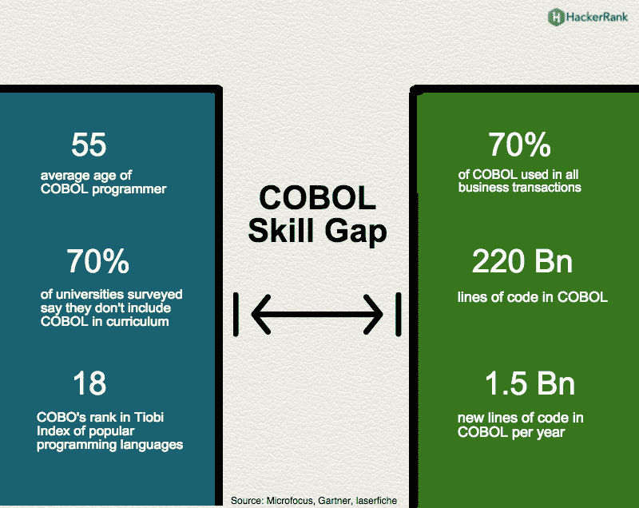

# 构建交付时考虑未来

> 原文：<https://devops.com/think-future-building-delivery/>

我们现在处于一种奇怪的钟摆状态，交付速度是王道，其他一切似乎都退居二线。许多组织甚至将质量置于速度之后，声称“我们稍后会得到它”，但我说的是更普遍的匆忙部署和我们正在构建的基础设施。

简而言之，看看你的组织。你有超过 10 年的应用吗？你们在做同类型的 app 吗？然后向前旋转你的思维，想想在那个时候对某人来说会是什么样子。

## 面向未来的交付

你不能阻止技术的进步，但你可以让环境适应。当涉及到您的 DevOps 工具集时，有一些简单的技巧可以为将来提供。

COBOL Still Needed. Source: Hackerrank.com

### 几乎完美

首先，在虚拟机(VM)或云实例上构建您的持续集成/持续部署/应用程序发布自动化(CI/CD/ARA)架构。如果你的标准是容器，那么就使用它们——但是要在 VM 之上。原因很简单:考虑到业务环境和 IT 优先级的不确定性，一个完全安装的虚拟机为您提供了一个缓冲区——您在一个包含的包中拥有运行环境所需的一切。仅有容器是不够的，因为底层操作系统会影响容器操作。举一个极端的例子，转换到红帽企业版 Linux (RHEL) 7.0 是一个巨大的突破。仅基于容器的 DevOps 环境将会与之决裂，而运行 RHEL 5 或 6X 的虚拟机将会继续前进，只要您的虚拟化环境还在运行。

### 获取内部版本

虽然任何 CI/CD/ARA 工具集和开发语言的可执行文件都是内部的，但是现代开发环境远不止这些部分。您的代码所依赖的库/模块必须可用。越来越多的时候，我们在构建中引入它们，但是当它们突然被显著改变或者完全丢失时，这就成了一个问题。现在有一个托管的、经过验证的模块供应商市场，他们保证他们支持的每个模块的给定版本的可用性，这是一个选项；然而，更好的方法是将它们一次取出，放入您自己的企业存储库中。维护是另一回事吗？是的。但是它可能会使您的项目免于紧急修补——坦率地说，这种保险是值得的。

### 明智地选择

像任何相对较新的市场一样，有许多 CI/CD/ARA 工具集。做评估；不要只抓一个团队成员喜欢或熟悉的。像看工具一样看项目/供应商的寿命和稳定性，因为我们在谈论未来的对冲。在早期(甚至今天偶尔)，开源爱好者会说“我们有源代码，我们会做得很好”，这在技术上是正确的，但大多数组织不从事维护他们的开发/部署工具的业务，也不想这样做，所以一点点研究就很有帮助。

### 做好计划，就像你选择不当一样

知道如果尽管经过评估，你选择的项目/产品还是不了了之，你会怎么做。虽然它不是 CI/CD，但我在一个团队中选择了 Mambo，就在这个大团队分裂之前，这个团队创造了 Joomla 并注定了 Mambo。我们的选择是明智的，是基于现有的信息，但事情仍然发生在我们身上。这也可能发生在你的选择上，无论你选择开源还是商业。所以，要知道在那种情况下你会怎么做，并记录下来。如果我们采用了足够多的 IT 工具，那么随着时间的推移，它们中的一些肯定会失败，所以这并不是一个完全浪费的练习。如果你需要的话，在事情分崩离析之前知道计划是什么有助于保持头脑冷静。

### 质量高于速度

记住交付时间是非常重要的，几十年来没有得到应有的信任。但是正如我上面提到的，要认识到现在钟摆已经摆到了另一边，许多商店都有一种“只是把它拿出来，我们以后会做得更好”的心态。不要加入与你的 DevOps 环境有关的事情。您正在构建的架构应该是长期的——除非您喜欢定期地重新构建它，并且这种重新构建会威胁到生产代码的延迟，那么请忽略这一点。

### 安全，安全，安全

DevOps 和安全性的关系一直不太好，但让我们来谈谈您的 DevOps 环境，而不是安全性对快速交付的影响。一旦你将所有的构建都投入到一个易于使用的工具中，来自成功的局外人或有风险的局内人的风险就相应地变大了。使用支持基于角色的访问控制( RBAC)的工具，并确保应用编程接口(API)被正确锁定。给安全部门足够的时间来为 DevOps 工具集建立一个建议列表，以便在几乎所有可能发生的情况下保护它们。因为通过一个自动化工具集来扰乱构建过程和部署过程的组合能力是强大而危险的，所以要确保您正在监视它并且它是安全的。

### 考虑一点标准化

在我的整个职业生涯中，“我们是 X 店”似乎从来没有成功过。我去过试图使用单一数据库供应商或单一开发语言的地方，不可避免地，其他力量会忽略这些指令。但是减少语言或数据库变体的数量是有好处的，这种好处在 CI/CD 领域最明显。跟踪这个项目使用哪个数据库，或者保持这个数据库是最新的——或者确定新版本将引入不兼容性——都落在 DevOps 环境上。降低累积的未来变更量符合组织的最佳利益。

### 制作很酷的东西

每次我认为我已经在敬畏上达到极限，一些新的东西就会出现。我们正处于全自动构建/测试/部署的尖端，ARA 工具同时调用 CI/CD 工具和应用供应工具。不断推动优势，给供应商你的反馈或项目你的修改，并使之更好。因为这里有一个根本性的变化，我们希望看到它结束。我喜欢玩玩具。

唐·麦克维蒂