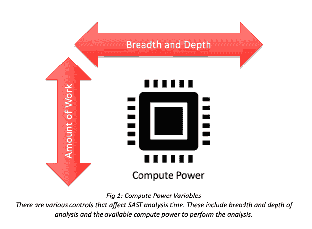
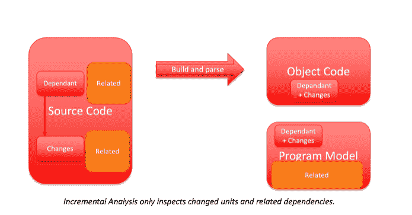
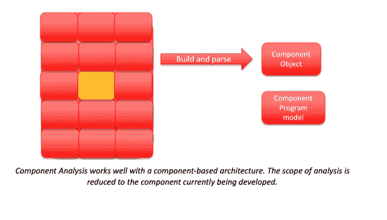
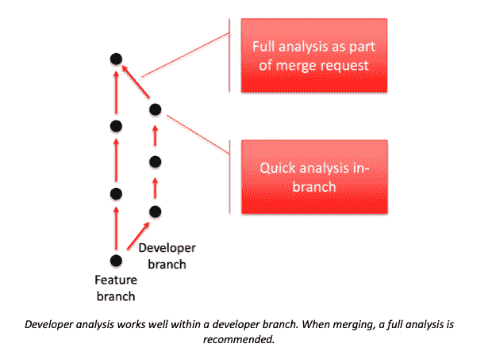

# 加速 SAST 的三种方法

> 原文：<https://devops.com/three-ways-to-speed-up-sast/>

在现代的、连续的软件开发生命周期(SDLC)过程中，当代码被编写时，在提交到存储库之前，它会通过测试，这可能包括单元测试、回归测试或静态应用程序安全测试(SAST)。对于 DevSecOps 来说，SAST 的好处在于，当开发人员在提交源代码之前创建和修改源代码时，它会向他们提供实时反馈。在这种工作流程中，可接受的时间最长为 15 分钟到 30 分钟，并考虑到变化的幅度。快速反馈意味着更快的周转和更多的功能进展。商业价值就在于这些特性。测试确保它们工作。

### 深度与宽度

SAST 使用的跳棋并不都是平等的，至少在计算能力方面是如此。分析时间与用于检测特定类型漏洞的检查器的复杂性直接相关。例如，与用于检测命令或 SQL 注入的复杂污染数据分析相比，编码标准实施规则通常更容易计算。因此，在被检测到的错误和漏洞的类型之间需要进行权衡。当开发人员编码时，优化 SAST 的计算时间以减少任何延迟是有意义的。在软件构建期间，有更多的时间和计算能力可用，因此可以增加深度和广度来捕捉复杂的漏洞。

### 计算能力

SAST 分析时间与计算能力成正比。更多计算资源(如 [CPU](https://www.techtarget.com/whatis/definition/processor) 和内存)的可用性会影响分析时间。在这种情况下，越大越好，为 SAST 增加硬件投资可以提高生产力。

### 代码库大小

SAST 分析时间还取决于分析的源代码数量。根据应用程序的不同，代码库是最佳分析深度和广度的决定性因素。

在小代码库大小和 SAST 的严格要求之间有一些关联，例如在安全关键软件中。构建和测试安全关键代码的成本很高，但是代码的大小通常比其他类型的应用程序要小。然而，这些产品需要符合工业编码标准，因此需要严格的测试和分析来检测各种缺陷。

较大和非常大的代码库需要在分析的深度和广度方面进行权衡。对缺陷和漏洞的类型进行优先排序至关重要。

加快 SAST 意味着减少工作量。最密集的操作是对整个源代码库的全面分析。正如从零开始全面编译需要很长时间一样，SAST 分析也是如此。

为了加快 SAST 处理时间，遵循在大型 C/C++项目中避免编译的三种技术:增量分析、组件分析和开发人员分析。

**1。增量分析**

增量构建是减少 C 和 C++项目开发人员构建时间的主要因素。小的改动不需要重新编译整个代码库。不切实际，没必要。当开发人员修改某些东西时，只有需要重新编译的东西会自动重新编译，构建基础设施会处理它。

SAST 以类似的方式工作。当源代码被编译时，SAST 解析相同的源代码并创建一个程序模型。第二阶段是根据配置的检查器分析程序模型并生成警告。这些警告通常会被存储到数据库中，以供以后分析。

在软件的构建过程中，SAST 是并行运行的。虽然在操作上类似于编译器，但 SAST 必须比编译器做更多的工作，并且需要更长的时间来完成和提供结果。每次修改需要重新编译的代码量会直接影响分析时间。

同时，增量构建的 SAST 需要比仅仅分析变更更多的工作。SAST 通过多个不同的编译单元使用代码流的抽象执行。因此，即使修改了单个文件，也需要分析它对其他文件的调用。增量分析不会增加构建和解析工作量，但是分析范围会比预期的大很多。因此，每当你做一个增量构建，SAST 将需要重新分析依赖关系，变化和围绕那些变化的单元的相关的点点滴滴。

尽管如此，它仍然是减少 SAST 分析时间的一个好选择。

**2。成分分析**

如果正在开发的软件有一个松散耦合的、基于组件的体系结构，并有良好定义的接口，那么就有可能将测试和 SAST 分析都隔离到做出更改的组件上。正如这种类型的架构简化了开发的许多方面一样，它也为 SAST 带来了回报。可以单独分析组件并获得良好的结果。

**3。开发者分析**

为了进一步减少 SAST 的工作量，在没有 SAST 的情况下开始第一次构建，这消除了所需的额外计算负担。因为后续的构建要小得多，构建速度也快得多。

但是，由于只分析发生更改的文件，因此分析范围变小，导致假阴性增加。这个较小的范围意味着所有可能的依赖关系都在程序模型之外，并且在分析中不被考虑。然而，例如，这种快速分析在编码标准实施中工作得很好。

### 从哪里开始？

从完整的构建和分析开始。这为检测到的错误和漏洞设置了基线，并为减少构建时间建立了性能目标。这一步将确定代码的确切行数、分析需要多长时间以及它对构建服务器负载的影响。这些指标应该推动分析优化工作。

给定选项，第一步应该是基于组件的分析。如果这工作得很好，仍然有可能进一步减少组件内的增量分析和开发人员分析。这种方法可以集成到典型的开发人员工作流中。

当创建用于实现变更的开发人员分支时，快速开发人员本地分析将捕获本地错误。这些往往是最大的集合，因为它们代表了代码更改的最大部分。当执行编码标准时，这是识别违规的点。建议对合并请求进行全面的分析，以检测与跨组件边界行为相关的剩余缺陷。

### 加速 SAST

为了加速 SAST，考虑在适当的开发阶段使用这些技术来减少完成的时间，同时仍然产生优秀的结果。请记住:
●完整的分析产生最好和最精确的结果，
●增量分析只分析已经修改的重新编译的代码，
●组件分析在遵循良好定义的组件架构的软件中工作良好，
●开发者(本地)分析提供了精确度和分析时间的良好折衷。