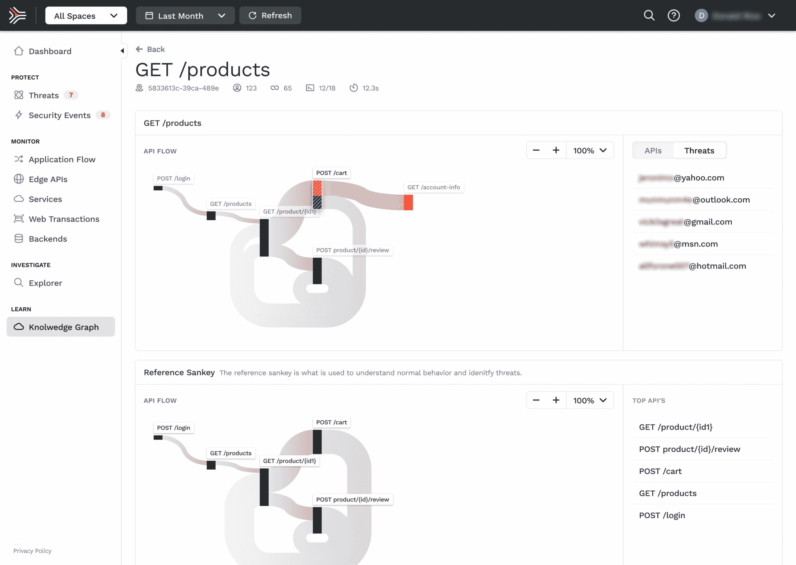

# Traceable 使用分布式跟踪保护应用程序

> 原文：<https://devops.com/traceable-secures-apps-using-distributed-tracing/>

Traceable 本周宣布，它将在早期访问计划[下提供一个同名平台，该平台结合了分布式跟踪和机器学习算法，以更好地保护应用程序。](https://www.prnewswire.com/news-releases/traceable-launches-with-20-million-series-a-to-secure-cloud-native-applications-using-ai-and-distributed-tracing-301093006.html)

Traceable 首席执行官 Jyoti Bansal 刚刚筹集了 2000 万美元的资金，他表示，目标是利用通过开源 Hypertrace 代理软件生成的分布式跟踪来捕获流数据，机器学习算法可以应用于这些数据，以更好地保护微服务。

Bansal 也是 AppDynamics 的创始人和前首席执行官，他说，这种方法利用软件工程技术和原则来解决应用程序部署前后的应用程序安全问题。

作为这项工作的一部分，Traceable 开发了 TraceAI，这是一个经过训练可以识别应用程序安全问题的机器学习引擎。

他说，一旦发现这些问题，开发者将能够使用 Hypertrace 代理软件应用策略来修复漏洞。

实际上，Traceable 正在应用应用性能管理(APM)平台的许多原则来保护应用。然而，Traceable 不是简单地聚合和分析数据，而是添加了一个流媒体引擎来实时收集大量的网络安全数据，这些数据由机器学习算法进行分析，以确定数据何时以及如何通过应用程序编程接口(API)被渗透。

随着部署在企业 IT 环境中的微服务数量的增加，可能受到危害的 API 端点的数量也会增加。Bansal 表示，通过将开源 Hypertrace 代理软件添加到微服务中，可以利用分布式跟踪来更好地了解微服务中嵌入的业务逻辑是如何受到危害的。这种情况也有助于开发团队通过更新或替换微服务来解决这个问题。

虽然最佳 DevSecOps 实践的兴起增加了开发人员和网络安全团队之间的合作，但 Bansal 表示，应用程序安全在很大程度上仍然是软件工程的挑战。他说，应用程序开发团队需要找到一种方法来指导代理在其代码中解决应用程序安全问题，而不是依赖网络工程师部署的覆盖层。

大多数网络安全专业人士都会点头同意这一原则。然而，网络安全团队可能需要一些时间来适应这样的想法，即他们可能不需要像今天一样参与应用程序安全。事实上，寻找任何漏洞的根本原因所花费的时间可能会大大减少。

与此同时，很明显，代理软件、分布式跟踪、机器学习算法和流数据引擎的原始汤正在以一种将改变应用程序安全性的方式汇集在一起。将所有这些元素转化为广泛使用的平台的催化剂可能还需要一段时间。然而，现在的问题是，应用程序安全性是否会有重大进步，从而将 DevSecOps 过程提升到一个更高的水平。