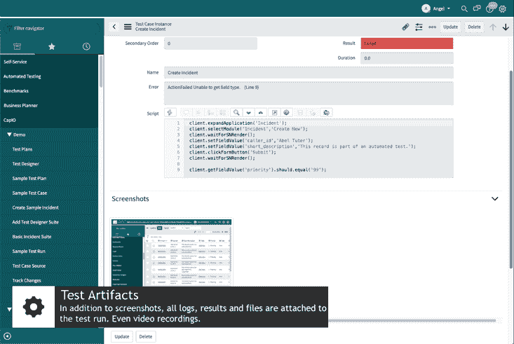

# Tricentis 将测试范围扩展至 ServiceNow 应用

> 原文：<https://devops.com/tricentis-extends-testing-reach-to-servicenow-applications/>

Tricentis 已经将其测试工具组合的范围扩展到[现在包括来自 ServiceNow](https://www.businesswire.com/news/home/20200902005283/en/Tricentis-Extends-Leadership-Enterprise-Application-Delivery-Launches) 的软件即服务(SaaS)应用。

Tricentis 产品营销副总裁马丁·克劳斯(Martin Klaus)表示，测试已经成为一个更大的问题，因为除了补丁更新之外，ServiceNow 现在每年还会对其平台进行两次重大更新。

现在，越来越多的 IT 组织正在利用 ServiceNow 平台来构建和部署定制应用。许多组织不是从头开始构建整个应用程序，而是通过扩展 SaaS 应用程序提供商已经提供的功能来加速数字业务应用程序的部署。Klaus 说，定期对这些应用程序进行的所有更新带来了测试自动化的挑战，可以使用 Tricentis Test Automation for service now 来解决这一挑战。

他说，tri centis Test Automation for ServiceNow 原生部署在 service now 平台上，提供了点击记录、测试实时回放和自动测试用例创建等功能。Klaus 补充说，目标是通过在几秒钟内运行由机器学习算法生成的数百个测试来加快 ServiceNow 应用程序的测试过程，而以前需要几天才能完成。

目前，有超过 6，200 家企业客户正在运行 ServiceNow 应用程序，其中许多都在使用 DevOps 流程来构建和扩展 ServiceNow 应用程序。ServiceNow 还通过与 DevOps 平台提供商的联盟扩展了其 DevOps 重点。

ServiceNow 的大部分用例涉及 IT 服务管理(ITSM)。然而，ServiceNow 最近一直在扩大其对数字业务应用的关注，除其他外，还增加了其他工作流应用，包括针对人力资源(HR)团队的工作场所联系人跟踪应用。

组织添加的 ServiceNow 应用越多，测试挑战就变得越复杂，尤其是当工作流开始扩展到来自不同提供商的 SaaS 应用时。Klaus 说，例如，组织跨 ServiceNow 和 SAP 平台构建和部署定制应用[并不罕见。他指出，Tricentis 提供了一套测试工具，可以应用于多个 SaaS 应用平台，以及 DevOps 团队自行构建和部署的定制应用。](https://devops.com/sap-aligns-with-tricentis-on-continuous-testing/)

随着组织越来越依赖数字业务应用程序，工作流所依赖的底层软件组件的更新所导致的中断成为一个更大的问题。在许多情况下，受影响的不是员工的工作效率。组织现在通过数字业务应用来增加收入，如果应用不可用，就无法产生收入。因此，人们越来越关注测试数字业务应用程序的更新。

很难说 SaaS 应用平台会在多大程度上成为更大的 DevOps 万神殿的一部分。然而，使用扩展这些平台的低代码/无代码工具构建和部署的应用程序的数量已经增加。甚至可能很快有一天，部署这些应用程序的积压会变成比现在更大的问题。与此同时，很明显许多 DevOps 团队将不得不扩展他们对部署平台的定义。