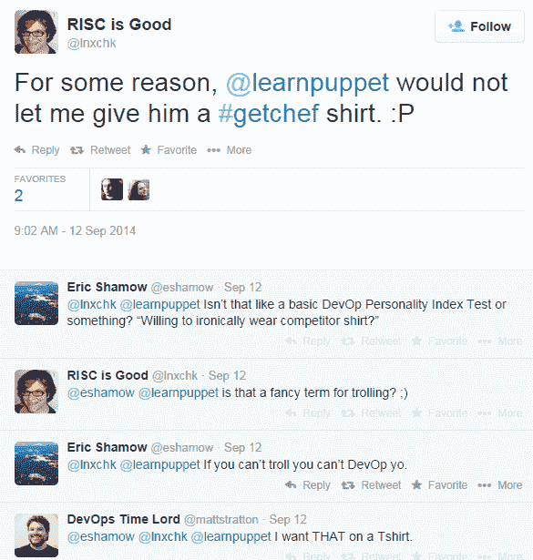
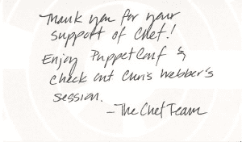
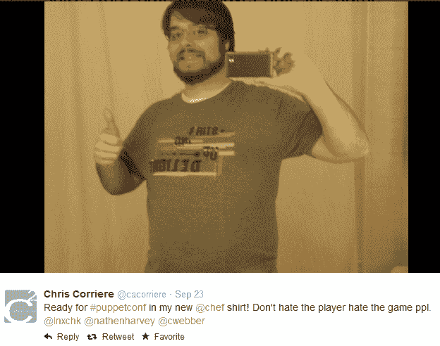
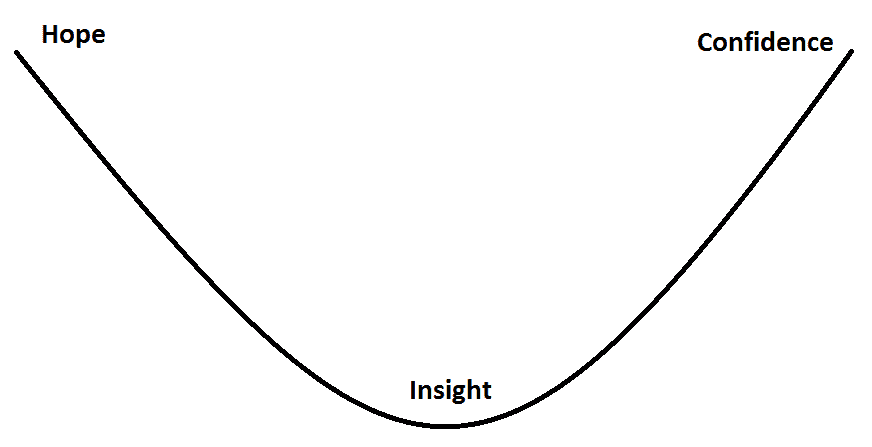

# 拖拉 PuppetConf:调查配置管理

> 原文：<https://devops.com/trolling-puppetconf-suvrveying-configuration-management/>

## [巨魔(互联网)](https://en.wikipedia.org/wiki/Troll_%28Internet%29)

在[网络俚语](https://en.wikipedia.org/wiki/Internet_slang "Internet slang")中，有**巨魔**([/](https://en.wikipedia.org/wiki/Help:IPA_for_English "Help:IPA for English")[ˇ](https://en.wikipedia.org/wiki/Help:IPA_for_English#Key "Help:IPA for English")[t](https://en.wikipedia.org/wiki/Help:IPA_for_English#Key "Help:IPA for English")[r](https://en.wikipedia.org/wiki/Help:IPA_for_English#Key "Help:IPA for English")[oʊ](https://en.wikipedia.org/wiki/Help:IPA_for_English#Key "Help:IPA for English")[l](https://en.wikipedia.org/wiki/Help:IPA_for_English#Key "Help:IPA for English") [/](https://en.wikipedia.org/wiki/Help:IPA_for_English "Help:IPA for English")[ˇ](https://en.wikipedia.org/wiki/Help:IPA_for_English#Key "Help:IPA for English")[t](https://en.wikipedia.org/wiki/Help:IPA_for_English#Key "Help:IPA for English")[r](https://en.wikipedia.org/wiki/Help:IPA_for_English#Key "Help:IPA for English")[ɒ](https://en.wikipedia.org/wiki/Help:IPA_for_English#Key "Help:IPA for English")[l 或](https://en.wikipedia.org/wiki/Help:IPA_for_English#Key "Help:IPA for English")[在……社区中的离题](https://en.wikipedia.org/wiki/Off-topic "Off-topic")消息……故意挑衅读者进入[情绪](https://en.wikipedia.org/wiki/Emotion "Emotion")反应^([【3】](https://en.wikipedia.org/wiki/Troll_%28Internet%29#cite_note-PCMAG_def-3))或以其他方式扰乱正常的话题讨论。

**-维基百科**

今年，当我路过 Velocity Santa Clara 餐厅的大厨摊位时，Nathen Harvey 的加大码 t 恤已经卖完了。当时我碰巧也穿着一件木偶衬衫，但这只是一个幸运的巧合。Nathen 一直主张使用某些东西(任何东西)来自动化您的基础架构，因为 devOps 的 CALMS 模型中的“A”代表自动化，但当我穿过他的视线时，他脸上的表情非常尴尬。Nathen 告诉我，如果我给他我在亚特兰大的地址，他会给我一件厨师衫。在我写给 PuppetConf 之前，我一直想这么做，但 Mandi Walls 的一条推文最终促使我采取了行动。

## 按照 Nathen 的话，他在不到一周的时间里就给我做好了一件衬衫，而且有足够的时间去参加。

我认为**“激起喜悦”**也是送给我的合适衬衫。我有点担心我会得到一件更具对抗性的衬衫，让我面临被袭击和午餐钱被偷的风险。幸运的是，几乎所有注意到这件衬衫的人都认为它很有趣。至少跟我说过这件事的人。一个真正的巨魔至少会让一个人有点生气，对吗？任何认出我穿着厨师服的人恰好给我创造了一个提问的机会，所以我就问了。

1.  您使用过 Chef、Puppet、CFEngine 或任何其他配置管理工具吗？
2.  你喜欢哪一个？
3.  你为什么更喜欢那个特定的工具？
4.  为什么这些工具之间的竞争会帮助或伤害我们的行业？
5.  五年后，你会在哪里看到这些工具？

仅仅是和人们交谈，我就得到了相当一致的答案，问答也经常演变成一种自然的对话，这是我更喜欢的。(我喜欢实践的另一个 devOps 原则是闭上你的臭嘴，倾听)。在会议期间，我还张贴了带有调查链接的传单，试图收集一些实证数据。说实话，这项调查是真正的难题。

我在 PuppetConf 上看到的最好的演讲之一是由林赛·霍尔姆伍德(Lindsay Holmwood)所做的(T1)，称之为(T2)devo PS 认知偏差领域指南(T3)。我在会议前不熟悉这个术语，但我想我有这个想法。我也知道我还是没有完全理解。观看视频，并查看林赛在最后推荐的书籍。这是很深奥的东西。我真的很喜欢他的建议，让工程师来管理，让经理来帮助打破这些偏见，因为这在两个群体之间产生了很多共鸣。

考虑到我自己的认知偏差，如果我看到我张贴的传单，我不会填写调查。传单上没有提到双胞胎女孩的家庭学校项目，这更有可能引起我的注意。相反，它只是要求人们填写配置管理调查，并承诺为他们的麻烦提供 cookies。我很高兴地说，科技界会对 cookies 的调查做出回应，即使是在未经加工的情况下。虽然我有足够的回答来进行合理的统计分析，但我知道我的数据没有充分分层，并且可能不代表配置管理社区的更大群体。换句话说，我的数据缺乏多样性。

女儿们的家校项目是创业，双胞胎决定推出[双子零食](http://www.geminisnacks.com/)。他们的公司相当于一个在线烘焙义卖，让他们能够回馈所有帮助过他们的医院和组织，让那些还不能回家的孩子振作起来。

我和女儿们的交易很简单。我会为 PuppetConf 打印传单，以获得调查反馈，帮助我写这篇文章。我会感谢尽可能多的人填写调查问卷，给他们寄去一些饼干，我会雇佣他们的公司来烘烤和运输这些饼干。如果人们填写了调查问卷，我的孩子就会经商。

尽管数据缺乏多样性，但在回答中有足够强的趋势，我现在可以充满信心地讨论这些问题。当然，我从 Puppet 用户那里得到了很多回应，但我也听到了使用 CFEngine、Chef、Ansible、Salt 和 bconfig2 的人的意见。很多人没有使用任何东西，只是最近拿起了木偶。我遇到过一些人，他们曾经使用过三种或更多的工具，他们可以给出非常有趣的对比。以下是我到目前为止能够得出的主要结论。

## 水涨船高

大多数组织仍然使用大量主机来处理事情，有时他们使用脚本来完成。配置管理(CM)工具仍在成为一个完全被采用的标准。我听到市场上每个 CM 应用程序的用户说，使用什么工具真的不重要，用什么东西来自动化你的基础设施。因此，这在科技行业中仍是一个不断增长的领域。

## **不要陷入配置管理的争论中**

烘烤比赛这个词已经被使用过，而且不止一个人明确地这么说。我不知道在做决定之前设置测试环境来尝试不同的配置管理工具会被称为什么，但是我自己会称之为牦牛毛的自行车棚。反正烘焙大赛大概是比较熟悉的人。我的观点是你应该使用 Puppet 或者 Chef，但是如果你根本没有使用任何配置管理工具，建议你开始使用。如果你忍不住在承诺前花了一个以上的时间，那就保持简短和甜蜜。比起试图找出最简单的方法，你最好花时间去承诺一个，并把工作投入到快速的转变中去。这种自动化需要一些努力。要理解的关键是，合适的工具取决于您的环境。

## **人们对 CFEngine 非常尊敬和欣赏**

CFEngine 是一个开创性的学术项目，在 CM 的早期获得了广泛的欢迎。正如我们所知，开源社区采用该软件确实证明了 CM 的可行性。虽然现在这个领域有了新工具的竞争，应用程序没有继续增长，但一些人特意强调了他们对该产品及其创始人 Mark Burgess 的巨大尊重，因为没有他们 CM 就不会发展。

## **Puppet:受到运营人员的青睐，因为它易于配置**

ops 群体似乎更喜欢 Puppet 的主要原因是它易于配置。在那次会议上，有人向我推荐了一本书，书名是《转变:当改变变得艰难时如何改变》，作者是奇普和丹·希斯。这本书描述了 IDEO，一家产品设计公司使用的“项目情绪图”,以支撑他们的客户面对逆境。

当一个新项目开始的时候，我们会乐观，希望有最好的结果。在工作过程中，我们不可避免地会面临逆境，尽管这种逆境总是令人沮丧，但它确实会让我们获得洞察力。我们对问题的新观点赋予了我们力量，我们可以满怀信心地着手找到一个可行的解决方案。

我相信 Puppet 就是这样从 CFEngine 进化出来的。Puppet 的创始人兼 Luke Kanies 是 CFEngine 的早期贡献者。我可以看到 Luke 沿着这条曲线，深入了解 CFEngine 社区正在经历的配置困难，并继续创建 Puppet，相信他有一个更适合行业的产品，因为它易于配置。

## Chef:开发人员的首选，因为它允许他们像对待物品一样对待他们的系统

我可以看到厨师从木偶中走出来时也遵循着同样的曲线。伴随着易用性而来的是缺乏健壮性。Puppet 相对于 CFEngine 的优势是它更容易配置，但是开发社区中似乎有一个挫折点导致了 Chef 的创建。开发人员喜欢像对待对象一样对待事物，如果你有任何面向对象编程的经验，这应该是显而易见的。将我们编写的软件的复杂性抽象化，以便非开发人员的最终用户可以对其进行配置，这是一个挑战。因为 Chef 允许用户像对待对象一样对待他们的系统，所以避免了将任何复杂性抽象成声明性模型的困难。

这就是为什么运营部的人不喜欢厨师的主要原因，因为他们不是程序员。如果您所在的组织有一个成熟的运营部门，但对学习编码不感兴趣，那么 Puppet 描述系统的声明性模型将是一个更好的选择。然而，如果你让开发人员在一家小商店或一个运营团队中做大部分的运营工作，而这些团队为内部工具做更多的软件开发，特别是如果他们喜欢 Ruby，Chef 可能更适合你的组织。

## **Ansible:共生编排**

任何人对 Ansible 最好的评价就是它对编排很有帮助。它似乎更直接地与 mcollective 竞争，m collective 是 Puppet Labs 支持的用于编排任务的框架。Mcollective 可以与 Chef 和 Puppet 一起使用，Ansible 似乎也是如此。Ansible 也是无代理的，通过 SSH 管理节点。取决于你和谁交谈，这可能是一件好事也可能是一件坏事。由于不运行代理，节点无法处理随之而来的开销，但是您也失去了在系统运行代理时尽可能严密地监控系统的能力。我的印象是 CM 正试图让我们远离 SSH 循环。虽然我不认为把 Ansible 写成一个夸张的 SSH 循环是公平的，但是我认为在您的环境中的每个节点上运行代理所提供的优势是值得的。看看 Ansible 与其他配置管理系统的关系是否会继续演变成一个共生的编排提供商，或者另一个产品，如 mcollective，是否会继续填补这一空白，这将是一件有趣的事情。

## **Salt 并不是真正的配置管理软件，但它的速度很快** 

Salt 是一个构建在 zeroMQ 上的远程执行平台，其设计考虑了速度。salt 使用的所有东西，包括 CM，都是项目核心的快速远程执行平台的补充。节点(称为奴才)与它们的主人保持的持续连接无疑有助于系统的速度。这将使我相信 Ansible 是这里讨论的四种技术中最慢的，因为它根本不运行代理，而 Chef 和 Puppet 将处于中间位置，因为它们在它们的节点上运行代理，但它不是持续通信的。(这是我有根据的猜测。请让我知道你是否能从个人经验来谈论速度问题。)

我遇到过一些处理高速金融系统的企业，它们在很多事情上都使用 salt，包括 CM，但仅仅是因为它很快。如果您的系统需要对故障和变化做出瞬间响应，salt 可能有助于解决您的组织当前面临的许多问题。我不相信它这么容易使用。

Salt 似乎很受那些像躲避瘟疫一样躲避 Ruby 的群体的欢迎，或者那些在 CLI 中如此舒适以至于使用 GUI 看起来不自然的人们。我认为这些是选择工具的可怕理由，因为它直接避免了 devOps 社区所信奉的“适应或死亡”的心态。不过，根据你所处的环境和你正在应对的逆境，这些可能是使用 salt 而不是其他技术的完全合理的理由。如果你告诉我你选择了盐，我会不那么担心，因为它很快。

## 调查仍在进行中

我希望你喜欢你在这里读到的东西，但我肯定有人根本不同意我的观点。好消息是你仍然可以[填写调查](http://www.cookieops.com/)并让我知道。当我的数据看起来足够多样化时，我会发布另一个更新，你也很有可能会得到一些 cookies。我还要感谢所有花时间和我讨论这个问题的人。[吉恩·金](https://twitter.com/RealGeneKim)、[约翰·威利斯](https://twitter.com/botchagalupe)、[克里斯·韦伯](https://twitter.com/cwebber)、[查尔斯·约翰逊](https://twitter.com/chipadeedoodah)、[道恩·福斯特](https://twitter.com/geekygirldawn)、[卡拉·索勒斯](https://twitter.com/FeyNudibranch)、[木偶实验室](https://twitter.com/puppetlabs)的每一个人，当然还有[纳森·哈维](https://twitter.com/nathenharvey)和[曼迪·沃尔斯](https://twitter.com/lnxchk)，他们都帮助 PuppetConf 取得了巨大的成功，成为我难忘的经历。从这次经历中，我学到的东西比我预期的要多得多，我很高兴看到这个领域的竞争在未来几年将会如何发展。竞争是件好事。随着不同的挑战出现，随着项目经历情绪波动，我相信我们会看到两件事情发生:这些工具的社区将使它们适应他们正在操作的环境，并且在某个时候足够的适应将使我们一起使用一套新的工具。就我个人而言，我真的很想看看会发生什么。