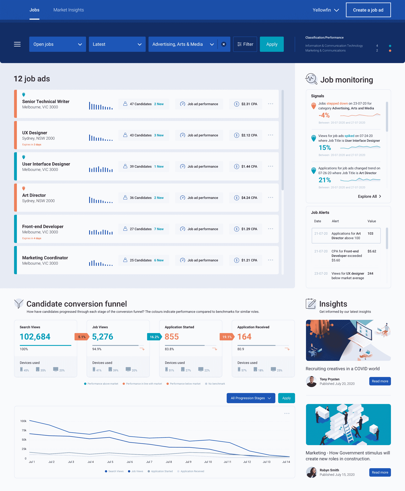
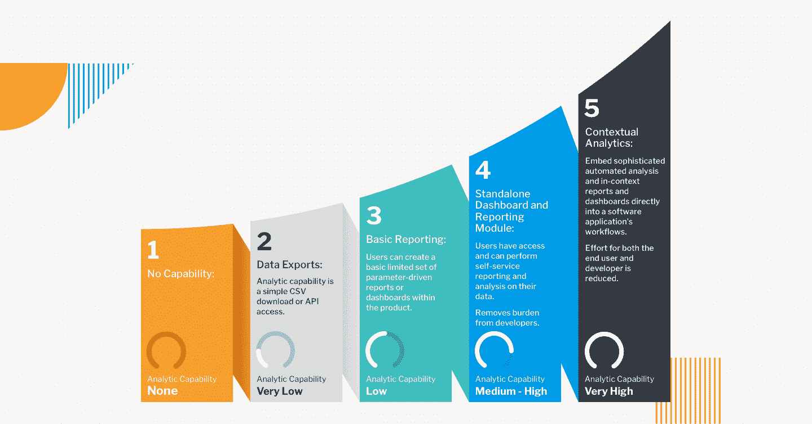

# 通过上下文分析增强企业应用

> 原文：<https://devops.com/turbocharge-enterprise-apps-with-contextual-analytics/>

软件产品经理和开发人员通常将分析视为一项独立的功能，即集成到应用程序的仪表板或报告模块中的功能。作为产品功能，分析无疑是一个有价值的工具。但是仅仅把它作为附加功能来提供是一种落后于用户现状的方法。

当[数据分析](https://devops.com/?s=business+intelligence)仅限于仪表板时，用户必须在需要查询数据或获得洞察力时从他们的事务环境中切换出来。这扰乱了工作流程，打断了思路，给用户制造了摩擦。此外，独立的分析功能不提供上下文或指导分析。用户必须手动寻找异常或趋势。因此，他们不太可能深入[分析](https://securityboulevard.com/?s=contextual+analytics)来支持良好的商业决策。

另一方面，上下文分析为用户的日常工作提供了一个强大的工具。上下文分析被定义为直接集成到应用程序核心工作流中的任何分析解决方案。这种方法在必须做出决策的情境框架中提供了分析的好处。

以这种方式嵌入分析为用户创造了巨大的价值。图表、表格和指标并排显示在屏幕上，旁边是应用程序的中心功能。只需一次点击，用户就能获得即时、有指导的动态洞察。

这种改进对各种商业活动都有帮助。零售店经理可以在创建每周工作时间表的同时即时访问需求预测。库存管理人员无需离开订购屏幕就可以查看趋势和分析库存。供应链、金融、物流、销售和营销、制造——任何涉及常规数据处理的流程都可以从上下文分析中获益。

## 丰富的工作流资产

当嵌入到交易工作流中时，上下文分析可以提供两种形式的理解。第一种来自预定义的可视化，从简单的 KPI 数字到折线图和条形图，甚至是上下文相关的仪表板。这些可视化是基于用户动作呈现的；例如，客户的购买历史可以在查看帐户记录时以图表形式弹出，使用户能够就销售激励或服务优先级做出决策。

其次是动态分析和警报。这些指示已经超过阈值或者已经发现记录中的异常，提示用户探索并采取进一步的措施。弹出警报在销售、生产、财务或许多其他领域非常有用。

对于预定义的和动态的上下文分析，结果可以基于交易数据的简单聚合，或者作为复杂的数据科学建模的结果(例如，购买倾向)。具体结果可以由产品经理或用户设定，以最大化效用。

上下文分析是根据任何业务需求支持或触发行动的理想选择。该能力通过提供关于特定交易的度量来增强交易工作流；它还会根据数据科学模型的输出，通过警报或行动建议触发新的工作流。

当然，这并不意味着基于仪表板的分析不再重要。用户总是需要进行广泛的数据分析。仪表板和/或报告分析允许用户监控整体业务绩效，并在必要时深入数字背后的细节。

然而，随着上下文分析的二次添加，用户可以在工作时不断地被引导做出决策。他们不断获得更深入的见解，在粒度级别上直观地支持管理任务。

## 开发人员部署框架

可以根据成熟度模型来指导将交易分析嵌入到企业应用中。产品开发有五个可能的阶段:

*   第一阶段:没有能力。工程的主要重点是将新应用推向市场。最小可行产品(MVP)属性引领开发，很少包括报告功能。
*   第二阶段:数据导出。分析是基于客户反馈提供的，但只能通过 CSV 下载或 API 访问来提供，最终用户可以使用他们喜欢的工具来分析数据。构建分析的负担落在客户身上。
*   第三阶段:基本报告。有限的一组报告由分析支持，内部开发人员负责创建功能，这通常会损害核心产品的新功能。
*   第四阶段:独立的仪表板和报告模块。这通常是大多数企业应用程序的终点。自助式报告和分析可通过现成的控制面板和报告获得。
*   第五阶段:语境分析。复杂的自动化分析可作为应用核心工作流程的一部分，也可在仪表盘上使用。用户被引导在交易和报告级别做出最佳决策。

这些阶段并不相互排斥。特别是对于第四和第五阶段，它们可以是附加的，因此最终用户将有各种机制在他们需要的时候访问他们需要的数据。

## 加速实施

提升终端用户分析体验比以前更容易实现，这要归功于专门从事基于开放平台的嵌入式和上下文分析的 BI 供应商。最好的供应商能够快速轻松地适应产品开发路线图，调整功能以满足特定需求，并跟进管理工具和自动化处理以支持最低的拥有成本。

与分析供应商合作意味着开发团队将获得从原型和设计到集成、部署和后续迭代的最大支持。面向 Windows 和 Linux、内部部署或云的选项将确保高度适销产品所需的通用性、安全性和可扩展性。

## 客户如何看待分析

作为一项产品功能，分析经常被认为是事后的想法，但是你的用户并不这么认为。商业智能分析越来越被视为企业治理的关键。用户希望从他们收集的数据中收集尽可能多的信息，而且是多层次的。这意味着你的用户希望从你的产品中获得更多，甚至是以他们还没有想到的方式。上下文分析可以为您的应用程序提供增强的吸引力，在企业应用程序比以往任何时候都更重要且更具竞争力的时候，让您的产品脱颖而出。