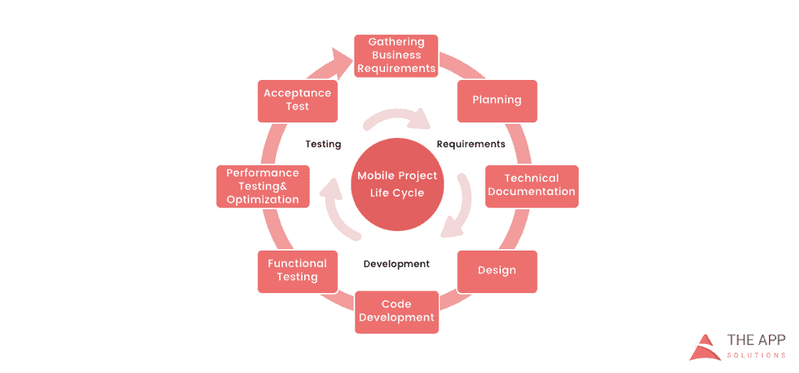

# 了解应用程序开发生命周期

> 原文：<https://devops.com/understanding-app-development-life-cycle/>

如今越来越多的企业正在向移动业务转移。这是绝对合理的选择:

*   超过 50%的数字媒体消费来自移动应用；
*   智能手机用户花在手机上的时间有 90%都花在了手机应用上；
*   一个典型的用户在他的手机上安装了大约 30 个应用程序，并且每月花费超过 35 个小时使用它们；
*   [42%的移动购买](http://www.outerboxdesign.com/web-design-articles/mobile-ecommerce-statistics)是通过移动应用完成的；
*   85%的消费者更喜欢原生移动应用而不是移动网站。

当决定开发一个移动应用程序时，描绘出要经历的整个阶段和过程是很重要的。

根据 [The App Solutions](https://theappsolutions.com/) 的移动应用项目方法，无论复杂程度如何，以下是典型开发项目的生命周期:

1.  **规划阶段**(包括项目经理、营销人员和业务分析师)——进行业务分析并制定移动战略。
2.  **技术**文档(由技术作者负责)–描述所有技术要求和细节。
3.  **原型制作**(通常由 UX/UI 设计师制作)——在批准后创建草图、线框、原型和最终的应用程序皮肤。
4.  **开发**(由开发人员执行)——编码的前端和后端部分。
5.  **质量保证**(通常在每次敏捷冲刺完成后持续执行；接下来是错误修复)–测试技术要求、设备兼容性、接口、安全方面等。
6.  **发布&维护**(由 DevOps 负责)——发布到 app store、更新版本、基础设施和整个应用维护。

## **规划阶段**

创建移动应用程序时，花时间完成必要的研究和规划步骤至关重要。

### **经营分析**:

*   想法评估——一个初步阶段，专家调查想法，纠正它，给出他们的建议，并为它创建一个粗略的逻辑。
*   竞争分析——研究市场中其他参与者的活动。
*   SWOT 分析——评估产品的优势和劣势，洞察机会和其他方面。
*   ROI 计算–评估未来应用市场表现有助于实现实际价值并相应调整预算。
*   需求范围——总结未来产品各个层面的需求。

### **移动战略**:

*   市场研究——这项研究展示了市场的总体情况，有助于根据当前需求调整产品概念。
*   [定义用户角色](http://blog.careerfoundry.com/ux-design/how-to-define-a-user-persona)-了解谁是你的目标受众对于设计广告方法至关重要。
*   技术和工具评估——研究行业所需的特定工具，并选择一组技术来满足项目目标。
*   复杂的推广策略——获取和留住用户的分步行动计划。

### **技术文档:**

也称为技术规范或软件文档，这份文件是您的产品的复杂手册，概述了需求、业务逻辑并引导您的专家通过项目的所有阶段:

*   让你的软件可以被普遍理解。
*   为未来的变化提供灵活性。
*   通过提供清晰的手册为您的应用增加价值。
*   有助于控制您自己的产品。
*   允许重用已开发应用程序的现有部分。

### **原型制作:**

原型制作是一个用视觉术语定义概念并评估应用程序如何发展以纠正误解的过程。

*   创建草图——在纸上创建你的应用的草稿版本，建立主要逻辑、屏幕数量以及它们相互交互的方式。
*   创建线框–提供草图结构的可视化。
*   创建一个可点击的原型——有助于发现和分析所有可能的用例，发现原始想法中的逻辑中断和技术矛盾。
*   设计应用程序皮肤——收集所有的线框，并把它们放在一起，得到最终的设计。

### **代码开发:**

该部分通常由两个主要部分组成:

*   前端开发——客户端开发，创建软件的表示层，供用户直接与之交互。
*   后端开发–开发的服务器/数据库部分，将移动应用的前端部分与数据访问层连接起来。

### **质量保证:**

在敏捷开发中，它通常是一个跟随每个开发冲刺的连续过程:

*   兼容性测试–在不同的设备和屏幕尺寸上运行应用程序。
*   界面测试–检查导航、菜单和按钮的性能。
*   设备兼容性测试——检查应用程序在各种屏幕尺寸下的外观和性能。
*   低级资源测试——在低电量、互联网连接缓慢等条件下检查应用程序。
*   安全测试–为用户数据安全提供质量保证。
*   测试版测试——让用户访问应用程序以获得反馈。

### **发布&维护:**

*   将应用程序发布到选定的应用程序商店，并跟踪更新版本。
*   基础设施支持——无论是发布管理面板还是附加云服务，您都需要确保其功能完整。
*   应用商店优化——帮助你的应用登上搜索列表的顶端，这样可以获得更多用户。

## **充分利用您的应用开发项目**

以下是一些让你自己的应用程序开发项目发挥最大价值的技巧:

*   关注时尚+研究市场和你的目标受众。这是一个至关重要的初步阶段，会影响到项目的方方面面和做出的每一个决定。
*   尽可能详细地说明你希望在项目结束时看到的产品。在项目的规划和原型点定义软件的最小特性和功能将有助于在实际开发中找到省钱的地方。
*   与各种开发团队协商你的想法(研究应用程序开发公司的概况，找到他们可信度的证据，讨论最佳价格)。确保他们听到并理解你的意思——简单地说，你们在同一页上。

## 关于作者/查理·沙贝

Charlie Shabe 是一名专业的数字营销策略师。他拥有 20 多年的数字营销经验，致力于帮助全球组织利用互联网提高其在线知名度并创造商机。除了他的公关和网络营销经验，查理是一个写作专家。在[脸书](https://www.facebook.com/charlie.shabe)和[推特](https://twitter.com/CharlieShabe)上与他联系。