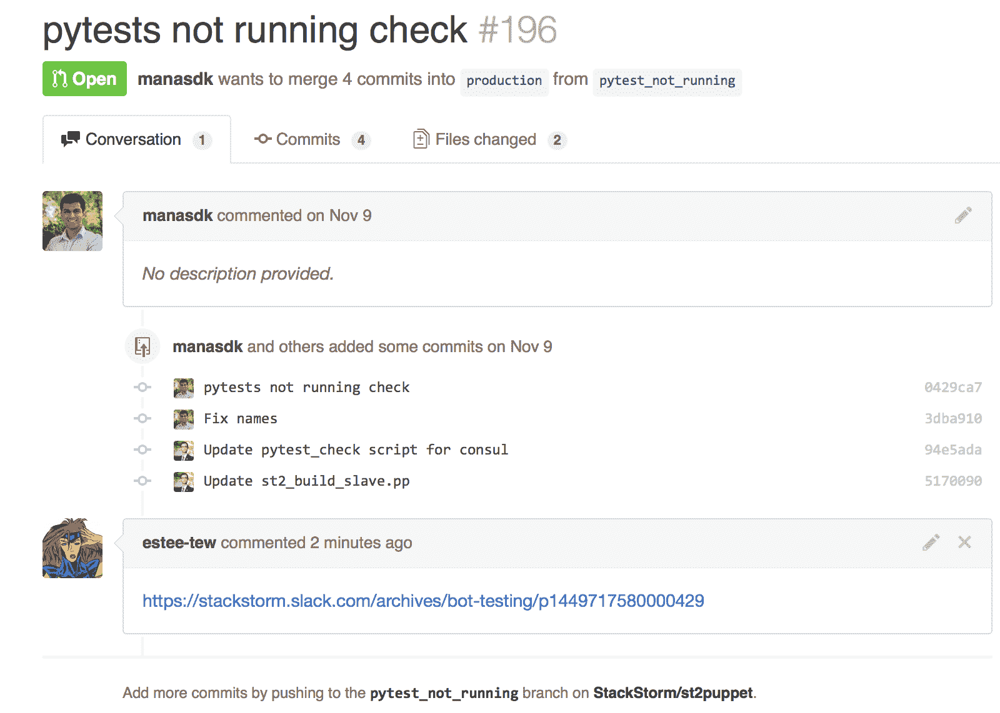
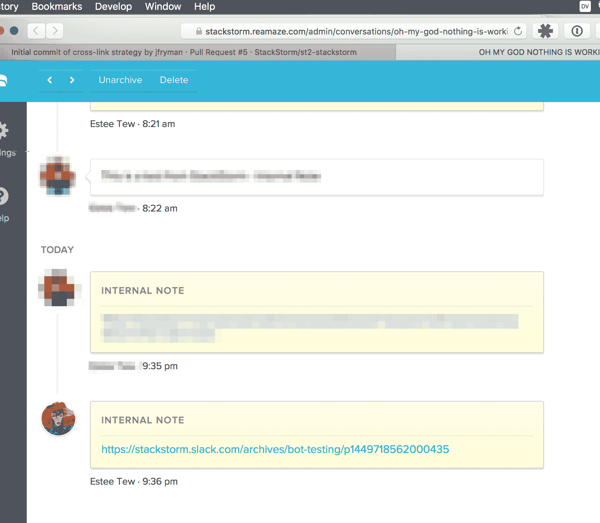
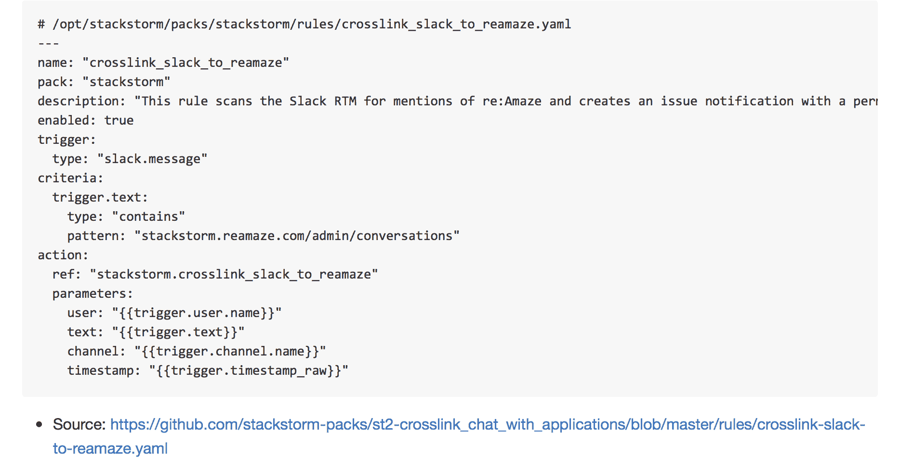

# 将应用程序统一到一个系统中

> 原文：<https://devops.com/unifying-applications-into-one-system/>

让我们来讨论一个我们都曾面临过的现实问题:跨许多不同的工具跟踪单个工作线程。无论一家公司从事哪个行业，随着公司的发展，它都会积累支持业务的后台应用程序。

许多以知识为基础的公司都有某种交流工具，项目跟踪和支持跟踪，所有这些都是为了帮助改进业务流程而设计的。对话足够了，直到它们不够了，工具随着需求的增加而实现。每个添加的工具都有其用途，解决关键需求，并使您和/或您的团队更有效率。

然而，在某些时候，这种情况会发生变化。发现成为一个主要问题，因为不同工具之间的使用模式会留下数据孤岛。很难将最终推动您业务的不同公司管道关联起来——为客户提供关怀和沟通的管道，提供新功能的管道，以及每个管道中涉及的人机界面。团队成员使用不同的工具和人员从事不同的项目，团队成员在不同的时区工作，大量的工作要做……

你能说出不仅仅是对话丢失，还有*语境*丢失的几种方式吗？【T2

通常，团队试图用几种方法来解决这个问题:

*   **规则！**关于如何以及在哪里进行对话和存储数据的具体指导方针(有时是建议，有时是强制性的)。
*   **整合！**编写数据转换，根据需要将数据从系统 X 移动到系统 Y。
*   **全押！**选择一套工具，为您解决所有这些问题。
*   **让它成为“未来的你”的问题** —这样很好，并不是真正的问题。

在 StackStorm，我们遇到了这个问题。我们有两个票务系统(GitHub issues 和吉拉)、一个服务台工具(reamaze)和一个聊天客户端(Slack)。我们在 StackStorm 使用的解决方案是我在 GitHub 工作时借鉴的。我的一个同事在 Hubot 上设置了一个非常酷的钩子，可以监听我们聊天室中与 GitHub 问题、拉取请求甚至代码提交相关的对话。当有人提到这些事情中的一件时，Hubot 会抓住一个聊天记录板，将永久链接交叉链接到问题或拉请求。



但是，那只是 GitHub。上下文对所有工具都很重要，并给予团队成员更多的自主学习和获取知识的灵活性。所以，我们用我们的支持工具，re:Amaze，做了同样的事情。

[](https://camo.githubusercontent.com/66c5b5697e9dfea715c2f6432baf3da8946e2661/687474703a2f2f692e696d6775722e636f6d2f6d4e37777851432e706e67)

*   在《速度时代》中，面包屑可以让你从旅行者曾经走过的地方拼凑出谜题。这可能不是全部的谜题，但是有背景会有很大的帮助。
*   在记录时代，这些面包屑允许你使用同样的调查技巧来汇编一个更好的历史。

这是帮助创建动态信息网络的一系列行为中的一部分。通过无缝地将对话和问题/pr/票证/等等相关联的机制，对话变得更容易在需要时发生(偶然的交互 ftw ),并且当团队成员可用时，仍然可以获得他们的上下文。

这很重要，因为:[只有一个系统](https://youtu.be/vEpXJRPITN0?t=10m44s)。

## 在我们开始之前…

充分披露:我隶属于 StackStorm，公司建设 StackStorm 的工具。也就是说，这里的最终目标是说明如何使用事件驱动的框架来利用最近的聊天文化变化的模式，希望在日常生活中恢复一点理智。如果您有兴趣了解更多关于 StackStorm 的信息，以及它如何与整个自动故障排除和自动修复领域联系起来，请查看我们由 Dmitri Zimine 撰写的 [ChatOps 陷阱和提示](https://stackstorm.com/2015/12/10/chatops_pitfalls_and_tips/)。这应该给你一个很好的背景，为什么我们使用 StackStorm，而不是，比方说，只是一个小脚本。

好了，言归正传！

### 传感器

这个工作流程从传感器开始。StackStorm-Slack 集成的内部是一个传感器类，它连接到 Slack 实时消息传递 API。首先从传感器开始。官方的 [Slack](https://github.com/StackStorm/st2contrib/tree/master/packs/slack) 包包含一个传感器，它使用 Slack RTM 连接到 Slack，并在与之相关的房间中监听消息。然后，每条消息都作为“事件”发送到 StackStorm，我可以创建规则来捕获某些事件并启动。

### 规则

现在，传感器正在向系统发送触发器，我需要找到一种方法，在有人提到问题或罚单时采取行动。这里的机制是通过一个规则。规则根据一系列检查检查通过传感器发送到系统中的触发器，如果匹配，则执行操作或工作流。一个触发器可以匹配许多规则。

让我们创建一个规则来观察与 reamaze 相关的讨论

```

```

*   来源:[https://github . com/stack storm-packs/st2-cross link _ chat _ with _ applications/blob/master/rules/cross link-slack-to-reamaze . YAML](https://github.com/stackstorm-packs/st2-crosslink_chat_with_applications/blob/master/rules/crosslink-slack-to-reamaze.yaml)

`criteria`块中的第一个元素是`trigger.text`。在规则中，触发器本身被称为`trigger`，而不是`slack.message.text`。我们想看看`text`是否恰当地`contains`了一个与我们的再制造问题追踪器相关的模式。我从[大列表的比较运算符](https://docs.stackstorm.com/rules.html#critera-comparision)中选择了`contains`，并确保模式匹配我正在寻找的内容。

最后但同样重要的是`action`块。这一块基本就是下一步操作了。在这里，我可以选择一个单独的动作或一个工作流来开始，甚至可以从触发器有效负载中获取数据并传递给动作。在这种情况下，我选择为我的目的创建一个新的工作流，并确保获取一些我需要进行处理的关键字。

此时，我有了一个匹配的规则，现在我需要创建处理触发器所必需的操作。

### 行动和工作流程

接下来，我们开始创建动作。这样做的目的是确保任何时候关于 re:Amaze 支持票的讨论随机爆发时,@estee-tew 会将 Slack 永久链接发布到支持票上。使用上述规则中提取的触发器有效负载，工作流将需要:

*   获取用户评论的文本并提取 reamaze 问题 URL。
*   根据收集的数据计算匹配消息的 Slack Permalink URL。
*   在匹配的再发货单上张贴松弛永久链接。

在 [`reamaze`包](https://github.com/StackStorm/st2contrib/tree/master/packs/reamaze/actions)里面，可以看出我有`create_message`的能力。这个动作需要三个参数:`slug`、`message`和`visibility`。在我们上面的规则中，当标准与期望的松弛消息匹配时开始的动作是`stackstorm.crosslink_slack_to_reamaze`。到目前为止，这还不存在，所以这是下一步。为了简洁起见，你可以看看 GitHub 上的[动作元数据](https://github.com/stackstorm-packs/st2-crosslink_chat_with_applications/blob/master/actions/crosslink_slack_to_reamaze.yaml)。

```
---chain:  -    name: "get_permalink"    ref: "stackstorm.get_slack_message_permalink"    params:      channel: "{{channel}}"      timestamp: "{{timestamp}}"    publish:      permalink: "{{get_permalink.result}}"    on-success: "sanitize_message"  -    name: "sanitize_message"    ref: "stackstorm.sanitize_slack_message"    params:      text: "{{text}}"    publish:      sanitized_text: "{{sanitize_message.result}}"    on-success: "get_reamaze_slug"  -    name: "get_reamaze_slug"    ref: "stackstorm.get_reamaze_slug"    params:      text: "{{sanitized_text}}"    publish:      slug: "{{get_reamaze_slug.result.slug}}"    on-success: "crosslink_slack_to_reamaze"  -    name: "crosslink_slack_to_reamaze"    ref: "reamaze.create_message"    params:      slug: "{{slug}}"      message: "{{permalink}}"      visibility: "internal"
```

*   来源:[https://github . com/stack storm-packs/st2-cross link _ chat _ with _ applications/blob/master/actions/workflows/cross link _ slack _ to _ reamaze . YAML](https://github.com/stackstorm-packs/st2-crosslink_chat_with_applications/blob/master/actions/workflows/crosslink_slack_to_reamaze.yaml)

这是一个简单的动作链，因为它只是一个接一个地完成任务。这里的任务被设计成小型和便携的，因此它们可以被重用。让我们快速检查一下每一项行动，看看现在摆在我们面前的是什么。

#### 第一步:聊天记录的永久链接

目标是创建一种方法来交叉链接一个松弛的永久链接，所以让我们从这里开始。这从上面的`get_permalink`动作开始。虽然历史永久链接不在触发器有效负载中(甚至也不在官方 API 中)，但是松弛永久链接实际上并不太难搞清楚。第一个动作有两个参数(`channel`和`timestamp`)，然后抛出我们的永久链接。我们知道我们将发布`permalink`变量，它现在可以在将来的工作流中全局使用。此外，下一步需要我们完成`sanitize_message`任务。可以看一下这个动作上游的 [python 代码](https://github.com/stackstorm-packs/st2-crosslink_chat_with_applications/blob/master/actions/script/get_slack_message_permalink.py)。

#### 步骤 2:获取支持问题数据

下一步实际上发生在两个任务中:`sanitize_message`和`get_reamaze_slug`。紧接着的下一步`sanitize_message`，是清理闲置的产出所必需的。在消息有效负载中，URL 数据作为特殊的“[转义序列](https://api.slack.com/docs/formatting)发送给我们，这对其余的操作没有多大帮助。下面详细介绍的这个操作非常简单，可以在其他几个工作流中重用。再次，看一下[动作本身](https://github.com/stackstorm-packs/st2-crosslink_chat_with_applications/blob/master/actions/script/sanitize_slack_message.py):这个`python-runner`任务中的`run()`方法是 StackStorm 的入口点，它清理文本并将其作为一个普通的 URL 返回，然后我们可以将它传递给下一个动作`get_reamaze_slug`。这个返回的信息为我们提供了我们需要调用的最终操作`reamaze.create_message`。我们能够发布聊天中分享和讨论的 permalink slug。现在我们知道*在讨论什么*。

#### 第三步:交联后

在这一步中，实际上创建了链接。我们到了！终点线！呜！唯一需要做的事情是确保我们只将便笺设置为*内部专用*便笺，以避免向我们的朋友发送奇怪的链接。下一步是`crosslink_slack_to_reamaze`动作。此时，我们已经拥有了所有需要的数据，所以只需要执行了。

松弛时间的永久链接。交叉发布到 re:Amaze

[](https://camo.githubusercontent.com/66c5b5697e9dfea715c2f6432baf3da8946e2661/687474703a2f2f692e696d6775722e636f6d2f6d4e37777851432e706e67)

### 现在，有了 GitHub…

前提很简单。包括如何用 StackStorm 设置类似的上下文映射的例子。看看[https://github . com/stack storm-packs/st2-cross link _ chat _ with _ applications](https://github.com/stackstorm-packs/st2-crosslink_chat_with_applications)。同样的过程，代码重用，同样的最终效果。

[](https://cloud.githubusercontent.com/assets/20028/11706367/bf7487ce-9ebd-11e5-87cf-657e8d89cc32.png)

# 未知数

*   这种工作流程并不适合所有人。
*   我们公开了用户无法访问的内部链接，在 GitHub 周围的问题中看到随机链接可能会令人困惑。为什么？！它们是什么？！
*   外星人！？

还会有更多的问题出现，但这里要解决的关键因素是，将这些问题放在一起并不困难，改变也并不困难。这没关系。我们会有问题需要回答，但是能够超快地尝试一些东西确实令人满意。(事实上，这个工作流程比这个博客发展得更快。:P)

# 总结

出于许多原因，用许多不同的工具捕捉许多流畅的对话是不可行的。答案不是四处移动数据，而是利用人类并为他们提供帮助。这绝不是一个解决方案，但它确实在日常工作中提供了更少的摩擦。随着时间的推移，添加足够多的这些减阻剂，然后突然它不再是一个令人恐慌的问题。这也强化了这样一种观点，即不存在系统的集合，而是一个单一的系统。单一公司。正如我们在开始时所定义的，您选择的工具显然是必要的，但是工具不应该支配您的团队的沟通结构，而是通知他们。消除形成孤岛的能力，允许比特和思想中的数据流动和移动。这甚至可以扩展到做更多的事情。

下次见！

## 关于作者/詹姆斯·弗莱曼

James 现在是 StackStorm 的高级开发工程师，最近在 GitHub 协助开发和管理运营团队的系统扩展。James 还经常在世界各地的会议上就自动化主题发表演讲。

Twitter: [@jfryman](https://www.twitter.com/jfryman)LinkedIn: [https://www.linkedin.com/in/jamesfryman](https://www.evernote.com/OutboundRedirect.action?dest=https%3A%2F%2Fwww.linkedin.com%2Fin%2Fjamesfryman)email: [[email protected]](/cdn-cgi/l/email-protection) / [[email protected]](/cdn-cgi/l/email-protection)