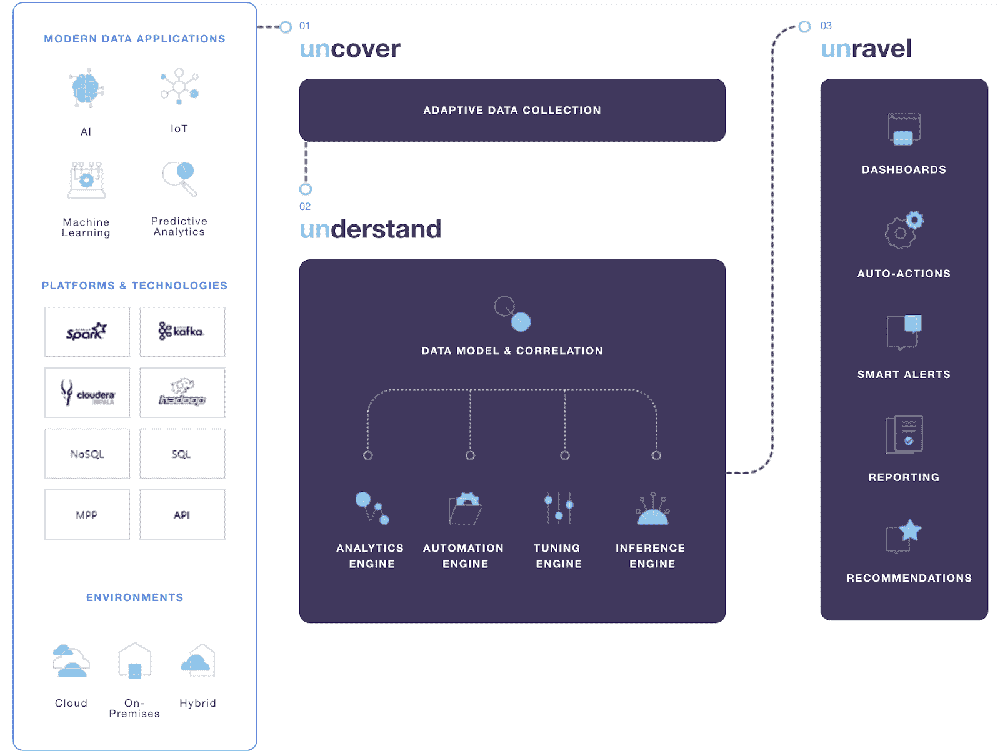

# 解开:系统架构师的数据操作指南

> 原文：<https://devops.com/unravel-a-system-architects-guide-to-data-operations/>

大数据是一个更古老的时髦术语，当它与敏捷方法、人工智能、人工智能和分析结合在一起时，在[数据运营](https://www.ciodive.com/news/5-trends-driving-big-data-in-2017/445239/) (DataOps)中再次成为一种强大的趋势。如果您是一名系统架构师，那么理解支持数据操作和改进数据驱动型应用程序的理念、优势和工具是有好处的。本文作为定义支持组织需求的企业架构的指南。

## 内部统计过程控制(SPC)

DataOps 宣言定义了一套指导系统架构师和实现团队的关键原则。总之，他们专注于客户和分析，通过持续改进流程推动积极的变革，这一流程依赖团队合作和自动化来帮助提高效率以及整体数据和系统质量。这是基于统计过程控制(SPC)，这是一种质量驱动的方法，使用数据和相关统计数据来监测、控制和改进系统和过程。从这个意义上说，质量意味着最大限度地延长应用程序的正常运行时间，提高对客户的有用性，减少交付时间和资源使用方面的浪费。

在 SPC 中，数据为王，大多数数据驱动的应用程序架构师在设计系统时都会经历一系列阶段。这些阶段包括:

*   **数据发现**:了解应用程序使用的数据源，以及识别关于您的应用程序及其环境的新数据源。这包括性能统计和其他系统和过程测量数据。
*   **数据关系**:从数据及其来源中，了解数据中的关系和隐藏价值是下一个阶段。这是大数据和分析的领域，您可以在其中搜索隐藏在数据中的商业意义，用于向客户扩展您的产品，同时增强和改善客户体验。
*   **数据监控**:这意味着您希望通过监控您的数据关键型系统(例如，数据馈送、数据库、分析等)来确保系统正常运行，但它也包括上述前两个阶段的自动化。

根据 SPC，性能数据用于确保您的系统及其流程稳定，正常运行时间和响应能力满足客户需求。为了实现这一目标，DataOps 的工作范围从您组织中使用数据和算法解决业务问题的数据科学家和业务分析师，延伸到使用数据(例如 ETL)并从中构建应用程序的数据库管理员和开发人员。

从这里开始，DataOps 让您深入了解价值发现，将其转化为新的方法和工具，并强调持续改进。工具和技术将帮助您自动进行数据挖掘，发现潜在的性能改进，确定提高效率和降低成本的领域，并为您未来的业务和架构需求做好准备。

## 利用数据运营:自动化是关键

建立反馈循环有助于实现整个数据流的自动化，从商业智能(使用工具来帮助数据分析流程)到数据科学(使用新的数学和架构方法来加深对数据的理解)，再到开发人员和运营人员(将数据汇总到应用程序中并进一步测量以通过该流程推动新价值的回归)。

自动化用于构建高效的反馈循环，而不会让您的 IT 员工负担过重。反过来，[自动化](https://devops.com/the-human-value-in-automation-driven-devops-testing/)工具不是用来取代你的分析师、数据科学家、开发人员或其他 IT 人员，而是用来增强他们的工作，让他们的工作更有效率。随着[数据生产和消费的持续增长](https://www.forbes.com/sites/bernardmarr/2018/05/21/how-much-data-do-we-create-every-day-the-mind-blowing-stats-everyone-should-read/#1ac41f6d60ba)，您的组织发现这些数据中隐藏价值并将其转化为实际系统改进的能力将成为一个关键的竞争优势。

## 人工智能驱动的数据操作

虽然数据可视化对有效的数据操作很重要，但显示图表和图片只能做到这一步。获得对指标的可行见解是推动性能和效率提高的动力。为了消除可能容易出错的手动方法来实现这一点，组织正在利用人工智能驱动的方法来进行数据操作。这有助于发现应用程序及其资源(例如，数据库和其他数据源)与其用户和需求之间隐藏的依赖关系，提供统一的可见性和运营智能来优化您的整个生态系统。

人工智能可以帮助您更深入地了解数据的有效性，超越运营效率，确定代码、整体系统架构以及云或数据中心的配置工具和框架的改进。更进一步，人工智能驱动的数据操作可以帮助您优化基于云的资源的消耗，或者在迁移到云时确定要迁移的关键组件(建议对部署进行更改)。

## 大趋势:云、微服务、无服务器和数据运营

作为一名系统架构师，您需要维护组织内使用的数据、系统和流程的全局视图，以便为您的客户提供最佳服务。这意味着您需要了解整个应用生态系统，以便交流和简化您的系统和数据操作。工具有助于提供和维护软件系统和数据工作流中组件之间的性能、交互和依赖关系的 360 度视图，以及支持它们的所有存储、计算和网络基础架构。

为了实现数据操作的价值并提高系统内数据和交互的可见性，采用更新的架构方法会有所帮助。例如，使用微服务方法拆分整体应用程序有助于推动整个技术生态系统的真正价值；它有助于改善开发团队的组成和速度，提高运营效率的好处，推动测试驱动的开发方法(因为这些服务更容易验证)，并有助于实现云部署。

其他方法，如使用容器和无服务器架构，有助于消除实现中的系统依赖性，减少部署更改对应用程序代码的影响。随着所有这些变化，没有应用程序的数据编排和工作流(在某些情况下，包括客户对这些数据的使用)变得更加明显和可衡量。

## 行动呼吁:利用工具和框架

DataOps 可帮助运营人员、应用开发人员和企业架构师降低交付可靠应用性能的复杂性。无论您是 DataOps 新手还是新手，了解有助于推动您的架构和运营控制的工具和框架都是成功的关键。来自[的工具解开了](https://unraveldata.com/platform/)(见图 1)提供了监控解决方案，映射了应用程序及其数据源之间的依赖关系，以及它们之间的所有组件。

Figure 1: DataOps tools such as the one from Unravel should support your existing implementation and technology choices, while supporting the three phases of DataOps work.

从业务所有者、IT 运营人员以及定义和构建系统的数据科学家和开发人员的角度来看，您使用的工具应该能够自动发现价值并进行优化。无论您使用什么平台、框架、语言和云提供商来支持您的应用程序和用户，所有这些都应该是可以实现的。最后，确保您的数据操作方法和工具能够在未来支持您的组织，支持整体架构和数据流程的持续改进。

*本文由[代表](https://unraveldata.com/)撰写。*

— [埃里克·布鲁诺](https://devops.com/author/eric-bruno/)