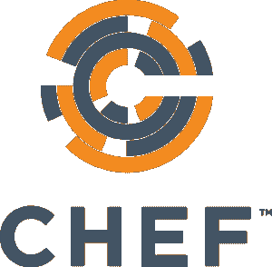
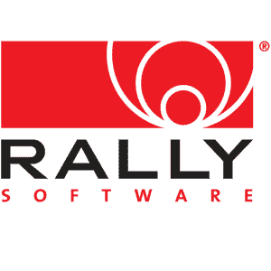

# 使用 DevOps 实现业务敏捷性 Rally Software 和 Chef 的网络研讨会

> 原文：<https://devops.com/using-devops-achieve-business-agility-webinar-rally-software-chef/>

我们将以一个真正的重磅炸弹开始我们的 DevOps.com 网络研讨会！加入厨师的科林·坎贝尔和拉力赛软件的乔纳森·昌西和杰夫·史密斯的讨论:

# **使用 DevOps 实现业务敏捷性**

### 在当今的数字经济中，领先的公司正转向软件来提供新的服务，以应对客户需求和竞争。技术可以实现并加速创新，但它需要业务领导者、软件开发人员和 it 运营团队围绕共同的目标以新的速度紧密合作，并能够灵活地根据客户需求和市场变化做出即时改变。在本次网络研讨会中，全球领先的企业级软件和服务解决方案提供商 Rally Software 将讨论其如何将 DevOps 制度化，以及如何使用 Chef 来支持其注重速度的方法来实现业务敏捷性。您将直接了解 Rally 如何自动化其虚拟化基础设施、加速应用程序开发和收紧客户反馈循环。

**日期和时间:**太平洋时间 9 月 4 日星期四上午 11 点/东部时间下午 2 点

## **报名地点:**

### 本次网络研讨会将由 DevOps.com 主办，由《DevOps.com》主编艾伦·希梅尔主持。演讲者包括:

*   ### Jonathan chauncey, developer of Rally Software Company. He has been engaged in Web application development for nearly 10 years, including 4 years in Rally. His technical interests include: automation, testing, clojure, Ruby and search.

*   ### Jeff Smith, development manager of Rally Software Company. He has been engaged in Web application development for nearly 20 years, including 11 years in Rally. His technical interests include: test automation, continuous deployment and infrastructure automation.

*   ### **colin campbell,** Chef Mode and Practice Director. For many years, he has been committed to advanced model-based testing and analysis techniques. He is currently involved in developing and documenting chef best practices and design patterns.

参加网上研讨会需要注册。可以在这里注册[。](http://devops.megameeting.com/registration/?id=1949-232488)

 