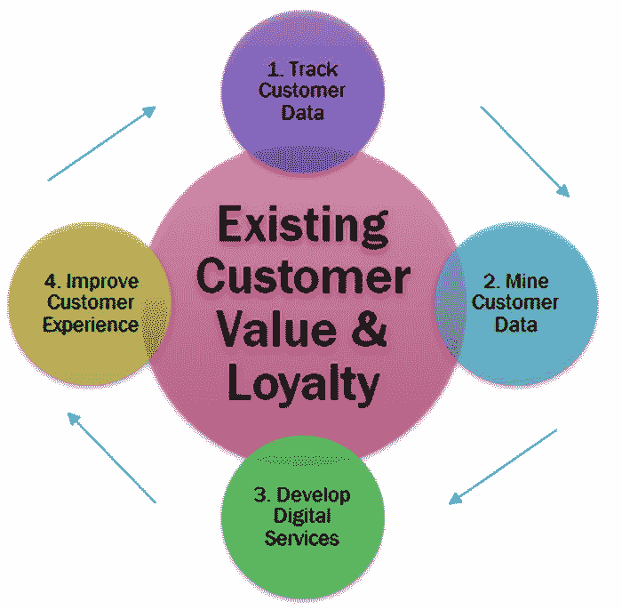
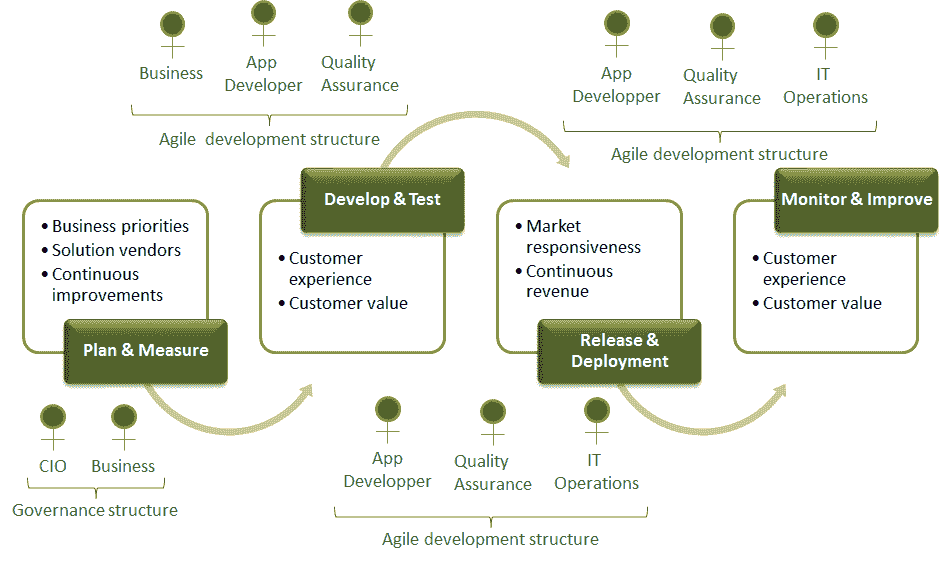

# 利用 DevOps 成为创新冠军

> 原文：<https://devops.com/using-devops-innovation-champion/>

创新越来越多地被认为是企业应对数字挑战所需的竞争优势，但却被广泛误解；它被错误地简化为技术或服务的复杂特性。

作为一个竞争问题，创新不止于此；它主要是将想法或发明转化为高价值技术特征或增值服务的过程。换句话说，要被称为创新，一项技术或服务必须满足特定的需求，并为客户创造价值。

DevOps 经常被视为使 IT 组织成为创新冠军的完美手段，这是真的。然而，许多首席信息官及其解决方案供应商和顾问未能实现这一目标，因为他们过度简化了流程。DevOps 是过程的一部分，而不是过程本身。DevOps 不是目的，而是手段。

在本文中，我分享了两个奇妙的概念——创新良性循环(IVC)和价值流——我们在 [ITaaSNow](https://www.itaasnow.com/) 利用这两个概念来实现开发运维，并在创纪录的时间内将 IT 组织转变为创新冠军。

## 用创新良性循环定义你的战略

让创新成为你组织的主要竞争优势并不像投资于最尖端的技术那样简单；它从定义您的战略开始，继续在您的 it 组织的价值流中实施它，最后在您的企业中采用它。

即兴创作和组织变革不是好朋友。依靠可靠的框架，一步一步安全地指导工作；这是 IVC 的目的——它促进并加速创新战略定义工作:

The Innovation Virtuous Circle (IVC)

IVC 的基本原则是，通过创新保持客户忠诚度可以保证持续的收入。这个想法是，越多的创新，越多的忠诚客户和越多的收入。

将您的业务和 IT 利益相关者召集在一起，讨论保持客户忠诚度的方法，以确保持续的收入。遵循 IVC 建议的步骤:

1.  阐明敏捷流程和实践、工具、技能和合作伙伴，通过这些工具、技能和合作伙伴，客户数据将被捕获和跟踪以用于分析目的。
2.  确定有助于发现创新想法、解决方案和技术的敏捷分析流程和实践、工具、人员、技能和合作伙伴。
3.  阐明确保高频率、高质量和快速创新交付所需的敏捷流程和实践、工具、技能和合作伙伴。
4.  确定有助于监控客户满意度和改善客户体验的敏捷流程和实践、工具、人员、技能和合作伙伴。

你从这一步得到的是一个全面的战略，包括要保持忠诚的目标客户，预计的预期收入以及实现这些目标的组织能力。

## 借助 DevOps 重新配置您的 IT 价值流

一旦您的创新战略被定义，下一步就是使用价值流框架在您的整个 it 组织中部署它。

价值流代表了增值互动、人员和技能、流程和实践以及在整个 IT 组织中动员起来以实现创新的工具:

The Agile IT Value Stream

它从概念上将 It 组织的价值流构建成一个四阶段的敏捷流程。每个阶段都与一个特定的目标相关联，并调动你的创新战略的特定元素。

同样，将您的业务和 IT 利益相关者聚集在一起，解决以下问题:

1.  对于**计划&衡量**，讨论您未来治理的结构、成员和角色、议程以及支持您基于分析的创新筛选和优先排序以及组合管理流程的工具和基础设施。
2.  关于**开发&测试**，就指派的人员、敏捷方法以及持续测试和集成基础设施达成共识，这将支持您的创新开发流程。
3.  关于**发布&部署**，讨论要指派的人员、您的发布管理和启动流程以及支持他们所需的持续部署基础设施。
4.  至于**监控&改进**，讨论要指派的员工、您的服务持续改进流程，以及旨在支持它们的分析技术。

您得到的是一份全面的、记录在案的蓝图，描绘了您的 IT 组织转变为 DevOps 的价值流。以此为基础，雇用解决方案供应商和咨询公司，他们将具体地重新配置您的 it 运营模式以进行创新。

## 包扎

使用 IVC、价值流和 DevOps 的概念来建立推动创新的 IT 运营模式是我们用来打造企业创新冠军的一种转型方法。

复制了本文中描述的组织转型方法的所有公司是:

*   每年推出 20 多种创新服务和产品
*   要么是他们收入的两倍或三倍
*   保持 98%的忠诚客户

这就是你的业务部门领导期望你作为首席信息官和你的 it 部门做出的贡献和影响。

——[菲利普·阿卜杜拉耶](https://devops.com/author/pabdoulaye/)