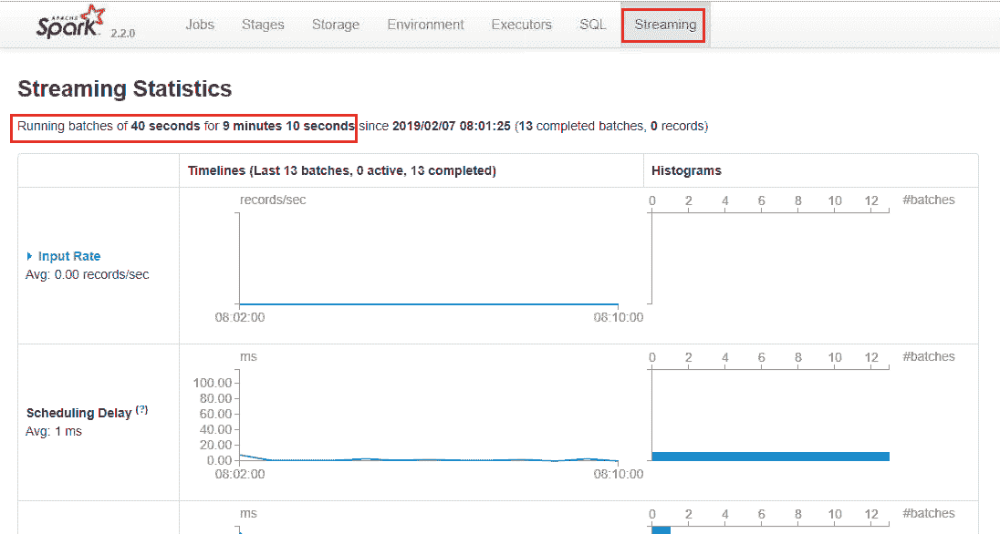
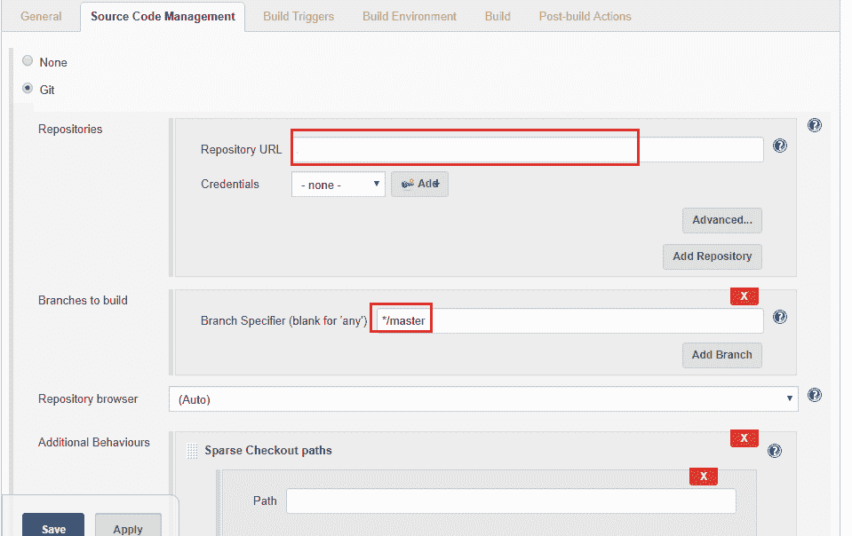
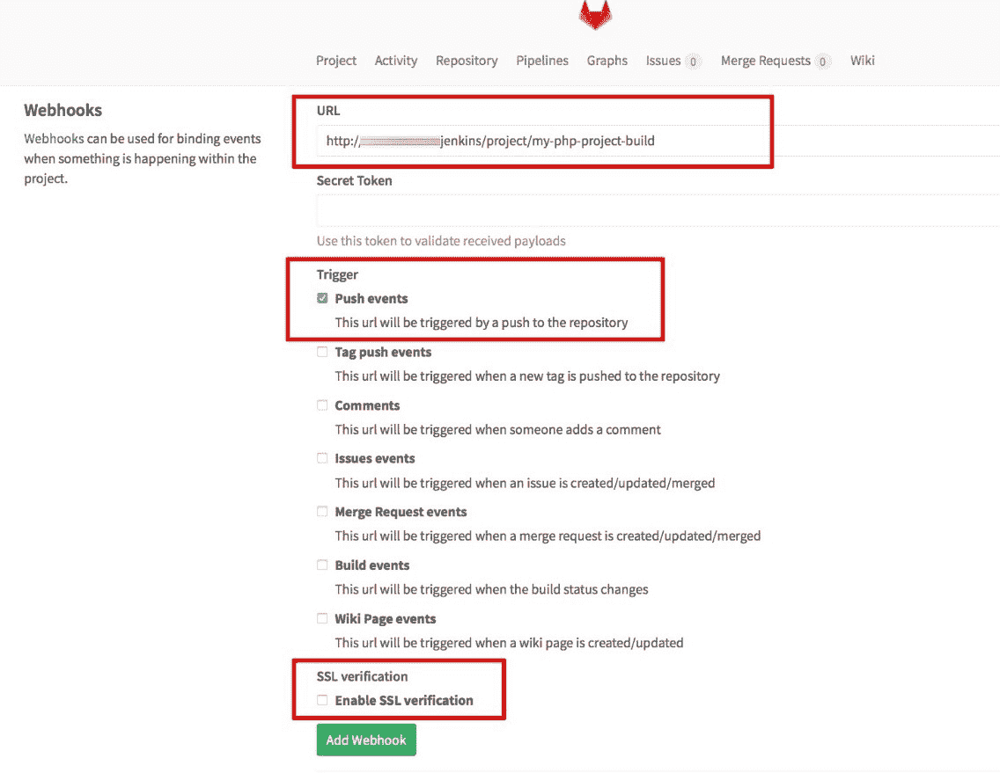
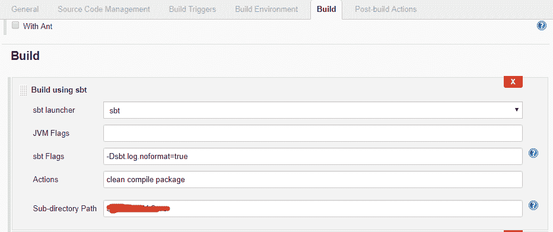
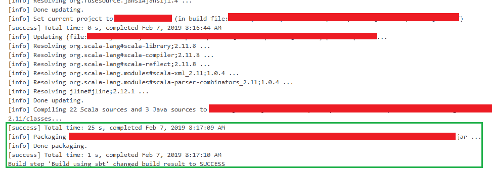
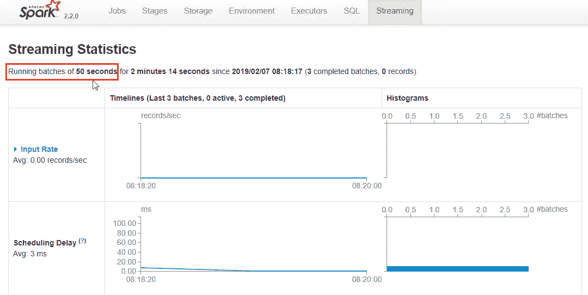

# 使用 Spark 和 Jenkins 将代码部署到 Hadoop 集群中

> 原文：<https://devops.com/using-spark-and-jenkins-to-deploy-code-into-hadoop-clusters/>

本文说明了如何使用 GitLab/Jenkins/Spark 应用程序将应用程序部署到 Hadoop 集群中。

在本文中，我们将涵盖以下内容:

*   在 Git 中提交代码时自动触发 Jenkins 构建。
*   通过詹金斯从仓库中取出最新的代码。
*   构建、编译和打包”。罐子”使用 SBT 工具。
*   正在上传。jar 到具有已定义版本的 Nexus 存储库。
*   将版本化的 jar 和相关文件从 Nexus 存储库拉至服务器。
*   正在部署版本”。jar "文件通过 Spark 作业导入 Hadoop 集群。

## **入门**

必须首先执行以下操作:

1.  下载并安装 Java 1.8。
2.  安装[詹金斯](https://www.digitalocean.com/community/tutorials/how-to-install-jenkins-on-ubuntu-16-04)。
3.  [整合 GitLab 和吉拉](https://docs.gitlab.com/ee/user/project/integrations/jira.html)。
4.  安装 [SBT](https://www.scala-sbt.org/1.0/docs/Installing-sbt-on-Linux.html)
5.  创建 Hadoop 集群: [Hadoop](https://dzone.com/articles/install-a-hadoop-cluster-on-ubuntu-18041) 和 [Spark](https://www.digitalocean.com/community/tutorials/how-to-install-apache-kafka-on-ubuntu-18-04) 。

## **详细的端到端步骤**

当开发人员将代码推送到 GitLab 时，Jenkins 会使用 webhooks 触发一个预定义的作业。

Jenkins 作业将使用 Git 从版本控制中提取代码；它构建代码并将包作为。jar 文件，使用构建工具 SBT。这个。jar 文件可以在 Spark 命令的帮助下部署到 Hadoop 集群中。

一旦在 Hadoop 集群中完成部署，应用程序将开始在后台运行。

最初，我们可以看到 Hadoop 中当前运行的应用程序(见图 1)。它有一个处于运行状态的应用程序 ID。

Figure 1

*   如果我们单击跟踪 UI，即 Application Master，它将导航到 Spark 流页面。

Figure 2

*   在图 2 中，我们可以看到批处理在 40 秒内运行。对于这个场景，我们将代码中的 40 秒。
*   当开发人员对代码进行更改时，他将在本地机器上提交并测试他的代码，然后推送到远程存储库。我已经把蒸的时间从 40 秒更新到了 50 秒。
*   如果我们可以在提交消息中指定吉拉任务号，那么吉拉任务中的相同注释将被更新，如下所示。

Figure 3

在吉拉应用程序中，我们可以看到提交消息的注释。

Figure 4

GitLab 和吉拉集成流程:

*   安装 Git 插件以从 GitHub 库获取代码，安装 SBT 插件以在 Jenkins 中构建一个. jar 文件形式的包。
*   在源代码管理下配置 Jenkins 作业，并提供存储库 URL 以及凭证和分支详细信息。

Figure 5

*   可选:设置 webhooks 在 GitLab 中发生推送时自动触发 Jenkins 作业。

Figure 6

*   在“build”部分，在 Actions 字段中添加参数 clean compile package，这将构建代码并创建一个. jar 文件。

Figure 7

*   在 Jenkins 中触发作业后，监控 Jenkins 控制台的下一步和错误(如果有)。

Figure 8

可选:如果我们配置了 sonar cube，它将分析代码文件并在 sonar cube 仪表板中提供结果。这可以让我们了解代码质量、代码覆盖漏洞和 bug，从而提高代码效率。

*   可选:为了维护版本，我们可以上传我们的*。jar 到 Nexus/Artifactory。
*   一次。jar 已经被创建，我们可以把它保存在一个特定的文件夹中，并触发一个 Spark 作业。这可以通过从 Jenkins 触发 Spark 命令来执行。执行以下命令提交 spark 作业:

| *#**spark-submit–name appName–master yarn–deploy-mode cluster–executor-memory 1g–driver-memory 1g–jars $(echo $ dependency jardir/*。jar &#124; tr ' ' ' '，')–class com . Coe . spotter . dq module–conf spark . driver . extrajavaoptions =../src/main/resources/log4j-yarn . properties–conf spark . SQL . warehouse . dir =。/spark-warehouse–conf spark . yarn . submit . waitappcompletion = false app。罐子* |

*   部署后，我们可以看到应用程序 ID 号增加了。

Figure 9

火花流作业的超时时间增加到了 50 秒。

Figure 10

— [诺达加拉·纳加尔朱那](https://devops.com/author/nodagala-nagarjuna/)