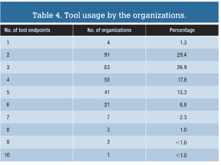

# 价值流管理:把你的管道当作你最重要的产品

> 原文：<https://devops.com/value-stream-management-treat-your-pipeline-as-your-most-important-product/>

当谈到加速客户价值时，只关注数字产品的开发和交付是危险的。对于许多企业来说，大部分时间都是在编写一行代码之前投入的。这解释了最近对[价值流管理](https://go.forrester.com/blogs/value-stream-management-tools-unlock-agile-plus-devops-potential-takeaways-from-the-forrester-wave/) (VSM)的关注——它迫使我们超越[敏捷和 DevOps](https://devops.com/?s=Agile%20and%20DevOps) 来思考，并考虑整个系统，而不仅仅是复杂流程中的一个阶段。

通过将我们的可见性进一步扩展到工作开始的上游，我们可以开始衡量端到端地创建和保护工作流的价值，以更快地实现业务成果。思考软件交付工作如何在价值流中从请求到操作的所有团队之间移动，会让我们意识到我们的工具管道是我们最重要的产品，我们应该这样对待它。

## 价值流管理的兴起

软件交付中价值流管理的增长已经出现，因为敏捷和 DevOps 不足以在技术寡头垄断的危险速度下保持竞争力。逐渐成熟的实践采用系统化的方法来持续测量和改进端到端流程，以加速价值实现。因此，随着我们对如何更快地协作和工作进行端到端的思考，以及对我们的生产力和效率进行衡量，新的工具正在出现。

测量和理解端到端的流量并不容易。软件交付是高度技术性和创造性的知识工作，可以跨越成千上万的 IT 从业者。信息分散在由特定学科工具组成的异构工具链中。事实上，一些 [42%的大型软件交付组织使用 4 到 10 个核心协作工具](https://ieeexplore.ieee.org/document/8354424)用于项目组合管理、设计、企业敏捷规划、测试和 ITSM，以及几十个额外的工具来支持 CI/CD 管道和操作。^()

Mik Kersten, “Mining the Ground Truth of Enterprise Toolchains, IEEE (Volume 35, Issue 3, May/June 2018, p12-17

因此，度量流程包括追踪价值创造和保护的组成单元，因为它们以工件的形式遍历所有团队工具，例如活动、能力、史诗、特征、故事、错误和事件。然而，长期以来，我们一直过于关注价值流的“右侧”,考虑如何通过敏捷和 DevOps 工具构建和交付产品，而不了解如何请求、分析、处理和设计产品。我们支持客户的能力受到了阻碍，因为我们不知道开发之外的工作在哪里以及为什么会变慢。我们的产品渠道被打破了，我们的可见性破裂了。

**一条“断裂”的产品管道**

传统上，CI/CD 工具包括源代码管理、构建、部署、质量管理和服务管理。再往右，是发布管理和服务管理。但是组织经常忽略集成工具，例如规划和投资组合管理、产品管理、需求管理和风险管理(静态和动态安全扫描工具)。这影响了我们观察和测量端到端流量的能力。

在“ [Accelerate](https://itrevolution.com/book/accelerate/) ”中，交付周期被定义为从(上一次)代码提交到部署的价值流部分。虽然这对于改进是必不可少的，但它只涵盖了从构建到部署的时间。我们需要考虑它到达开发人员的 backlog 之前所经过的时间。为了将 IT 从项目转移到产品焦点，您需要通过“左移”在交付生命周期的早期进行度量来减少端到端的流程时间因此，你需要在构思、创建、发布和运营阶段的整个价值流中使用工具。只关注优化 CI/CD 工具和实践是过于狭隘的观点，会随着时间的推移产生递减的回报。

**IT 和业务之间的巨大脱节**

由于缺乏整体视图，IT 团队觉得他们无法影响业务方面，而大部分工作进展(WIP)都是从业务方面开始的，例如对功能或应用程序更改的请求。这些引入过程很多时候会导致团队承担过多的 WIP 而忽视工作。许多团队需要“停止开始”和“开始完成”来更快地交付商业价值。至关重要的是，在这个领域，商业领袖有他们自己的流程，并且不太可能使用工具；这是一个由电子表格、文档和 PowerPoint 演示文稿主宰的世界。这是工作最不可见和最不可测量的地方。这正是我们需要 VSM 的地方:从客户需求开始打开灯，这样我们就可以不断改善端到端的流程。这需要 IT 和业务/产品所有者的文化转变。这需要对业务领域的工具和实践采取更广泛、更全面的观点。

**流程架构**

端到端的集成管道产品可以针对流程进行设计。例如，用于可视化系统管理的工具(如吉拉、Azure DevOps)越来越成为一种商品，真正的区别在于它们如何与用于项目组合、缺陷和服务管理的工具集成，因为这些是工作的来源，这些工作将流入基于产品的团队，用于开发商业价值和计划外的工作。团队应该考虑他们如何能够在持续的流程(和资金)上与业务组合团队更紧密地合作，因为最终这项工作将成为在加速业务交付能力的旅程中需要解决的下一个瓶颈。

**关注价值保护工作**

借助对整个管道中工作的端到端可见性，您可以将关联的技术数据抽象为总体价值流指标(称为流程指标)，以确定在哪些领域进行实验来改善端到端流程。在这里，我们不能只关注创造价值的工作，也要保护价值。

我们应该为我们的软件交付团队提供心理安全，以投入时间来解决债务和被忽视的工作。债务拖累了特性开发速度，因为变更变得更加复杂，需要更长的时间来完成。此外，随着技术债务的增加，更多的时间花费在解决缺陷上，这使得执行特性工作的能力变得匮乏。随着债务的增加，观察到以下情况:

*   流速降低。
*   流动时间增加。
*   随着代码库变得更加脆弱/成本增加，质量会下降。

所有这些都会降低客户和团队的幸福感，增加团队倦怠的风险。有许多这方面的警示故事，市场领导者由于对技术债务的忽视而最终失去了相当大的市场份额。这些故事举例说明了为什么有必要观察流程分布，以确保与产品所有者一起制定优先级决策，包括提供必要的能力来解决技术债务。

将价值流架构的概念应用到您的端到端管道中，是那些试图度过像今天这样的破坏性时期的组织的关键区别，因为新冠肺炎扩大了那些已经大规模掌握软件并正在蓬勃发展的人与许多努力在数字优先的环境中转向和适应的企业之间的差距。