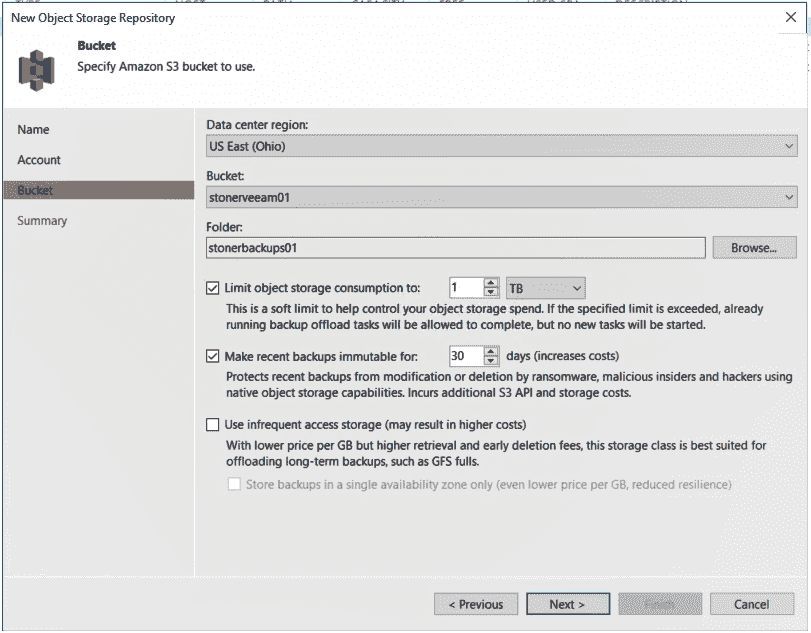

# Veeam 更新备份和恢复平台

> 原文：<https://devops.com/veeam-updates-backup-and-recovery-platform/>

Veeam 今天宣布了 Veeam 可用性套件的[版本 10 的正式上市，在 150 多项增强功能中，增加了对网络连接存储(NAS)系统的支持、通过在云中创建不可变备份的能力提供的额外勒索软件保护、同时恢复多个虚拟机的能力以及一组用于挖掘数据的应用程序编程接口(API)。](https://www.businesswire.com/news/home/20200218005560/en/Veeam-Releases-Generation-Data-Backup-Highly-Anticipated)

Veeam 首席技术官兼产品战略高级副总裁 Danny Allan 表示，IT 组织正在寻找更高效的数据保护方法，因为一天中已经没有足够的时间来备份数 Pb 的数据。

Allan 说，Veeam 现在能够备份驻留在 NAS 系统中的大量非结构化数据，只需用 NAS 平台上数据的最新更改来更新主备份文件。他指出，这种方法还降低了成本，因为它大大减少了需要通过网络复制的数据量。

与此同时，Allan 表示，备份和恢复平台在打击勒索软件的战斗中发挥着更具战略性的作用。Veeam Availability Suite v10 用户可以创建数据的不可变副本，该副本可以驻留在任何支持由 Amazon Web Services (AWS)定义的 S3 API 的平台上。该产品被称为 S2 对象锁，其开发目标是创建数据集的原始图像，在网络犯罪分子或恶意内部人员利用勒索软件攻击来加密组织数据的情况下，可以恢复该图像。

此外，Veeam 正在努力降低灾难恢复成本，使其能够在数据中心停机时同时恢复多个虚拟机。

最后，API 现在使分析应用程序能够访问使用 Veeam 可用性套件存储的数据。

刚刚被风险投资公司 Insight Partners 以 50 亿美元收购的 Veeam 正在扩展其备份虚拟机的核心能力，以创建一个跨多个云的数据管理平台。Allan 说，目标是创建一个跨混合云计算环境管理数据的平台。

随着组织现在例行管理数 Pb 的数据，备份和恢复供应商之间的竞争空前激烈。每个备份和恢复工具提供商都在某种程度上演变为数据管理平台，这一过程在很大程度上始于 IT 团队开始使用备份工具将大量数据迁移到公共云中。现在，这些工具的提供商看到了一个机会，让 IT 团队不仅可以将数据移入和移出云，还可以在云之间移动数据。

现在说这场战斗将如何结束还为时过早。备份和恢复是少数拒绝整合的软件类别之一，即使新的创业公司定期推出。对于大多数 It 组织来说，采用来自不同供应商的多种备份和恢复工具并不罕见。不太清楚的是，使用多种工具的趋势会持续多久，但是随着每个备份和恢复工具都增加了新的功能，其他工具继续证明其价值的压力也在不断增加。

— [迈克·维扎德](https://devops.com/author/mike-vizard/)