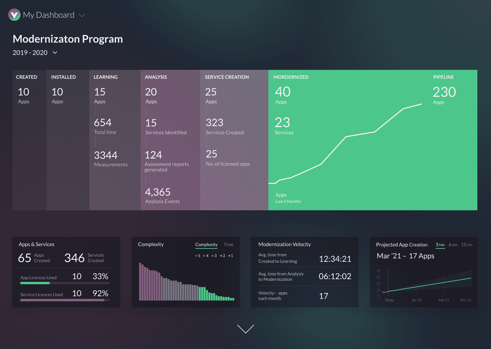

# vFunction 自动将 Java 应用转换为微服务

> 原文：<https://devops.com/vfunction-automates-conversion-of-java-apps-to-microservices/>

[vFunction 开发了一个同名平台](https://www.globenewswire.com/news-release/2021/02/02/2168090/0/en/vFunction-Unveils-the-First-and-Only-Platform-Purpose-Built-for-Automated-Intelligent-and-Scalable-Cloud-Native-Modernization.html)，能够将 Java 编写的单片应用自动转换成一组[微服务](https://devops.com/?s=microservices)。这家初创公司今天正从隐形模式中脱颖而出。

刚刚筹集了 1220 万美元的种子资金，vFunction 首席执行官默蒂·拉法林表示，该公司的平台采用动态分析、静态分析、数据科学和自动化，使 IT 团队能够以可重复的方式重新设计用于创建整体 Java 应用程序的源代码。

作为该过程的一部分，vFunction 还会检测并消除不再执行的代码，以减少应用的占用空间，最大限度地降低安全风险和整体维护任务。

vFunction 平台被部署为一个服务器，它与注入到传统单片应用程序中的代理软件进行通信。Rafalin 说，服务器然后创建一个微服务，由其他工具扫描，以确定如何最佳地优化它，以便在例如基于 [Red Hat OpenShift](https://devops.com/?s=Red%20Hat%20OpenShift) 平台的 Kubernetes 集群上运行。

IT 团队还可以使用 vFunction 来确定哪些单片应用程序更适合转换为一组微服务，这些微服务可以自动提取到单独的可编译项目中。每个项目都有一个估计的完成时间表，可以通过平台提供的现代化工厂仪表盘和应用复杂性评估工具进行访问。

Rafalin 说，大多数单片应用程序是由大量“意大利面条式代码”组成的，这些代码是由不同的开发团队经过多代人添加的。Rafalin 说，作为重构遗留应用程序工作的一部分，手动分析代码将需要数周的努力。因此，大多数组织重新设计应用程序的速度非常慢，他说。

事实上，it 组织开始这样做，但很快就放弃了，因为所需的时间和精力成本太高，这种情况并不鲜见。vFunction 声称其自动化、领域驱动的流程将手动重构的速度提高了 10 倍，从而为每个应用程序节省了 30 万至 50 万美元。

vFunction 的定价基于每个应用的模型。该公司还与 HCL Technologies、Tata Consulting Services 和 Wipro 等系统集成商建立了联盟，这些集成商经常与 IT 组织签订合同来重构他们的应用程序。

当然，并不是每个单片应用都需要转换成一组微服务。然而，大多数单片应用程序都有更容易维护和支持的组件，作为一个独特的微服务。总体而言，组织正在采用微服务来构建更具弹性的应用。在一个微服务变得不可用的情况下，对服务的请求被重新路由到另一个微服务，以确保应用适度降级，而不是完全崩溃。挑战在于，随着时间的推移，数百个微服务之间可能存在的依赖关系可能比那些被取代的整体应用程序更难管理。