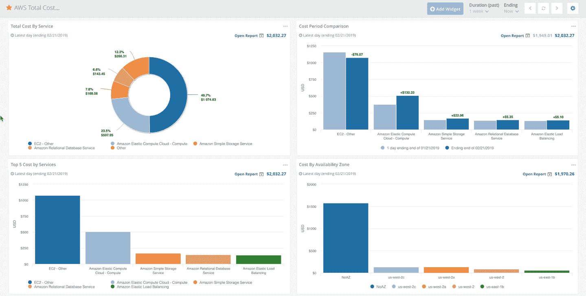

# 虚拟仪器公司收购 Metricly 来监控云成本

> 原文：<https://devops.com/virtual-instruments-acquires-metricly-to-monitor-cloud-costs/>

虚拟仪器公司[收购了 Metricly](https://www.virtualinstruments.com/press/virtual-instruments-expands-cloud-monitoring-and-analytics-portfolio-with-acquisition-of-metricly/) ，这是一家软件即服务(SaaS)应用程序提供商，帮助组织优化云应用程序工作负载的部署。

虚拟仪器产品高级副总裁蒂姆·范·阿什(Tim Van Ash)表示，Metricly 采用机器学习算法来识别提高性能和降低成本的机会。这些功能补充了虚拟仪器公司现有的虚拟智慧平台，以应用机器学习算法来优化 IT 运营，也称为 AIOps。

Virtual Instruments 专注于增强存储 I/O 性能，然后将其产品组合扩展到服务器性能。Van Ash 说，通过收购 Metricly，该公司进一步扩展了产品组合，以跨越混合云计算环境。

Metricly 原名 Netuitive，提供专注于帮助组织控制云成本的分析工具。

Metricly 首席执行官 Bob Farzami 表示，随着云中部署的应用程序数量的增加，该公司的工具越来越多地通过应用程序编程接口(API)整合到 DevOps 流程中，以提供成本可见性。对 Metricly 的收购为虚拟仪器监控产品组合增加了 50 多个开源 DevOps 技术集成，该产品组合涵盖数据库、消息平台、容器和云基础设施服务，如 AWS Lambda、EC2、ECS、ASG、EMR、Microsoft Azure VMs 和负载平衡器。

Farzami 说，这些集成至关重要，因为随着 AWS 上可用服务数量的增加，组织对其真实云成本的可见性变得更加难以辨别和限制。AWS 上已经有几百个云服务了。云服务提供商经常指望组织忘记他们已经启动了多少个实例，例如，在月底收到一份意想不到的账单。随着组织更加积极地采用多种云平台，这些问题将进一步加剧。

随着有状态应用程序动态访问的数据量的增加，许多组织也看到了云成本的增加。一旦这些成本达到一定水平，这些组织就会意识到，将这些应用程序迁移回内部 it 环境的成本会更低。Metricly 提供了一种机制，通过这种机制，组织可以更加实时地了解他们的云成本，还可以确定何时将达到特定的成本阈值。

至少还需要 5 到 10 年的时间，大多数应用程序工作负载才会在云中运行。10 多年后的今天，只有大约 20%的应用程序工作负载运行在公共云中。组织仍然喜欢内部 IT 环境的原因有很多，从法规要求和性能到网络安全和简单的惰性。然而，无论工作负载最终部署在哪里，DevOps 团队可以指望的一件事是，财务组织中的某个人很快会提出更尖锐的问题，即运行该工作负载需要多少成本。

— [迈克·维扎德](https://devops.com/author/mike-vizard/)