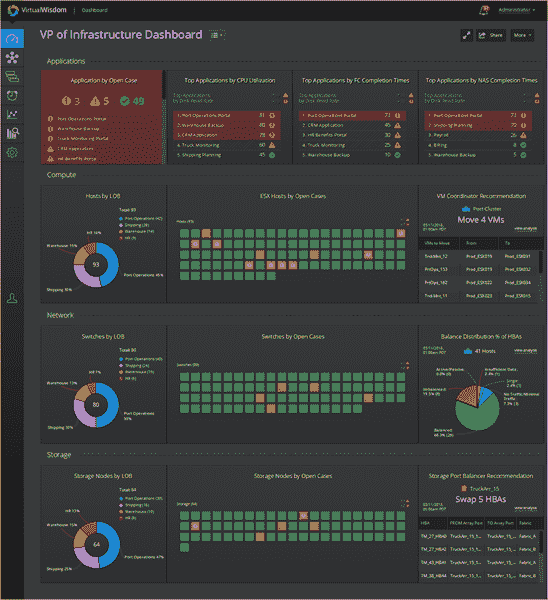

# 虚拟仪器扩展了 AIOps 平台的范围

> 原文：<https://devops.com/virtual-instruments-extends-scope-of-aiops-platform/>

虚拟仪器扩展了其 AIOps 平台的范围，增加了应用服务保证、预测性容量管理、工作负载基础设施平衡以及问题解决和避免能力。

基于机器学习、统计分析、启发式和专家系统技术的结合， [VirtualWisdom](https://globenewswire.com/news-release/2018/10/23/1625509/0/en/Virtual-Instruments-Brings-an-End-to-Costly-IT-War-Rooms-with-Next-Generation-of-VirtualWisdom-Hybrid-Infrastructure-Management-Platform.html) 旨在使开发运维团队能够应用分析来近乎实时地解决问题，而不是召开“作战室”

虚拟仪器公司的首席营销官 Len Rosenthal 说，整个作战室的概念在 DevOps 时代已经过时了。每次出现问题时，VirtualWisdom 不会浪费时间让 IT 组织内的各个部门聚在一起为无辜者辩护，而是立即识别问题的可能来源。

他补充说，最新发布的 VirtualWisdom 增加了预测功能，可以识别工作负载平衡机会，旨在从一开始就防止问题出现。

作为将 AIOps 融入 DevOps 流程的持续努力的一部分，除了增强对思科旗下 AppDynamics 的 APM 工具的现有支持外，VirtualWisdom 的最新版本还增加了与 Dynatrace 的应用性能管理(APM)工具的集成。

VirtualWisdom 现在还能够收集 Linux 和 Windows 操作系统，以及亚马逊网络服务(AWS)或微软 Azure 上生成的指标。在 NAS 性能探测中现在还有 iSCSI 有线数据监控支持，它补充了现有的 NFS 和 SMB 监控功能。

Rosenthal 说，应用程序开发和部署的速度很快将迫使大多数组织考虑 AIops 问题。他指出，随着这些应用程序在混合云计算环境中变得更加分散，任何单个 it 团队都不可能手动跟踪所有可能对其所有应用程序产生负面影响的依赖关系。

虽然在这一点上对人工智能(AI)的依赖增加几乎是不可避免的，但尚不清楚 it 组织本身将在多大程度上因此而重组。大多数组织都采用 DevOps 来弥合 IT 运营和应用程序开发团队之间的分歧。但是，随着对专门的计算、存储和网络专家的需求下降，他们的 IT 运营团队中的许多孤岛可能很快就会自动消失。在某些情况下，开发人员已经在利用应用程序编程接口(API)来承担对 IT 基础设施的端到端控制。随着人工智能继续自动化更多的机械 IT 操作任务，这种情况可能会变得更加普遍。

这并不意味着不需要有人来设计支持大规模应用所需的 IT 运营工作流。但这确实意味着许多较低级别的管理员任务可能很快就会大幅减少或完全取消。IT 组织很快将面临的挑战是重新培训这些管理员，以处理超出使用人工智能可能自动化的任务。

与此同时，各组织将继续对人工智能进行实验。并非每个组织都对人工智能感到满意，不会将控制权移交给许多人仍然认为是“黑匣子”的东西，它不能提供对这些自动化流程的任何可见性。但随着更多的可见性的提供，人工智能平台控制 it 环境只是时间问题。

— [迈克·维扎德](https://devops.com/author/mike-vizard/)