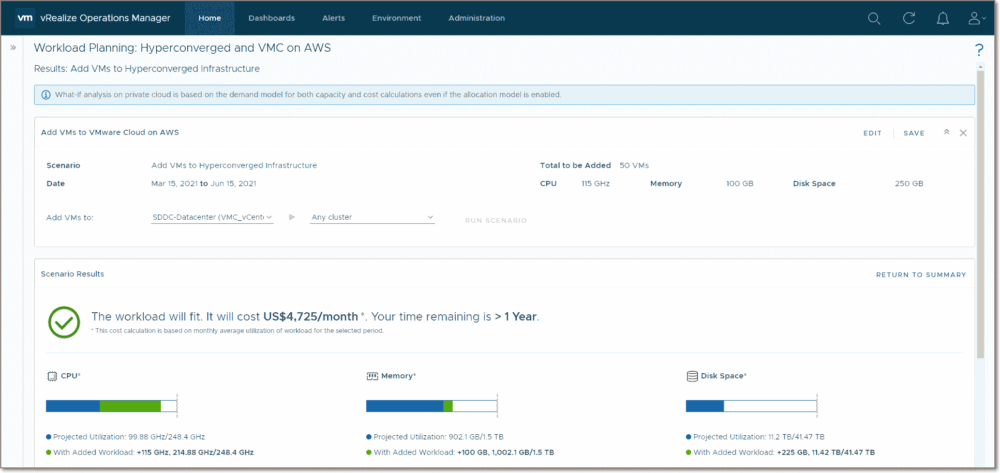

# VMware 增强管理产品组合

> 原文：<https://devops.com/vmware-enhances-management-portfolio/>

VMware 今天对其自动化和监控产品组合推出了一系列[更新，作为简化高度分布式 IT 环境管理的持续努力的一部分。](https://www.vmware.com/content/vmware/vmware-published-sites/us/company/news/releases/vmw-newsfeed.VMware-Broadens-Multi-Cloud-Management-Support-to-Address-Customer-Flexibility-and-Choice.9abec03a-b90f-4157-8bd7-c0b71115388e.html)

VMware vRealize Cloud automation 产品组合的更新包括 VMware vRealize Automation 8.4 与开源 Salt automation 框架的更紧密集成，该框架是该公司去年通过收购 SaltStack 而获得的，此外还有一系列用于调配和管理在 Google Cloud、Microsoft Azure 和 VMware Cloud on Amazon Web Services(AWS)上运行的 VMware 软件实例的工具。

还有一套工具可帮助运行 NSX VSP here 网络虚拟化软件的组织迁移到 NSX T，这是一种可在任何地方部署的网络虚拟化软件实例。

与此同时，VMware vRealize Operations 正在更新，以支持总共 57 种 AWS 服务，并能够预测在 AWS 上部署 VMware 云的成本。后一种功能包括跟踪通过关闭空闲或未使用的虚拟机以及快照、孤立磁盘和超大虚拟机所产生的潜在节省。现在还有十个额外的仪表板用于跟踪各种成本，包括投资回报、总拥有成本和潜在的成本节约。IT 团队还可以更轻松地跟踪 AWS 上的容量利用率趋势。

VMware 增加了对开源 Telegraf 代理的支持，使 IT 团队能够从任何平台收集指标，此外还提供了对 VMware vRealize Log Insight 8.4 和 vRealize Log Insight Cloud 的更新，使这些监控工具能够更高效地存储从多个云服务收集的数据。IT 团队也将能够从微软 Azure 和 AWS 收集日志。

最后，VMware 正在扩展其网络监控工具，以提供跨多个云的更大可见性。

VMware 高级副总裁兼云服务总经理 Fidelma Russo 表示，自从新冠肺炎疫情开始以来，IT 团队使用 VMware 管理和可观察性工具的软件即服务(SaaS)版本(即[成熟的托管服务](https://digitalanarchist.com/videos/featured-guests/joshua-lory-techstrong-tv))的比率急剧增加，因为 IT 团队在家中管理内部部署和 VMware 软件的云实例。

目前尚不清楚有多少 VMware 客户群正在使用该公司的自动化和监控工具，但随着部署在公共云上的 VMware 实例数量以及内部 It 环境的增加，管理挑战也在增加。IT 团队通常必须做出的选择是，在针对特定平台优化的自动化和可观察性工具与采用工作范围更广的框架之间做出决定。随着 Salt 的收购和对 Telgraf 的支持，VMware 显然正在将其管理产品组合的范围扩展到自己的软件之外。

与此同时，IT 团队不仅需要管理更复杂的 IT 环境，还希望通过自动化，他们能够更有效地实施成本控制。这发生在许多组织对 IT 总成本还不太敏感的时候。当然，挑战是那些组织被要求今天在自动化上花钱，希望明天因为它而花费更少。