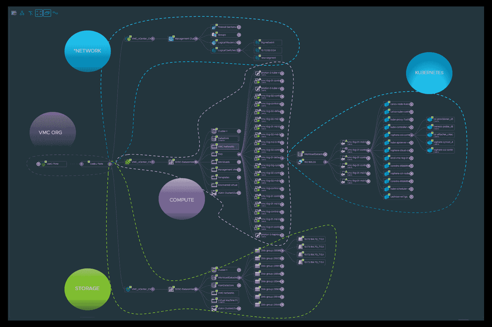

# VMware 扩大了 IT 管理产品组合的范围

> 原文：<https://devops.com/vmware-expands-reach-of-it-management-portfolio/>

VMware 今天宣布了对其 IT 管理工具组合的一系列更新，这些工具现在是其整体开发运维方法的核心。

VMware vRealize Operations 8.2 和 VMware vRealize Operations Cloud 是同一个 IT 自动化平台的内部版本和软件即服务(SaaS)版本，为 Kubernetes 发行版提供了更深入的支持，包括 VMware Tanzu Kubernetes 网格，以及与 AppDynamics、Datadog 和 Dynatrace 的应用性能管理(APM)平台的更紧密集成。

VMware 还提供了与其 VMware vRealize Network Insight 的更紧密集成，以弥合 IT 与网络运营和工具之间的鸿沟，从而更好地监控在 Amazon Web Services (AWS)公共云上运行的 VMware 软件实例。

VMware 作为平台的一部分对容量和成本管理工具进行了增强，包括更深入地了解日常虚拟机(VM)成本、增强的计量功能以及对非 VMware vRealize Automation 工作负载的支持。

与此同时，VMware 正在对 VMware vRealize Automation 和 VMware vRealize Automation Cloud 进行更新。VMware automation platform 的最新更新增加了对 VMware 云模板的支持，这是一种将基础架构作为代码进行管理的方式，与使用 Terraform 工具创建的配置兼容。

其他增强功能包括通过服务目录自助配置 Kubernetes 命名空间，包括支持 VMware vSphere with Kubernetes，以及更精细的基于角色的访问控制和应用程序编程接口，通过这些接口可以应用 VMware NSX 网络虚拟化软件的策略。

对 VMware vRealize Log Insight 和 vRealize Log Insight Cloud 的更新增加了增强的 Kubernetes 支持、与 VMware Cloud on AWS 的更深入集成以及其他可用性增强。

最后，VMware 正在简化 VMware Skyline 的入职流程，这是一款预测分析工具，该公司将其作为其运营管理产品组合的扩展。

VMware 产品营销高级总监 Ken Lee 表示，VMware vRealize Cloud Management 产品组合正在不断发展，传统 it 管理员和开发运维团队都可以使用它。他说，平台中的每个功能都可以通过图形用户界面或应用编程接口(API)调用。

他说，与此同时，VMware 正在整个产品组合中注入机器学习算法来支持 AIOps，从而消除了 IT 组织为采用 AIOps 或采用最佳 DevOps 实践而购买单独的 IT 管理平台的需要。

虽然采用 VMware 虚拟机软件的 IT 组织数量达到了数十万，但采用其 IT 运营平台的组织数量仍以百计。就与那些客户的关系而言，该公司显然享有优势。但是，很明显，依赖 VMware 提供的工具以外的工具来管理其环境的 it 组织数量很大。

然而，随着 IT 组织寻求实现这些 IT 环境的现代化，VMware 显然有机会获得额外的吸引力。挑战在于，将 AI 和 DevOps 实践嵌入 IT 运营平台的竞争已经相当激烈。