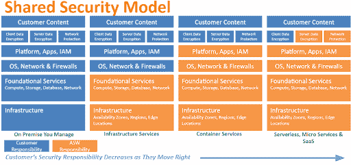
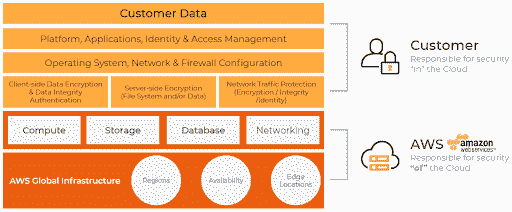
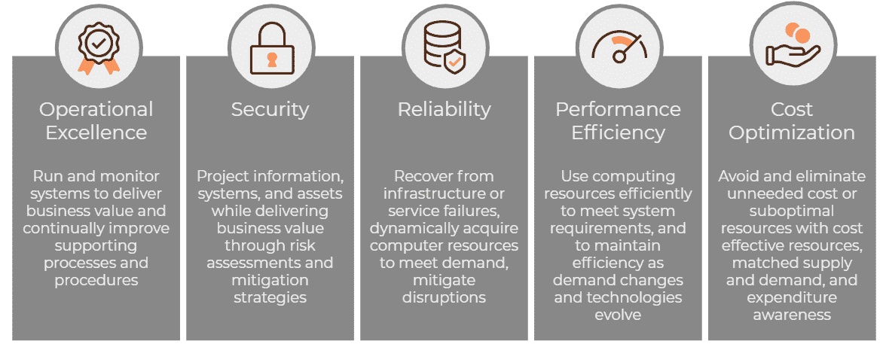
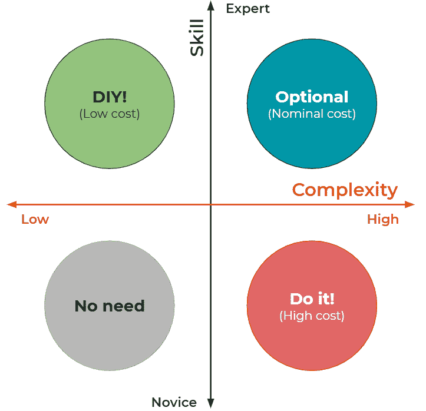
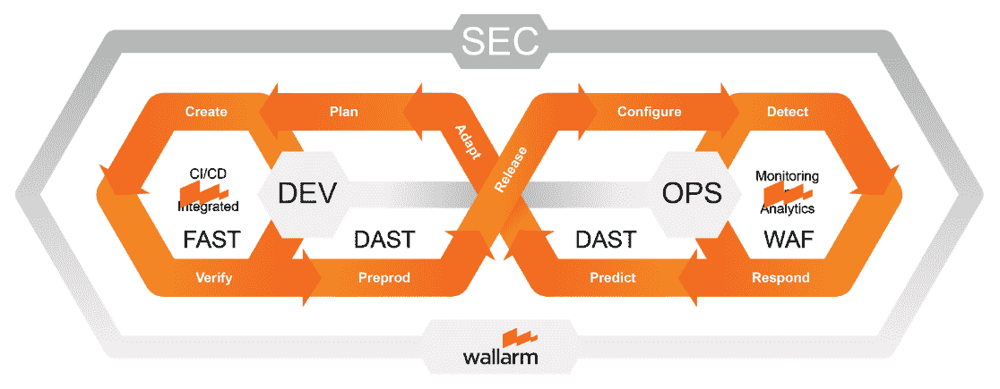

# 在 AWS 中打一场胜仗

> 原文：<https://devops.com/waging-a-winning-war-in-aws/>

在所有其他针对使用亚马逊网络服务(AWS)的企业的安全建议中，有一个响亮的口号:“开战。”WAR 是一个缩写词，意思是架构良好的评审。对于 AWS 团队及其合作伙伴来说，这是一种减轻实际风险的强大而主动的方法。如果你正在使用 AWS(或者正在考虑),考虑将 WAR 添加到你的安全武器库中。这是一个保守得很好的秘密，开始在云行业扩散，原因在阅读本文后你会发现显而易见。

## **AWS 推广共担责任模式**

谈到云环境，所有云服务提供商(CSP)经常听到和使用的一个通用术语是“共同责任模式”这种模式通常规定了与任何潜在 CSP 的主服务协议条款，无论是软件即服务(SaaS)、平台即服务(PaaS)还是基础设施即服务(IaaS)模式。目标是明确识别和建立 CSP 和云消费者之间共享的安全责任。

作为安全专家， [Wallarm](https://wallarm.com) 为共同责任模式的倡导者。云提供商不可能为您提供 100%的安全性，例如保护您客户的数据和访问(您可以在下面的 AWS 共享安全模型中看到这一点)。让 CSP 和云消费者都采取强有力的防御措施，对应用和 API 安全性也有巨大的好处。AWS 和其他云基础设施上的所有客户都应该成为其云安全的主动代理。(参见 [使用 Wallarm](https://wallarm.com/resources/aws) 保护 AWS 上的应用程序)。)

此视觉图像描述了共同责任是如何分配的:

## **首先是面向 AWS 云架构师的架构良好的框架**

AWS 开发了 [架构良好的框架](https://d1.awsstatic.com/whitepapers/architecture/AWS_Well-Architected_Framework.pdf) 来帮助云架构师为他们的应用构建安全、高性能、弹性和高效的基础设施。该框架基于五大支柱——卓越运营、安全性、可靠性、性能效率和成本优化——为客户和合作伙伴评估架构和实施可随时间扩展的设计提供了一致的方法。

AWS 架构完善的框架方法建立在共同责任模型的基础上，该模型有助于消费者和提供商真正理解他们的责任部分，如下图所示。

该框架不仅仅是 AWS 的架构工具。它被设计成一种生活方式和看待你的架构的方法，以确保弹性和一致的结果。

良好架构的框架是 AWS 不断更新的一套活的最佳实践。每当你想开始新的东西或改变一些东西时，用这五个支柱来评估你的提议。这就是战争爆发的原因。

## **走近云安全之战**

WAR 是一种审查您的架构的系统方法——无论是已经在 AWS 中，在本地，甚至在其他云提供商中。《战争》目前是一套 46 个问题的游戏，由于这是一套活的方法论，所以问题的数量可能会有变化。它与提到的五大支柱保持一致:

*   安全。
*   可靠性。
*   性能效率。
*   成本优化。
*   卓越运营。

回答战争问题有助于识别哪些领域属于三类:

*   设计良好的。
*   需要改进。
*   关键问题。

应立即补救关键问题。这些事情包括不对您的帐户使用多因素或向公众公开数据。需要改进的项目应在三到六个月的时间内进行检查。

AWS 建议您定期(至少每 6 到 12 个月)对每个关键工作负载执行这些审查。即使今天被认为是架构良好的项目也可能由于您环境的变化或取代您今天做事方式的新选项而改变。

## **如何为 AWS 开战**

在您考虑对 AWS 开战之前，有两个关键因素必须考虑:

1.  架构复杂性。
2.  技能等级。

我们来看一些例子，看看什么样的因素组合会鼓励你发动战争，或者不发动战争。

**案例 1:** 高度复杂的架构和专家技能集。

如果你有一个高度复杂的架构和一套专家技能，建议使用混合方法。

至少与 AWS 代表见一次面会非常有助于找出容易被忽略的重要小事。例如，对基于业务逻辑的基础设施的关注可能会模糊您对关键问题的看法。

在最初的 WAR 练习和在 AWS 控制台中导入结果之后，您可以与您的高技能员工在内部重复相同的过程。战争的频率取决于你的发现和内部可用资源的数量。

**案例二:** 高度复杂的架构和新手技能集。

当你正在处理一个高度复杂的架构，并且没有足够的带宽去理解架构良好的框架的不同支柱时，寻求外部的帮助。与 AWS 合作伙伴协商一个好的价格是最好的方法。

成本问题不应该阻止你参战。从设计良好的审查中节省的成本可以证明与 AWS 合作伙伴顾问合作所涉及的额外成本是合理的。

**案例三:** 不太复杂的架构和新手技能集。

如果您对 AWS 相当陌生，并且您的架构不太复杂，建议您直接联系 AWS 团队。WAR 将帮助您了解如何处理灾难恢复、冗余、故障转移等。新团队通常不会考虑这些因素。

**案例 4:** 不太复杂的架构和专家技能集。

DIY 方法可行(但可选)的唯一情况是当你拥有较低水平或架构复杂性和专家级技能时。

对于一场 DIY 大战，你可以使用 [AWS 架构良好的工具，2018 年 11 月发布的](https://aws.amazon.com/well-architected-tool/) ，以及一份 [用户指南](https://docs.aws.amazon.com/wellarchitected/latest/userguide/) 。查看 [良好架构的框架](https://d1.awsstatic.com/whitepapers/architecture/AWS_Well-Architected_Framework.pdf) 白皮书，并参考问题和最佳实践自行进行查看。

这个设计良好的工具已经是你的 AWS 控制台的一部分。它非常容易使用。每个问题都有很棒的说明和视频。

强烈建议您通过浏览 AWS 资源来了解所有支柱。

## **战争的过程**

战争的过程很简单，并不像你担心的那样乏味。它从基于问卷的审查开始。审查通常需要几个小时，而且相对来说没有痛苦。无论您是自己动手、指定 AWS 合作伙伴还是直接与 AWS 专家团队合作，您都将使用设计良好的工具来完成这 46 个问题。在初始会议结束时，您将对您当前的体系结构有一个大致的了解，并获得一份非常详细的报告，该报告将关键问题和需要改进的方面分解为可操作的改进步骤。在 DIY 方法之外，你可能会收到一份详细的报告，指出战争的五大支柱之间的差距。

亚马逊以其顾客满意的基本原则而闻名。随着 AWS 代表与客户合作，帮助减轻战后的调查结果，这一理念在战争中真正变得鲜活起来。很多时候，公司可以从 AWS 获得信用来解决战争期间发现的关键问题。War 可以在多次迭代中完成，尤其是在确定了几个关键工作负载并将其纳入 WAR 范围的情况下。

## 什么是关键工作负载？

每个客户都了解自己的业务，知道什么对他们的运营至关重要。这可能是您处理所有订单的客户门户。可能是供应链系统推动了你的生产流程。它可能是您用来确保客户工作按时完成的案例管理系统。关键工作负载是您确定的对您的业务运营、变化或发展最关键的工作负载。

## **各种镜片增强战时视野**

AWS 说“ 戴上各种镜头 就是这个意思。”战争过程是一个不断发展的过程。AWS 针对一些非常具体的用例展开了战争。AWS 称这些为“lenses”:

*   [无服务器应用](https://d1.awsstatic.com/whitepapers/architecture/AWS-Serverless-Applications-Lens.pdf) 。
*   [【高性能计算】T3。](https://d1.awsstatic.com/whitepapers/architecture/AWS-HPC-Lens.pdf)
*   。

每个领域都在快速变化，并且有不同的架构最佳实践。这就是为什么完全依赖 CSP 来实现云安全从来都不是一个好主意的重要原因。不断变化的威胁形势使得理解分担责任的必要性和利害关系变得至关重要。

为了便于理解，我们先来关注其中一个镜头:无服务器。

无服务器计算假设提供商运行客户提供的代码，同时完全照顾基础设施和环境本身。无服务器提供商提供被称为 [功能的服务(FaaS)](https://en.wikipedia.org/wiki/Function_as_a_service)平台。FaaS 平台为应用程序逻辑执行代码，但本身完全无状态，这意味着它们不存储数据。[AWS Lambda](https://en.wikipedia.org/wiki/Amazon_Lambda)是历史最悠久、最受欢迎的公共云基础架构无服务器计算产品。

无服务器镜头减少攻击面。因为 AWS 完全考虑了基础设施问题，所以没有必要强化 EC2 操作系统和配置容器。此外，因为没有数据或暴露于数据的状态，所以危害是有限的。

仍然需要保护的是来往于功能计算和访问控制(包括身份验证)的 API。为了保护这些易受攻击的区域，运行时工具— [，如 Wallarm 的人工智能解决方案](https://wallarm.com/products/advanced-cloud-native-waf)—可以启用无服务器 API 安全，并应用众所周知的深度防御策略。

为了用可行的应用安全步骤和强大的精细认证实践来增强 WAR 流程，我们建议:

1.  应用自动配置， [运行期 API 安全](https://wallarm.com/how-it-works) 进行深度防御。
2.  将 [自动化安全测试](https://wallarm.com/products/fast) 集成到您的构建或持续集成过程中。

DAST: 动态应用安全测试。 DEV:开发者。

WAF: Web 应用防火墙。 保安处。

FAST: 应用安全测试框架。 OPS:作战。

CI/CD:持续集成/持续测试。

## **结论**

AWS 架构良好的框架将提供一些策略，帮助您将工作负载与本文推荐的最佳实践进行比较。它还可以帮助您获得关于生产稳定而高效的系统的指导，这样您就可以专注于功能需求和整体业务。

下载 [AWS 良好架构框架白皮书](https://d1.awsstatic.com/whitepapers/architecture/AWS_Well-Architected_Framework.pdf) 开始了解战争。如果有一件事你必须做，以最好地理解和操作你与你的 CSP 的共同责任，是执行一场战争。

[鱼子酱皮尔曼](https://devops.com/author/kavya-pearlman/)