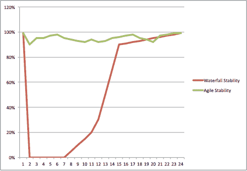

# 瀑布和敏捷，自动化和持续集成的效果

> 原文：<https://devops.com/waterfall-and-agile/>

## 敏捷是个愚蠢的想法？

当我第一次听说一些原则时，我是一个在大型企业工作的年轻开发人员，这些原则后来成为 90 年代中后期敏捷过程的一部分。退一步说，我对我所听到的持怀疑态度。毕竟，我们今天所称的瀑布在很长一段时间内都是常态；软件建立起来，然后最终变得稳定。是的，这需要很多哀号和咬牙切齿，但这难道不是它应该的方式吗？

当我第一次听到结对编程的想法时，它对我来说就像一个笑话:谈论时间和资源的浪费，以及允许平庸的开发人员溜之大吉并让其他人做所有艰苦工作的完美方式。对大公司来说，这是再好不过的事情了:让那些有生产力的人成为累赘。

甚至名字，如 Scrum 和极限编程听起来都像个笑话。哦，你是一个极端的程序员…让我吻你的脚！啊，作为一个年轻的开发人员，有着巨大的自我，向其他人展示如何做的好时光。但是我跑题了。无论如何，我当然是持怀疑态度的，最初关于敏捷的讨论是从高层传给我的，来自某个不知名的技术团队，他们不可能理解我们的世界，或者理解我们正在构建高质量的软件，在自动化方面每月为我们的公司节省数百万美元。

我从来没有参加过正在进行的 XP 培训项目:我最终在接触它之前离开了那家公司。所以，我离开了那份工作，去了一家初创产品公司 StillSecure，在那里我们也完全接受了瀑布技术，但只是一个文档较少的版本，而且我们没有业务分析师。而且，我们不是 18 个月的时间表，而是 3-4 个月的时间表。它是瀑布式的，而且确实工作得更好(即使为了满足我们的最后期限，我们也不得不缩小范围或者降低质量)。我们在 3-4 个月的时间表上比在 18 个月的时间表上更接近我们的目标。

## **有时候敏捷就是不起作用**

然而，在某一点上，我们确实尝试了一些 12-18 个月的项目，并且悲惨地失败了:复杂性战胜了我们，并且让范围蔓延杀死我们太容易了。最后，由于我们产品测试自动化的复杂性，我们不得不适应 6-7 个月的发布时间表:我们必须在发布中构建足够的东西，以使所有的测试都值得。我们确实自动化了一些测试，但所有真正耗时的工作都涉及网络设备，如实验室中的交换机、VPN 集中器和路由器，以及使用不同的网络配置测试不同的场景。甚至现在还不能完全自动化，或者至少成本不合理。

## 没有自动化的敏捷肯定不是敏捷

在这个过程中，我们开始开发新产品，一个基于 SaaS 的专注于云计算的防火墙管理系统。因为我们是从一张白纸和一个非常小的团队开始的，所以我们决定尝试变得更加敏捷。我们转向两周迭代模型，但是大约每六周向我们的客户发布一次。事后看来，有两件事阻碍了我们实现敏捷的最大好处:

1.  我们完全专注于构建新的特性，没有在测试自动化上投入时间。
2.  我们有一个非常强大的 QA 领导，非常有效，足够快，让开发人员在每次迭代后的一两周内保持警觉修复 bug。

好吧，所以第二个更多的是一个借口，而不是真正阻止我们的东西。然而，当你有这样的人时，就很难说:我们将放慢速度并构建测试自动化，以便我们可以更快地构建特性。然而，这是一种目光短浅的观点:当然，您可以在早期侥幸成功，但是复杂性会越来越大，以至于一个人无法满足测试需求，然后您必须做出艰难的选择:雇用另一个 QA 人员，或者回去尽可能多地自动化测试。无论如何，您都会受到打击:但是，在进行过程中构建测试自动化可以让您建立一个可信的步调，并确保您可以在代码重构之类的事情中生存下来，而无需投入大量时间来证明您没有破坏任何东西。随着您的代码库变得越来越大，这意味着很多:这是必须在越来越不稳定的基础上构建您的产品，还是允许您快速、廉价地改进您的基础。

我在上一篇文章中提到了我的挫败感，人们期望我提前几个月甚至几年预测未来，尽管与最初的计划相比，许多因素发生了变化，但我还是要对自己的预测负责。使用更短的迭代确实允许我们更好地预测在任何给定的时间周期内我们将完成什么，但是我的管理层仍然期望我能按照设定的时间表满足长期的路线图。这部分并不适合敏捷，它仍然是使用敏捷包装器的瀑布式思维。此外，我们在追踪这些长期预期时惨败。最后，这是我支持敏捷方法的主要原因:理解那些要求和期望软件项目完美展开，几个月甚至几年都没有变化的方法是注定失败的方法。

为了弥补这一事实，有能力的瀑布项目经理创建了一个严格的变更管理过程来跟踪软件项目计划没有像每个人预先期望的那样实现的所有原因。这防止了管理层的意外，并确保每个人都知道做出了哪些决策，以及为什么。如果没有这些借口，任何长期项目都会被认为是彻底的失败:即使是小项目，在漫长的开发周期中也会经历相对大量的变更请求，根据我的经验，这些变更通常会增加完成项目所需的努力，因为它们通常会导致系统设计时不知道的复杂性。

敏捷承认事情会随着时间的推移而变化，有时变化很大，并将这一点融入到过程中。这对团队、经理和公司的领导层来说更容易:没有人会得到一个虚假的日期来承诺给客户，然而团队可以朝着长期目标不断地取得可测量的、可靠的进展。而且，因为您在每个测试周期之间改变得更少(通过持续集成，您每天晚上或者在每次构建之前运行测试)，您不会以一堆混乱的代码结束，在这些代码中，您必须花费数周或数月的时间来达到稳定性，然后才能修复您刚刚引入的所有其他新错误。

## 但是敏捷真的更高效吗？

下面的图表显示了在一个典型的 6 个月瀑布式项目中，没有持续集成和敏捷项目的持续代码稳定性的评估。第 2-7 周是瀑布项目的编码阶段，代码“在操作台上”并且完全不稳定，没有集成测试。在敏捷方面，代码可能在整体稳定性方面有所下降，但是持续的集成测试有助于防止稳定性的大幅度下降，这需要付出巨大的努力来恢复。

 这张图完全是轶事，基于我对敏捷和瀑布的体验。我所看到的是，在没有持续集成的瀑布项目过程中，代码的稳定性在没有持续集成的情况下非常快地达到零(系统根本不工作，甚至可能无法干净地编译)，并且随着系统集成测试的进行，才慢慢地返回到高水平的稳定性。在一个利用持续集成的项目中，这种稳定性的大幅下降是不可能发生的，因为持续集成环境会因为这种不稳定性而崩溃。然而，由于持续集成环境无法捕捉到丢失的测试用例，确实会出现一些下降。即使开发人员尽了最大努力，也不可能捕捉到每一个潜在的情况，因此在这种环境下，稳定性会从最大值略微下降，并会波动。对于利用持续集成的瀑布项目，这个图完全改变了:就代码稳定性而言，它看起来更像敏捷。这是否提供了一些证据，至少，敏捷方法只有在测试过程的自动化程度上才有价值？这给我们留下了两个有争议的未决问题:

1.  哪种方法最终更有成效，在单位时间内为客户生成更多的功能？
2.  哪种方法可以更快上市？

这些不是同一个问题:上市时间为你提供了一些东西，让你尽可能早地把它们放在客户面前。在给定的时间内生成更多的功能可以让你在更短的时间内构建更多的功能:帮助你赶上或超过竞争对手。有些人可能认为瀑布最适合#1，敏捷最适合#2。我见过一些瀑布团队以非常高的质量非常快速地构建深度功能。

## **是自动化，而不是流程**

无论哪个更好地满足你的目标，有一点是肯定的:自动化可以自动化的事情总是一个好主意。事实上，这句咒语构建了整个工业时代。在我看来，瀑布方法可以利用持续集成和测试驱动开发的优势，同时仍然保留其非常有思想的、有良好文档记录的、非常以架构为中心的世界观。无论是从敏捷方法还是瀑布方法，过渡到 DevOps 都非常容易:预先投资自动化，从长远来看，你会走得更快。下一次，我将讲述我在 JumpCloud 使用 DevOps 的经历，以及它使我们能够做我们无法做的事情，以及对可靠性和安全性的影响。