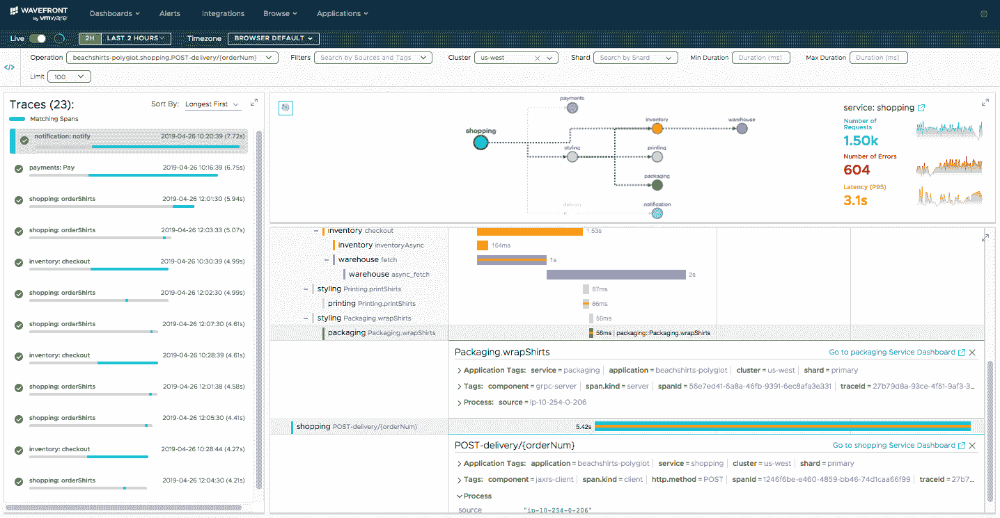

# 波前为微服务提供地图

> 原文：<https://devops.com/wavefront-provides-map-for-microservices/>

VMware 宣布，它正在为其随 VMware 监控工具提供的 Wavefront 3D Observability 平台添加服务映射功能。

Wavefront 产品营销高级总监 Stela Udovicic 表示, [Wavefront Service Maps](https://www.wavefront.com/wavefront-introduces-service-maps-for-faster-microservices-containers-troubleshooting/) 将使 it 组织更容易看到即将出现的数千个运行高度分布式计算环境的微服务，包括那些基于 Docker Engine 上运行的容器，通过 Istio 等服务网格或 Envoy 等跨代理服务器连接。

wave front Service Maps 提供的功能包括带有服务依赖关系图的请求流的打包可视化、运行状况指标的内置跟踪，以及查明性能瓶颈的单个跟踪视图。

作为一组软件即服务(Saas)应用程序，VMware 的 Wavefront 依靠无代理的监控方法来支持所有主要的公共云，并提供与 Kubernetes、GitHub、Slack、PagerDuty、Kafka 和 Pivotal 应用程序服务等平台的集成。

Udovicic 表示，通过使可视化识别和故障排除微服务变得更加容易，it 组织应该能够加快向现代云原生应用的过渡。基于微服务构建和部署单个应用已经足够复杂。如果没有可视化这些服务之间的所有相互依赖关系的能力，试图支持数百个这样的应用程序简直太令人望而生畏了。她说，解决任何问题都变得更加容易，因为 Wavefront Service Maps 旨在使 DevOps 团队能够深入到用于监控应用程序的跟踪。

今年早些时候， [Wavefront 增加了对分布式跟踪和机器学习算法的支持](https://devops.com/vmware-wavefront-adds-ai-distributed-tracing/)，这也使得在基于微服务的应用程序中识别异常变得更加容易。

就云原生应用的采用而言，Udovicic 说基本上有两类。第一类是早期采用者，他们已经高度致力于开发云原生应用。Udovicic 说，然而，大部分企业 IT 社区仍处于构建和部署这些类型的应用程序的早期阶段。

积极采用微服务进行云原生应用开发的组织与实施最佳 DevOps 实践的组织之间自然存在高度相关性。事实上，可视化工具的一个好处是，它可以更容易地将新成员加入到这些团队中。DevOps 团队的新成员可以直观地检查他们可能负责管理的每个微服务，而不必拼凑环境中发生的事情。

开发运维流程成为管理 It 的主要默认方法可能还需要一段时间。但是随着 DevOps 工具变得更容易使用，DevOps 从业者的数量应该会稳步增加。可以说，DevOps 的采用没有达到预期效果的原因之一是学习曲线仍然太陡。但是，随着可视化功能被添加到这些工具的分析框架中，现在可能被开发运维流程吓倒的 it 专业人员数量开始稳步下降只是时间问题。

— [迈克·维扎德](https://devops.com/author/mike-vizard/)