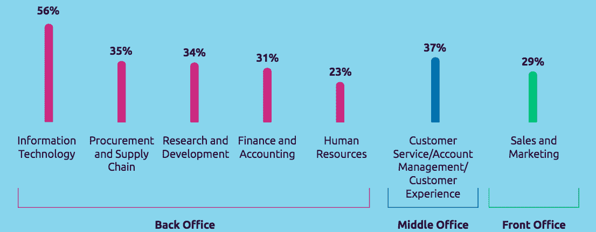

# 自动化能从 DevOps 学到什么？

> 原文：<https://devops.com/what-can-automation-learn-from-devops/>

凯捷最近的一项调查显示，尽管企业级自动化仍处于起步阶段，但 IT 自动化项目正在向前发展。IT 部门开始从战略角度而非战术角度看待自动化。

IT leads automation implementation (respondents were asked to select all that apply: “In which of the following functions has your organization implemented automation initiatives?”). Capgemini Research Institute, Automation Use Case Survey; July 2018, N=705 organizations that are experimenting with or implementing automation initiatives.

凯捷调查还显示，IT 自动化可能会带来一些立竿见影的效果，包括自我修复、事件关联、诊断、应用发布、网络安全监控、存储和服务器管理任务。这些项目不仅节省了大量的 IT 成本，更重要的是，提高了可靠性以及对客户需求和业务服务的响应能力。这表明，虽然自动化是手工工作的一个很好的解决方案，但它也是创新业务的高层次、战略性 it 计划的一部分。

随着敏捷方法、持续部署和优化等 DevOps 实践开始在现代企业中扎根，随之而来的问题是:自动化也可以是敏捷的吗？这是人工智能(AI)对 IT 运营或 AIOps 的承诺，但如果这对您的 IT 组织来说是不可能的，那么确保您的自动化实践不断优化以适应任务是很重要的。设置和遗忘是服务器时代的惯例，在一个随需应变的基础设施世界中，自动化应该不断优化和评估以获得最大效益。

## **自动化的新期望**

如果出现任何问题，IT 自动化项目可能会产生严重的后果，因为当机器执行策略时，它们会以很大的方式执行。这可能是为什么使用渐进的步骤来定义和评估被自动化的过程和自动化本身是至关重要的主要论点——它们减轻了可能出现的任何问题的严重性。这就是为什么考虑以下事项很重要:

1.  这是一个好的过程吗，值得自动化吗？
2.  这个过程多久发生一次？
3.  当它发生时，需要多长时间？
4.  有没有自动化替代不了的人的因素？

让我们分解这些步骤，看看它如何为自动化的迭代方法提供基础:

### **这是一个好的流程吗？**

这似乎是一个基本的问题，但事实上，流程和政策经常被设定和遗忘——即使事情发生了巨大的变化。适当的持续优化或敏捷自动化开发将迫使 IT 团队重新审视现有策略，并确定它是否仍然适合业务服务目标。

一些过程是微妙的，自动化可能会威胁到它们的完整性，而另一些过程是高级的，自动化忽略了作为最终结果基础的常规任务。一个好的自动化工程师知道什么任务最适合自动化，并相应地制定策略。

### 这个过程多久发生一次？

修补、更新、负载平衡或编排可以遵循按需或时序计划。随着工作负载越来越短暂地转移到无服务器的云原生基础架构，这一过程的时间表也将发生变化。自动化时间表应不断适应工作负载需求、客户需求和基础设施形式。随着企业继续向数字化转型迈进，特定工作的性质和时间表可能会变得更加动态。

### **发生时，需要多长时间？**

这也取决于底层的基础设施。一些传统系统需要更新，这可能需要几个小时，并且一些工作负载的编排将是连续的。必须测试自动化在手工任务的时间表和频率上的效率和效果。

### 有没有不可替代的人的因素？

尽管你可能想这么做，但如果没有人工智能或机器学习的帮助，自动化很难向左转移(转移到更有经验的任务和团队)。很多时候，在获得洞察力、创建新的工作流程、项目管理或架构时，都会涉及到人的因素。当构建一个迭代的自动化实践时，确保您识别出人类交互必须在哪里发生以进行评估和优化。在我们的一生中，技术以闪电般的速度发展，机器人现在完成了曾经由人承担的工作。然而，有时机器无法提供与人类相同的质量。

## **全部自动化**

自动化可能是 IT 运营管理未来最具定义性的特征之一。它减轻了团队的日常工作，并有助于提高整体效率，同时推动速赢，将 It 团队变成英雄。但是不要让自动化成为最终目标。相反，把它看作是一个可以从数据中驱动行动的工具。在人工智能成为日常选项之前，it 专业人员有责任不断优化推动这一行动的数据。

— [巴努·辛格](https://devops.com/author/bhanu-singh/)