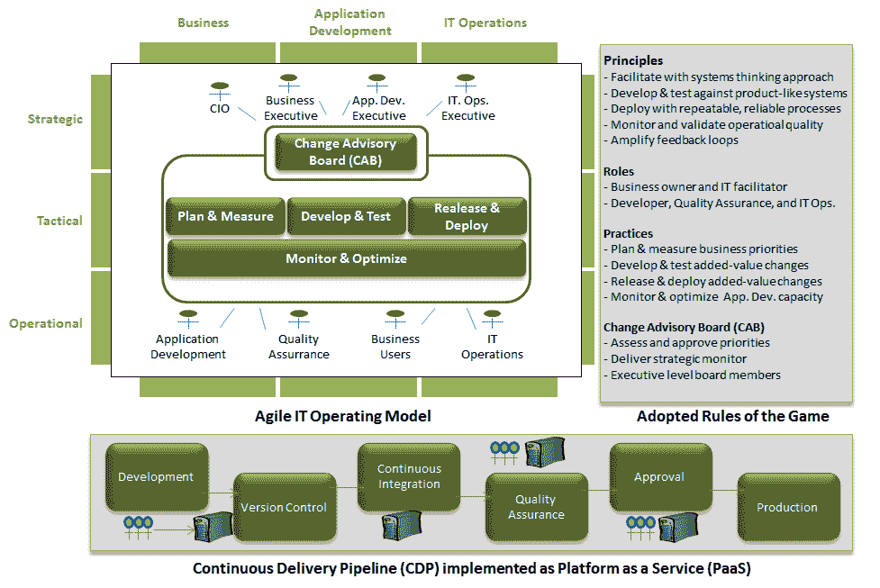
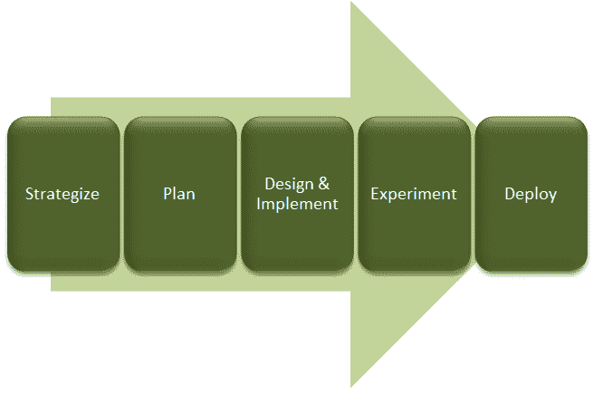
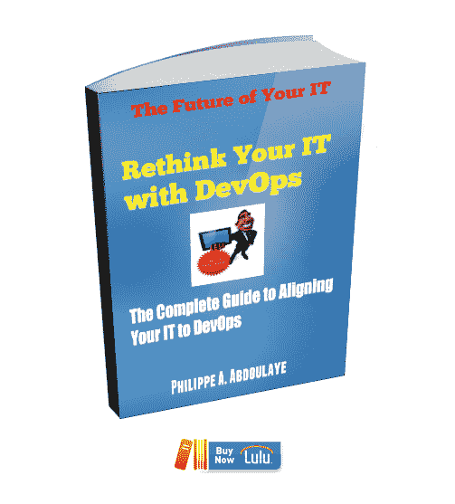

# 数字化转型能为你做什么？

> 原文：<https://devops.com/what-can-digital-transformation-do-for-you/>

与围绕数字化转型的大量文章所建议的相反，你的业务线的主要关注点不是每天涌现的令人惊叹的技术创新，而是它们将如何处理你的行业中断。可以肯定的是，您的 IT 组织的数字化转型不能局限于技术变革；这是一种过于简单的观点，忽略了对业务的破坏性影响，尤其是对 IT 部门的影响。

霍华德·金(Howard King)在《[什么是数字化转型？发表在《卫报》上的“转型是对一个企业的基础组成部分的全面改变:从运营模式到基础设施。它卖什么，卖给谁，如何进入市场*。*“他说得对，以业务为导向的 IT 愿景要求您的 IT 组织进行转型，包括基础架构、应用交付方法和运营模式，开发运维越来越多地被视为新 IT 的基础。](https://www.theguardian.com/media-network/media-network-blog/2013/nov/21/digital-transformation)

本文分享了我在实施 DevOps 作为数字 IT 组织的基础方面的经验和教训。

## 当务之急:应对行业混乱

DevOps 从业者已经习惯了这样一种营销宣传，即实施连续交付基础设施是您在数字中断中生存的全部业务需求。这是一个阻碍您做出明智的数字化转型决策的神话。以你所在行业的颠覆为代价强调技术，迫使你过早地进行技术变革；实际上，你的首要任务应该是找出如何应对冲击你所在行业的混乱局面。

问问你自己:当你最喜欢的供应商和顾问不能清楚地解决这些问题时，投资于分散的连续交付基础设施实现的兴趣何在:

*   您如何重组您的业务价值流，使其精益和敏捷，以便将正确的服务及时交付给正确的细分市场？
*   您如何将 DevOps、IT 即服务、云、物联网和大数据集成为连贯一致的业务能力，以便将正确的服务及时交付给正确的细分市场？
*   您未来信息系统的架构是什么，包括您的虚拟数据中心和应用交付基础架构？
*   作为首席信息官，你的角色是什么？如何管理与业务线和供应商的关系？

毫无疑问，这些是你目前的业务线问题。除非你解决了这些问题，否则单靠 Chef、Puppet、CodeDeploy 或任何其他软件应用都无法跟上优步、苹果、谷歌等公司的步伐。您需要将您的业务和 IT 员工整合在一个精益和敏捷的能力中，这需要重新设计您的 IT 结构、流程、实践和治理。

## 开发运维是您数字 IT 组织的基础

让我们消除歧义:作为代码的基础设施不是 DevOps。DevOps 与持续交付基础架构之间日益增加的混淆正在缓慢但肯定地扼杀它——它甚至丧失了作为竞争优势的资格。这种专注于工具的愿景与 DevOps 下的逻辑毫无关系。

正如我一直让客户满意的那样，DevOps 主要是一种应用交付模式，旨在通过加速增值应用交付，使企业能够响应市场机遇，并以持续创造价值为目标。它基于三个原则，帮助企业在数字中断中生存下来，然后发展壮大:

*   除非产生切实的商业利益，否则使用连续交付基础设施来加速应用交付是没有意义的。
*   应用程序是为客户带来价值和商业利益的手段。
*   贯穿软件开发生命周期的敏捷原则使你的价值流变得精简和敏捷，这反过来会产生持续的价值。

DevOps Delivery Model – (Credit: [Philippe Abdoulaye – ITaaS Now LLC](http://philippeabdoulaye.wix.com/itaasnow#!workshops/c1805))

交付模式使用三个杠杆来实施上述原则，并将开发运维作为您数字 IT 的基础，它们包括:

*   游戏规则，即约定的原则、实践、角色和责任以及制度化的工具，以确保敏捷性和加速应用交付；
*   运营模式，即通过应用游戏规则而形成的精益和敏捷的工作环境；和
*   持续交付基础设施，这是一个利用基础设施即代码解决方案来加速应用程序开发和部署的平台。

## 数字 IT 组织:方法、原则、工具

IT 组织转型的成功往往更多地来自一连串的小胜利，而不是一次性的洪水。这就是我所说的渐进式转型，在下面的数字化五阶段转型之旅中有所阐述:

The transformation journey – (Credit: [Philippe Abdoulaye – ITaaS Now LLC](http://philippeabdoulaye.wix.com/itaasnow#!workshops/c1805))

以下建议肯定会帮助您实现 IT 转型，并帮助您的企业应对数字经济的竞争挑战。

### 制订战略

首席信息官要想帮助业务线从行业的混乱中生存下来，发展壮大，首先必须明确他们的业务目标；估计潜在的收益、损失和风险；并就 DevOps 交付模型达成共识，以便在高级架构和实施时间方面实施。这就是制定战略阶段的目的。

千万不要跳过这一阶段—这是获得管理层认同和发展未来 it 能力愿景的阶段。确保完成以下工作:

*   创建由首席信息官和业务代表共同领导的执行任务组；
*   安排一到三个研讨会，讨论您的转型业务案例、转型路线图、未来 IT 能力的高级蓝图和 DevOps 采用计划；
*   指定一名项目经理；和
*   任务组成员就变革计划的原因进行沟通。

### 计划

数字化转型以跨职能团队的形式涉及您企业中的许多职能:相关业务和 IT 员工。作为首席信息官，您的职责是在整个转型过程中传达企业的声音，从业务目标的阐明，到设计和实施，到试点实验，再到部署。

同样，不要忽视这一阶段——这是将工作转化为团队结构、实施时间表以及运营和战略审查。这是对可能阻碍项目目标的风险的预期。确保召开涉及业务和 IT 部门的研讨会，以解决以下问题:

*   团队结构、角色和职责；
*   转变路线图步骤转化为与预期结果相关的运营时间表；和
*   项目的运营和战略审查，包括风险管理计划。

### 设计和实施

第三阶段是设计和实现数字 IT 组织的三个维度。其中包括 DevOps 游戏规则、运营模式和持续交付基础设施。

永远不要在这个阶段即兴发挥——使用一种经过验证的方法来解决维度问题。支持协作方法，包括与相关业务和 IT 人员的研讨会或头脑风暴会议。

在游戏规则集思广益会议中，确保解决以下问题:

*   组织和运营功能障碍，阻碍跨职能协作、快速解决问题和决策；
*   根据敏捷流程、实践、角色、职责和工具对功能障碍提出建议；
*   与适当的 DevOps 原则、实践、角色和职责以及治理结构相对应的建议；和
*   IT 组织的 DevOps 章程，旨在加速游戏规则和运营模式的采用。

在持续交付基础架构研讨会中，确保解决以下问题:

*   交付管道，包括步骤以及每个步骤的后续内容:
    *   所需人员、技能和背景
    *   实施、测试和部署敏捷流程和实践
    *   实施、测试和部署工具，如 Chef、Jenkins 或 CodePipeline

### 实验

在此阶段，建立一个小规模真实业务环境中的试点实验，由业务和 IT 人员组成的小组评估项目收益的可能性。

不要跳过也不要忽略这一步，这是需要改进的地方。在整个试点项目中，确保以下各项到位:

*   执行工作队通过两周一次的审查监测试点项目；
*   涉及相关业务线和 IT 业务线；
*   围绕 DevOps 章程、运营模式和持续交付基础设施组织培训活动；
*   战略管理工具，如平衡计分卡，以监测进展、风险和成就；和
*   根据预期收益衡量运营模式和持续交付基础设施的影响。

### 部署

这最后一个阶段是一个“行-不行”的里程碑，在这个阶段，您的任务组将根据试点项目的结果，决定是否在公司范围内部署您的数字 IT 能力。在整个部署过程中:

*   利用试点试验带来的好处，发起宣传活动，强调对公司和员工的好处；和
*   就 DevOps 章程、运营模式和持续交付基础设施对业务和 IT 人员进行培训。

## 包扎

今天，专注于持续交付基础设施的 DevOps 实践不太可能帮助企业在数字经济中成长和繁荣。思想领袖 Joe McKendrick 在“[通往数字幸福的道路是由服务思维和 DevOps](https://www.zdnet.com/article/the-road-to-digital-bliss-is-paved-with-service-thinking-and-devops/) 铺成的”中证实了这一事实。

本文中讨论方法在我的新书中有详细介绍，该书旨在帮助 IT 领导者实现企业数字化转型:

如果您正在考虑以 DevOps 为中心的 IT 转型，您的第一步是什么？很想听听大家的想法，来认识一下 [@TheFutureOfYourIT](http://philippeabdoulaye.wix.com/itaasnow#!workshops/c1805) 。