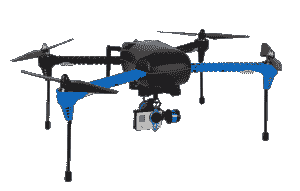

# DevOps 对你来说是什么？弹性盒和 DevOps.com 的新调查

> 原文：<https://devops.com/what-is-devops-to-you-new-survey-by-elaticbox-and-devops-com/>

DevOps 对你来说是什么？这是一个有内涵的问题。长久以来，DevOps 一直没有定义。那么我们如何量化它呢？你怎么知道它是否有效？你在这上面花费多少？你做的时候具体是做什么的？你使用什么工具？

尽管 Puppet Labs 的人员、Gene Kim 及其团队已经完成了出色的年度调查，显示了 DevOps 的采用及其对高性能 IT 组织的影响，但现在是时候更深入地研究一下我们到底在使用什么工具，什么有用，什么没用了。见鬼，就连我们认为的工作与否也仍有待界定。

因此，我们与我们在 ElasticBox 的朋友合作[进行一项调查](https://www.surveymonkey.com/s/devopsdot)以更好地了解你认为 DevOps 是什么，你为它付出了什么，以及你认为它成功吗。

您可以在大约 10 分钟或更短的时间内完成调查。你可以在这里参加调查:[https://www.surveymonkey.com/s/devopsdot](https://www.surveymonkey.com/s/devopsdot)

哦，等等，还有呢。50 分之一的受访者将赢得 50 美元的亚马逊礼品卡(你需要提供联系信息才能获胜)，一名大奖获得者将赢得一架非常漂亮的 3DR IRIS+无人机(下图)，同样，你必须提供联系信息才能获胜)

 我们将在 7 月公布结果和分析。因此，请花 10 分钟时间，帮助我们向社区提供这些重要信息。