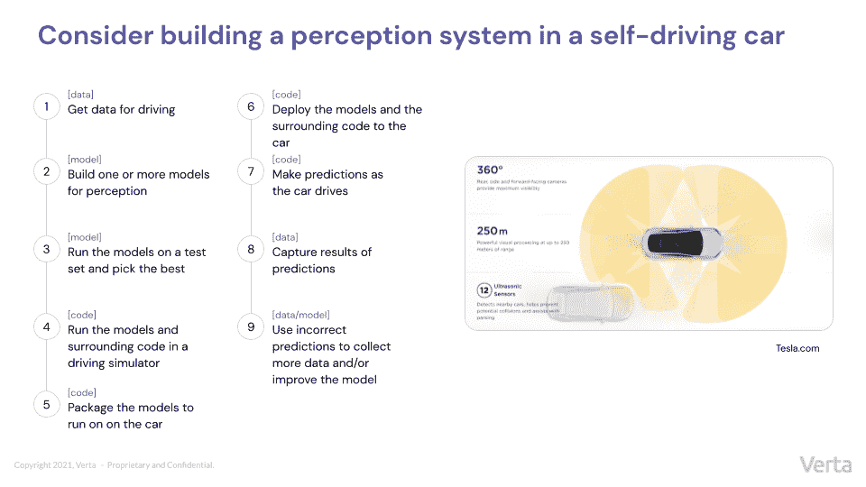
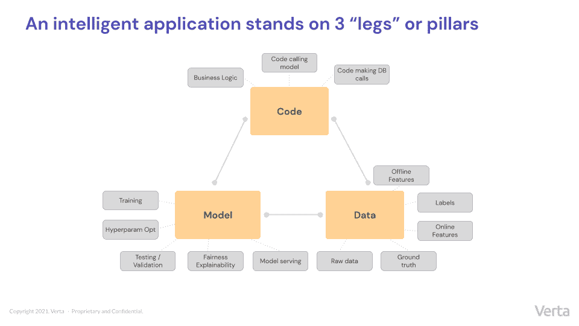
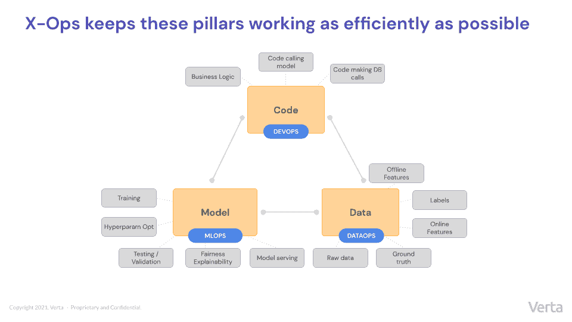
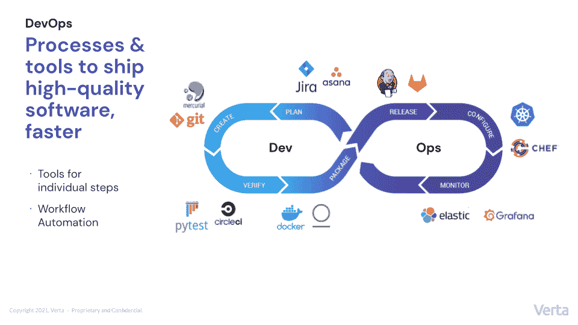
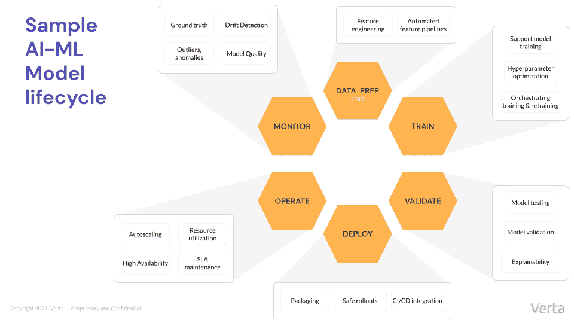
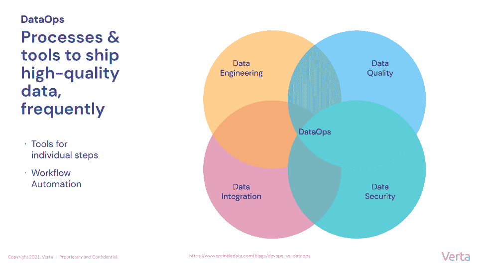

# 什么是 MLOps？数据操作？为什么它们很重要？

> 原文：<https://devops.com/what-is-mlops-dataops-and-why-do-they-matter/>

让我们来看三个截然不同的学科 —DevOps、MLOps 和 DataOps 。2011 年，马克·安德森著名的 [宣称](https://future.a16z.com/software-is-eating-the-world/) 软件正在“吞噬世界”十几年后，随着软件已经嵌入几乎每个行业，几乎不可能反驳他的预感。

但是现在另一个转变正在进行，正如我们所知，人工智能正在吞噬软件。我们的电子邮件可以帮我们完成句子，联网汽车帮助我们在路上更加安全，预测技术有助于最大限度地减少新冠肺炎造成的供应链中断。在不久的将来，几乎我们与之交互的每一个软件都将内置智能，随着人工智能的接受和新用例的推出，应用程序只会继续变得更加智能。向支持 ML 的软件的广泛转移有可能像安德森预测的那样具有变革性和深远的影响。

但是创新很少是容易或简单的——智能应用也不例外。传统软件只涉及一件事——代码，没有太多其他的东西，而智能软件依赖于三个相互关联的变量或三条腿凳的腿之间的复杂关系。

### 一 T 三脚 凳子: DevOps、 MLOps 和 DataOps

**模型:** 一个或多个 AI/ML 模型(例如，线性回归、规则、深度神经网络等。)经过训练，能够识别数据模式并做出决策，这是应用程序“智能化”的原因

**数据:** 最常见的是，在历史数据上训练一个模型，并对其进行编程仿真。因此，应用程序的行为在很大程度上取决于数据，即原始输入数据、标注和要素，以及应用模型的新数据和这些数据的基础事实。

**代码:** 代码 是应用程序用来运行的语言。当在智能应用程序的上下文中使用时，代码支柱可能指的是业务逻辑、对模型的调用、接收输出、决策制定和对其他数据系统的调用。

### 现实世界的例子

为了了解这些支柱在现实生活中是如何发挥作用的，请考虑自动驾驶汽车感知系统的例子。这种系统使用数据(由离线来源和实时相机和传感器提供)、模型和代码来确定无数不断变化的变量(例如，道路上是否有障碍、车道标线看起来像什么、汽车可以安全行驶多快等)。)虽然下图 大大简化了 ，但它概述了构建和部署这样一个系统所需的基本步骤，并指出每个步骤属于哪个支柱。

无论应用程序类型如何，智能应用程序所依靠的腿总是相同的:模型、数据和代码。如果你试图删除其中的任何一个，应用程序就会崩溃。

随着组成智能应用的三个不同支柱的出现，出现了三个不同的学科来保持每个支柱尽可能高效地运行:MLOps和 DevOps。这篇文章的其余部分研究了使每个规程与众不同并且对模型生命周期是必要的细节。

### DevOps

从前，公司使用瀑布流程来开发软件。这一过程通常进行得非常缓慢，以至于产品在消亡或被取代之前都没有意识到自己的潜力。2000 年，敏捷被引入，允许开发人员在他们不断交付的紧张冲刺中快速迭代地工作。例如，到 2009 年，Flickr 成为业界羡慕的对象，每天例行执行 10 次以上的部署。寻求提高自身生产力的公司将软件开发与既定的运营原则相结合，并创造了术语“DevOps”。

正如下面熟悉的循环图所示，开发运维周期从规划阶段到创建、测试/验证、打包、发布、配置、监控，然后从规划阶段重新开始。在过去的二十年中，出现了许多独特的工具来支持 DevOps 生命周期中的各个步骤，通过从一开始就构建持续集成和持续测试来帮助开发人员确保质量，并通过工作流自动化来帮助加快上市时间。DevOps 生态系统是强大的，经过深思熟虑的，并且总是在迭代改进。

### mlops

MLOps 帮助团队在模型生命周期中更快更有效地移动——这是一个包含六个不同步骤的循环，每个步骤都包含独特的考虑因素。

由于 MLOps 与 DevOps 有关，企业有时会尝试调整用于编写常规软件的流程，以执行机器学习操作化的陌生任务。但是这种方法行不通，因为这两个学科实际上是完全不同的。

MLOps 主要处理模型，而不是代码——模型和代码有很大的不同。例如，模型训练和测试看起来与代码构建和测试非常不同。(对于一个模型来说，“测试用例”到底意味着什么？)并且监控模型性能与监控传统软件完全不同。(DevOps 看的是 CPU 利用率、延迟和吞吐量之类的东西，而 MLOps 看的是模型质量、漂移和数据质量。)

此外， MLOps 工程师为之建造的人与他们的 DevOps 同行大不相同。正如人们所料，模型的主要用户是数据科学家，而 DevOps 通常服务于软件开发人员。大多数情况下， MLOps 工程师都是有 ML 和数据科学背景，或者是拿起 ML 的软件工程师。

与 DevOps 一样，不存在单一的全包式 MLOps 平台。相反，不同的工具支持模型生命周期中不同的单独步骤，并提供一些工作流自动化来加速过程。不同的工具支持 ML 生命周期的特定部分——但是生态系统仍然有些支离破碎。理想情况下， MLOps 将会发展成提供更多类似 DevOps 的工具，它们可以很好地协同工作，并提供更多的自动化。对于希望构建 MLOps 平台的公司，构建一套考虑到速度、安全和自动化的支持工具。

### 数据操作

我们已经看到了上面讨论的另外两个支柱的非常明确的生命周期；然而，当涉及到 数据操作 时，生命周期仍在定义中。但是 DataOps 的总体目标听起来应该很熟悉:DataOps 涉及频繁运送高质量数据的流程和工具——这需要数据工程、数据质量、数据安全和数据集成的结合。

与 DevOps 和  MLOps  一样，  DataOps  平台或  DataOps  工程师所做的是支持帮助执行这些活动之一并帮助构建工作流的工具。例如，工作流可以从数据库中获取数据，对其应用一些转换，然后使其可用于商业智能(BI)工具。这就是参与 数据操作 的那种自动化。

正如你可能想象的那样，数据操作所需的技能和工具与m 操作 和 DevOps 中所需的技能和工具完全不同，所以期望一个 DevOps 工程师同时也是 数据操作 的专家似乎有点不现实。虽然 MLOps 需要比 DevOps 历史上要求的更紧密的数据集成，但是 MLOps 是 而不是 与 DataOps 是一回事。与支持智能应用的其他支柱相比， DataOps 更倾向于独立和独特。

### 结论

从感知系统到企业级金融科技软件，每一个智能应用都依赖于三个不同的学科:DevOps、 、MLOps 和 DataOps 。这就是开发智能产品的复杂性所在。每个领域都是不同的，在 ML 生命周期中处理不同的问题和目标，需要不同种类的人员和工具。然而，它们基本上都被一个共同的目标联合在一起:优化 ML 生命周期迭代的质量和速度。上升到顶端的工具、实践和组织将使不同 ML 团队之间更加无缝的协作，帮助他们快速有效地通过 ML 生命周期。