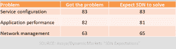
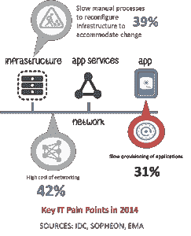

# 它对 SDN 的期望是 DevOps

> 原文：<https://devops.com/what-it-expects-from-sdn-is-devops/>

当宣布 Docker 公司收购 SocketPlane 公司时，人们非常兴奋。不仅仅是从我的世界角落发出的，在那里 DevOps for network(整个网络)是你已经注意到我几乎生活和呼吸的东西。

该公告被集装箱化领先的 Docker 称为 SDN(软件定义的网络)游戏。这一开始可能会令人困惑，因为 Docker(更一般地说，容器)通常与 DevOps 相关联，而不是 SDN。

啊，但问题就在这里，不是吗？虽然 SDN 的原始规则在本质上肯定不是 DevOpsy，但它(像技术中的所有其他流行术语一样)已经演变为与技术规范和标准一样关注(如果不是更多的话)肯定类似 DevOps 的原则和目标。

例如，考虑一下最近由 Avaya 赞助的关于“ [SDN 预期](https://www.avaya.com/usa/registration/sdn-expectations-report/?PC=NW-USAFY15-SDN&CMP=INT-NW-USAFY15-SDN-A4)”的动态市场报告(gated)

要检查的第一个数据点是受访者经历的“问题”的排名。头号问题(38%)是由人为错误导致的*停机。第二个(与 37%的网络故障转移问题相关)是在网络上配置服务和应用程序的*复杂性。**

如果这些不是 DevOps 解决的典型问题——特别是在协作和自动化方面——我会吃掉我的帽子。是的，我经常戴帽子，这是我的一个怪癖。

同样有趣的是，这张表不仅显示了问题领域，还显示了有多少受访者遇到了问题，以及有多少人希望 SDN 能够解决这些问题:

如果您忽略网络管理元组，前两个问题肯定经常与开发运维相关联，因为这些问题可以通过协作和自动化以及一些引入的测量来解决。

在这一点上，SDN 已经发展到更加关注网络自动化，而不是自动化网络。实际上，与 DevOps 的区别是深远的，因为前者实际上是关于  管理，关于配置和供应以及流程自动化，旨在将 CD 跨整个应用部署生命周期扩展到生产环境中。它是关于在模板中编码和封装配置，以及集中网络状态，以便在出现问题时，在前进和后退方面产生更好的敏捷性。

[如今的 SDN 实际上是(或者应该是)DevOps](https://devops.com/blogs/sdn-just-devops-network/) 的子集，专注于网络基础设施运营，而不是应用基础设施运营。但同样的原则和目标在 DevOps 和 SDN 之间、网络和应用基础设施之间非常一致。这是一个关键的融合，开始出现这是必要的，因为当你深入了解 IT 以及这些天来按时交付应用程序的问题时，主要是网络仍然是一个障碍。

网络通常被认为是一个关键的 IT 难题，而这个难题通常与跨网络提供服务和应用程序有关。还提到了网络的高成本，这在很大程度上是由于网络的复杂性，以及手动调配、配置和测试部署业务交付应用所需的服务所需的各种网络基础架构所耗费的大量运营人力物力。

如果只是为了强调其对网络基础设施的关注，SDN 可能会继续被称为 SDN，但事实是它是 DevOps。网络开发运维。

这就让我们回到了为什么像 Docker 这样与 DevOps 相关的集装箱化公司会吞并 SocketPlane 这样专注于“SDN”的初创公司。

因为它对 SDN 的期待真的是 DevOps。如果 DevOps 最终是关于文化变革和打破孤岛，那么关注网络的人不能(也不应该)与管理应用基础设施的人隔离开来。

Docker 的举措将软件定义的网络与软件定义的操作一起纳入(应该是)一个包含 IT 的概念:DevOps。