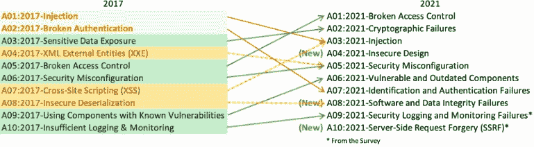

# 新的 OWASP 十大变化对开发人员意味着什么

> 原文：<https://devops.com/what-the-new-owasp-top-10-changes-mean-to-devs/>

开放 web 应用程序安全项目(OWASP)最近在四年后更新了 web 应用程序最严重的十大安全风险列表。这是该榜单自 2003 年推出以来最彻底的变动。毫无疑问，这些变化将对未来企业如何解决应用安全问题以及开发人员和 DevOps 团队如何开展工作产生重大影响。本文将着眼于新的十大变化中出现的三个最重要的变化。

### **应对当前和未来威胁的新方法**

这一次，OWASP 采用了一种更加数据驱动的研究方法，以更好地了解当前和未来的威胁。成员们就他们看到的安全威胁提供了超过 150 万个数据点。OWASP 对数据进行了分类，并在得出总体排名之前分配了一个影响分数。

OWASP 还包括来自安全专业人员的关于新兴威胁的调查数据。例如，[服务器端请求伪造](https://owasp.org/www-community/attacks/Server_Side_Request_Forgery) (SSRF)漏洞目前的发生率较低，但安全专业人士认为这种攻击非常严重，预计未来会显著增加。SSRF 使攻击者能够使用易受攻击的服务器从受保护的内部来源请求和接收数据，这是一个非常严重的风险。因此，SSRF 今年成为了一个新的类别(A10:2021)。

借助这一新方法，OWASP 现在能够全面洞察当前和未来最严重的威胁。

### OWASP 10 向左扩展安全性

新的 10 大名单中的一个关键变化是纳入了许多类别(例如，不安全设计-A04:2021，软件和数据完整性故障-A08:2021)，这些类别认识到行业必须从更好的应用程序设计实践入手来提高安全性。

由于从一开始就没有遵循安全设计原则，所以许多应用程序漏洞会渗入到软件中。在加快应用程序开发的竞赛中，人们正在偷工减料。应用程序开发的 CI/CD 方法是使用完整性可疑的插件、库或软件模块的主要原因。这个问题越来越严重。企业必须确保其所有软件组件都来自声誉良好的来源，并应使用软件供应链工具来检查已知的漏洞。

### 由于不断变化的威胁形势，排名发生了重大变化

注射攻击自 2003 年以来一直被列为头号风险，现在排在第三位。虽然这是个好消息，但我们还不能宣称胜利。易受攻击的应用程序仍然会给您的宝贵数据带来很大风险，这些应用程序允许不良行为者运行未经授权的命令，并访问您的业务所依赖的敏感企业信息。

注入攻击已被破坏的访问控制取代(A01:2021)。OWASP 报告称，在他们的数据集中，94%的应用程序经过了这些漏洞类型的测试，3.8%的应用程序显示出一个或多个弱点。数量惊人！

由于越来越多地采用更容易获得和实施的标准化身份认证框架，身份和身份认证失败(A07:2021)在风险排名中从第二位骤降至第七位。

这种转变表明，随着企业在确定谁可以访问应用程序方面做得越来越好，它们却忽略了对单个用户、流程或设备在该应用程序中的权限进行控制。为了获得更好的安全性，将身份验证和授权结合起来考虑是至关重要的。

### 将左右两边的安全结合在一起还有很多工作要做

2021 年 OWASP 十大榜单向前迈进了一大步。OWASP 将安全性向左扩展，包括了新的类别，并对其排名进行了重大更改，这将要求企业重新评估其应用程序安全状况。在应用程序开发生命周期的早期解决安全问题可能会防止许多更常见的攻击，但企业必须在“右侧”补充强大、成熟和可扩展的安全保护，如 web 应用程序防火墙。这不仅仅是关于[左移](https://devops.com/mdr-for-devsecops-how-managed-security-can-help-you-shift-left/)，而是关于向左扩展。为了获得更好的多层安全态势，您需要左右两侧的安全。