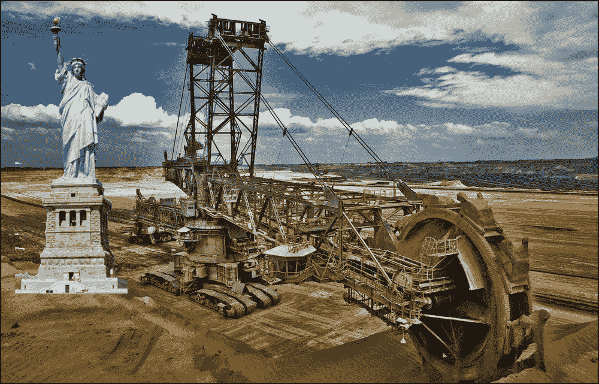
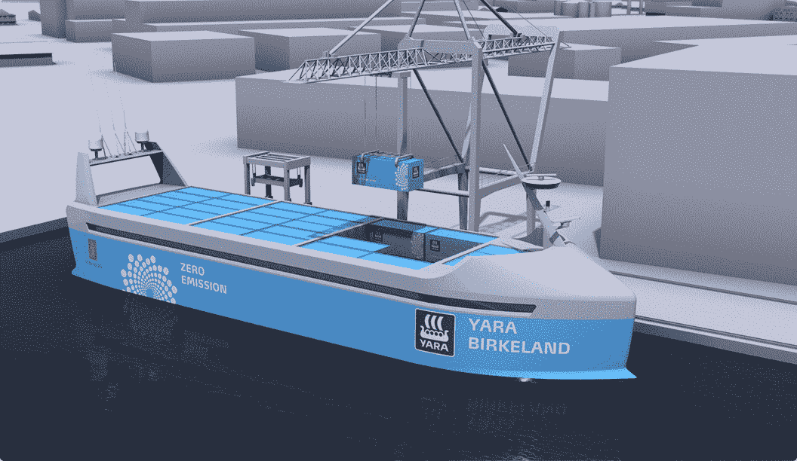

# 什么时候大自动化大到让人不舒服？

> 原文：<https://devops.com/when-big-automation-too-big-comfort/>

科技界流传着这样一个笑话:

换一个灯泡需要多少个软件开发人员？

*回答:没有，是硬件问题。*

在现代 DevOps 的世界中，物理基础设施已经被抽象为代码。在过去的一年里，我可以用手指数出我认识的进行物理内存升级的人数。幸运或不幸，取决于你的观点，我是其中之一。尽管如此，在很大程度上，硬件在很久以前就离开了大楼，没有双关语的意思。剩下的就是我们用来移动数据的笔记本电脑。

然而，对于那些不甩代码的人来说，自动化的世界比我们以软件为中心的观点要大得多。我们大多数人都知道，今天有一些硬件可以在没有帮助的情况下在我们的客厅里漫游，并从地板上吸尘。还有 3d 打印，这是一种技术，我的牙医广泛使用这种技术在他办公室检查室旁边的壁橱里制作牙冠。当然，无人驾驶汽车和卡车预计将很快成为我们日常生活的一部分。

但是，这是小事。有许多硬件自动化远远超出了消费电器和工厂中使用的房间大小的自动化技术的范围。事实上，机器自动化正在变得巨大，就像哥斯拉一样巨大，尤其是在采矿业。

# 采矿:让我们吃掉一座山

从第一天开始，当一个人带着镐和铲被送到一个洞穴里开采矿石时，设备就成了采矿的必需品。从那时起，采矿已经走过了漫长的道路——今天，这是一项庞大的事业，已经变得更加难以置信的机器密集型。然而，在过去，我们会派人到地下的竖井里去取货物，而现在，我们只是让一台机器吃掉地面。

下图所示的[装袋机 293](https://en.wikipedia.org/wiki/Bagger_293) 是一台斗轮挖掘机。这台 315 英尺高的机器每天可以挖掘 850 万立方英尺的泥土。

高 315 英尺的 Bagger 293 比自由女神像还要高

为了让你感觉到整个操作有多大，首先要明白，315 英尺，机器的高度，大约相当于自由女神像从地面到火炬顶部的高度。这台机器一天可以清除的灰尘量相当于在[罗马竞技场](http://tribunesandtriumphs.org/colosseum/dimensions-of-the-colosseum.htm)的地板下挖一个八层的地下室。装袋机自 1995 年以来一直在使用，无论你如何切割它(再次没有双关语)，那块铁已经吃了很多污垢。

目前，装袋机需要六名船员操作。但是，如果趋势保持稳定，这种规模的机器挖掘机能够自主操作只是时间问题。

听起来很牵强？其实不是的。小松 AHS 已经有了自己的想法。

小松 AHS 号是一辆自动运土车，可以移动 290 吨 T2 的有效载荷。这台机器有普通房子那么大。

**小松 AHS(右)是一款自主运土机器**

在过去，一小群人需要几周甚至几个月的时间来开采原材料。今天，使用像贝格 293 和小松 AHS 这样的技术，六个人就可以完成这项工作。而且，在不太遥远的将来，这项工作将不需要任何人工干预。

因此，我们将拥有能够从地下挖出大量泥土的机器，并且无需任何人工干预就能搬动这些泥土，但是，一旦被开采出来，这些泥土都去了哪里呢？

保持这种想法。答案来了。

# 集装箱自动化不仅仅是 Kubernetes

挪威奥斯陆的一家船运公司 Yara 与同样来自挪威的海事工程集团 Kongsberg 合作，制造了一艘自主集装箱船 Yara Birkeland，该船将于 2018 年进入公海。这艘远洋船将不配备任何船员。完全无人驾驶。

将于 2018 年完工的 Yara Birkeland 号是一艘零排放的自主集装箱船，预计可运载 40，000 辆卡车

**根据美国运输统计局的数据，2010 年进入美国港口的 19，000 多艘船只是集装箱船。这相当于美国码头上全部海事活动的 31 %,很可能导致船员的消失。**

**集装箱运输是有用的，因为它可以方便地从各种各样的托运人那里运输货物。过去，码头边的码头工人使用绞车、传送带和堆垛机手工将单个的提环、板条箱和桶装入船舱。集装箱运输公司制造了它，所以托运人装载一个集装箱，然后一台机器把集装箱装到船上，就像叠乐高积木一样。一个人做几十个人的工作。**

**采矿运输没有必须适应不同尺寸和形状的各种货物的负担。只有一种产品:原矿。因此，很有可能一艘自主集装箱船[可能有四个足球场](https://newatlas.com/cscl-globe-worlds-largest-container-ship-hyundai/35102/)那么大，可以被改造成一个巨大的远洋集装箱，里面只装一种产品:未加工的矿石。**

**所以，让我们看看供应链的整体动态。在不太遥远的将来，一台机器将会滚向一座山。它会开始吞噬这座山，一次吐出一大口泥土到一辆同样巨大的自动倾卸卡车的车厢里。自动倾卸卡车会将其内容物卸载到自主、适于航海的船只的货舱中，该船只很可能将内容物带到自动化的矿物精炼厂进行处理。**

**我们这些最近不得不更换灯泡的人明白其中的含义。它们很深奥。我们这些仍在试图找出如何给我们的智能家居编程来更换灯泡的人可能需要更长的时间才能理解。但是，这种想法仍然存在:如果我们可以创造一个建筑物大小的机器，让它自己行动，那么多久我们才能创造出建筑物大小的数据中心，让它们自己行动？如此大规模的自动化不仅是可能的，而且是不可避免的。控制一个失控的家庭真空是一回事。但是，当一个装袋机 293 出现故障时会发生什么呢？**

**我不知道。但我可以向你保证，这不会像往常一样。好消息是装袋工每天只移动大约一英里半。但是，如果它学会了如何加速，那么有一天我们醒来会不会发现我们最喜欢的爬山已经消失了，这是因为一个独立的智慧生物的突发奇想，它不关心或者不知道我们对自然的热爱？然后呢？**

**就像他们在战场上说的，预先警告就是预先武装。**

**鲍勃·雷瑟曼**