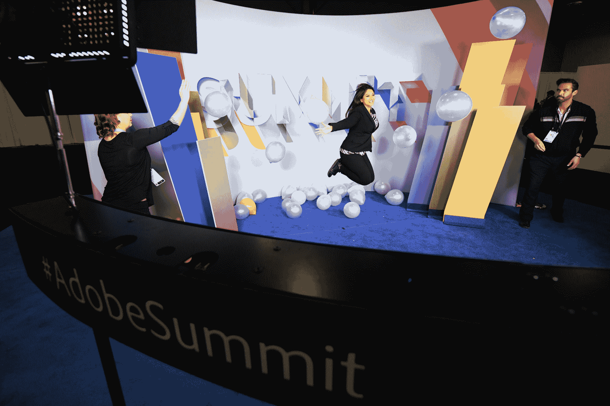

# 当开发运维与营销发生碰撞:来自 Adobe Summit 2019 的见解

> 原文：<https://devops.com/when-devops-and-marketing-collide-insights-from-adobe-summit-2019/>

*我参加了 [Adobe Summit 2019](https://devops.com/6-examples-of-digital-transformation-at-adobe-summit-keynote/) ，研究开发运维与营销的交集。以下是我采访领先的营销技术专家的见解。*

DevOps 正在进军市场吗？简而言之，一个柔和的“是”

我最近参加了 3 月 26 日至 28 日在拉斯维加斯举行的 Adobe 峰会。今年强调数字客户体验，我很好奇想看看这个营销技术的世界，看看 DevOps 是否有任何影响。

我交谈过的许多人描述了营销技术是如何采用一种更加敏捷的、受 DevOps 启发的思维方式的。但营销真的在推动产品变革吗？虽然 Adobe 及其支持者希望我们这么认为，但有些人并不确定。

在 Adobe Summit 上，我与投资于数字营销、零售和分析服务的专业人士举行了一些令人大开眼界的会议，其中大多数人都以某种形式使用 Adobe 产品。在本文中，我们将重点介绍他们在开发运维与营销的交集上的观点。

## DevOps 在营销中的作用是什么？

打破数据孤岛的需求是我在 Adobe Summit 的主题演讲、会议和整个会议中的一个共同主题。

例如，当大型数字营销机构接受客户时，他们发现的一个常见缺陷是一个完全不同且功能失调的客户数据存储系统。在我们的会议上，[德勤数字](https://www.deloittedigital.com/)的董事总经理 Alex Kelleher 指出，“数据需要可用，并且可以整合。这是我们通常为客户解决的第一件事——我们将解决孤岛中的数据，将数据放在同一个位置，通常还会对其进行简化。”

德勤数字公司的流程包括三个 D:首先，他们整合**数据**筒仓，然后建立数据驱动的**决策**，然后**交付**敏捷产品。在这样做的过程中，Kelleher 看到越来越多的开发者实践进入营销和销售领域。

“我们看到首席营销官以敏捷团队的方式管理他们的团队，招募敏捷和 scrum 大师，”他说。“对于 CMOs 来说，参与其中非常酷……这些世界的碰撞非常令人兴奋。”

## DevOps 是否在侵蚀传统界限？

DevOps 原则鼓励团队之间共享知识和开放交流。现在，这种想法似乎正在影响营销技术人员设计团队和交付周期的方式。

[Rachel Lane](https://www.linkedin.com/in/rachellane/) ，在 [Medallia](https://www.medallia.com/) 的解决方案主要客户体验部门，看到了协力合作的三股力量。“开发、运营和营销必须协同工作，”她说。“如果其中一个没有连接起来，那么我们会看到延长的交付时间，这可能会成为问题。”

Medallia 的目标是通过推送通知、调查、嵌入式调查、净推广者评分(NPS)系统和其他方式与客户见面，收集可操作的反馈。莱恩全神贯注于这个客户反馈的世界，他提醒我们:“你不应该问一个你已经知道答案的问题。”

不幸的是，这种情况仍然经常发生。用户数据通常被锁在小仓库中，如果多个团队(销售、营销、支持工程师等。)使用单独的用户数据存储库，客户交互可能会受到影响。因此，用户对话数据必须被分离和统一。

对于 Lane 来说，拥有紧密的客户体验驱动的反馈对于重申整体产品至关重要。然而，客户通常讨厌填写调查。为了减少摩擦，她预计家庭人工智能将提供更多被动的语音反馈。

## 为敏捷性重新构建数字足迹

到目前为止，不明确的数据计划和混乱的数据存储显然会阻碍数字化转型。那么，组织正在做些什么来消除孤岛并开放数据呢？

安海斯-布希公司(Anheuser-Busch)是一家大型啤酒公司，旗下品牌包括百威啤酒、布希、伊利西亚和许多其他品牌。每家都有独特的在线电子商务店面，出售 t 恤、饮料和其他产品等辅助商品。

面对数百个品牌的公共网站，维护其产品列表的数据标准化是一场噩梦。不同的数据结构也可能阻碍从内部引导变革，从而减缓企业主导的增长。

[安海斯-布希](https://www.anheuser-busch.com/)的需求和整合营销技术总监约翰·法维亚诺描述了 AB 如何通过创建一个[一致的数据结构](https://theblog.adobe.com/how-anheuser-busch-created-a-customer-first-experience/)来解决这个问题，所有的在线商店都可以从这个数据结构中提取内容。

“在过去的三年里，我们已经对技术体系进行了标准化，以使业务运行更加高效……你必须从平台的角度来考虑问题，而不是单一的孤立技术，”他说。

AB 的 web APIs 现在提供了不可思议的可扩展性，因为现在内容的交付不受客户或品牌的限制。AB 品牌保留了独立的门面，但受到统一的内容存储和交付流程的推动。“我们的 API 策略是一次构建一个大规模的机制，”Faviano 说。

## 物联网和人工智能的数字化

[Sreedhar Bhagavatheeswaran](https://www.linkedin.com/in/sreedharb/)，SVP 和 [Mindtree](https://www.mindtree.com/) 的数字业务全球负责人，认为企业的每个部分都需要数字化。他看到了大量未开发的数据，企业可以利用这些数据来转变用户体验。

Mindtree 已经为包括万豪、P&G 和凯洛格在内的知名消费品牌建立了数字存在，它了解在软件周期中使用 DevOps 方法的优势。Bhagavatheeswaran 说，虽然这可能需要文化上的改变，但是“在 DevOps 环境中项目成功的可能性比在非 DevOps 环境中要高得多”。

发布自动化是 Mindtree 流程的一部分。Jenkins 等代码检查和 CI 工具带来了快速发布，使业务团队和客户能够每天看到影响。他们还为 API 驱动的微服务设计提供了特权，以提高敏捷性。

“从敏捷项目管理的角度来看，这很有挑战性，但这是野兽的本性，”他指出。

Bhagavatheeswaran 对物联网发展成为面向工业、商业和消费者的接触点的潜力感到兴奋。例如，工业工程师可以使用真实物理设备的数字双胞胎进行远程服务。他还描述了为他的客户开发移动物联网应用程序:例如，通过取下化妆瓶的盖子触发的推送通知可以为消费者提供如何正确化妆的建议。

总而言之，巴伽瓦提斯瓦兰用一种简单而有力的情绪描述了我们当前的范式:“体验是边缘、人性和智慧的汇合。”

## 接近开发者体验

但数字化转型并不止步于开放数据、API 和物联网。开发者体验(DX)已经成为无数数字服务走向成熟的重要因素。

[Adobe](https://www.linkedin.com/in/woosley/)的商务产品和平台副总裁 Jason Woosley 创建了 Adobe 收购的 Magento，它最初是 GitHub 上的一个开源项目，欢迎改变产品功能的拉式请求(当然，要有适当的审查)。

通过投资开源和开发者社区，Magento 随着时间的推移达到了临界质量，使开发者建立在线商店的方式民主化。

Woosley 估计 50%的 Magento 代码是由第三方开发者开发的。其中一个特性是多源库存，他说，这占 Magento 代码库的 70%。自然，他对开发者社区的力量有着深刻的理解。

“不能买开发商小区。你不能引导或创造一种文化，”沃斯利说。“代码保管人实际上是参与者，为了配得上这一角色，DX 需要令人愉快并被授权。”

为了改善开发者体验，Magento 举办了无数的活动，增加了开发者支持人员，注释了其 API，采用 GraphQL 进行扩展，投资优化开发者门户等等。随着 Magento 被纳入 Adobe Experience Cloud，更多的资金可用于进一步增强 DX-这是 Woosley 感到兴奋的事情。

Wednesday March 27, 2019 in Las Vegas. (Jeff Bottari/AP Images for Adobe)

## devops 正在推动 mastech 进行创新

德勤数字公司的凯莱赫指出，“如今，你的竞争对手是任何数字活跃的应用程序，”不管他们是否在同一个行业。

这意味着，消费者在评判航空公司的移动数字体验时，会像评判打电话给优步或进行贝宝转账一样仔细。用户对任何企业都抱有同样崇高的数字期望，迫使我们所有人都必须做出巨大的调整。

在来自用户的巨大压力的推动下，营销技术正在采用 DevOps 原则，从几个方面改进他们的产品:

*   **连续发布** : Martech 采用 DevOps 策略快速发布。例如，面向用户的移动应用发布周期通常采用 CI/CD。
*   **去孤岛化**:用户数据和消费者对话信息在企业间的传播速度越来越快，提高了终端 UX。
*   **开放数据计划**:有了 web APIs，新的平台无关的内容分发架构已经出现。整个企业的开发过程都是标准化的，加快了发布周期。
*   **云架构**:通过采用基于云的管理工具，martech 正在改善支持许多面向用户的接触点的资产管理条件。
*   **开发者体验**:通过拥抱开源和支持开发者社区，领先的电子商务集团正在改进他们的产品。

虽然市场营销对整体至关重要，但它可能不是头号业务驱动因素。当我问 Bhagavatheeswaran 营销是否真的在推动新工具的创造时，他回答道:“营销是在推动工具吗？他们有影响吗？还没有。但是，它有能力影响开发者的质量。可能不是他们的工作。”

即使营销没有直接影响产品开发，我们仍然看到 DevOps 渗透到传统的非技术环境中，这是令人兴奋的。

进入营销技术领域，亲眼目睹这些机构——如百年老店[ansi ra](https://ansira.com/)——如何使用敏捷方法来简化数字化转型计划，令人大开眼界。

Adobe Summit 2019 强调创建和管理高质量的数字客户体验，揭示了 martech 领域正在采取的许多独特战略。

无论是领导面向用户的应用程序的开发，监督庞大的品牌目录，使用基于云的单一真实来源进行内容管理，还是建立开发者社区以获得巨大的 R&D 利益，营销和技术的交叉从来没有像现在这样需要更多的战略行动。

— [比尔·多菲尔德](https://devops.com/author/bill-doerrfeld/)