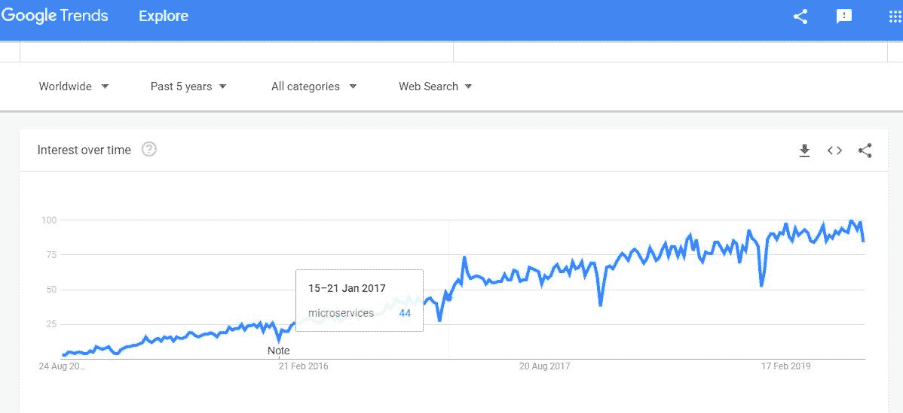

# 您应该何时选择微服务架构？

> 原文：<https://devops.com/when-should-you-go-for-microservice-architecture/>

自 2014 年以来，微服务架构风格的采用稳步增长(图 1)。微服务架构风格将应用程序结构化为实现业务功能的松散耦合服务的集合。

架构风格是共享某些特征的一系列架构。例如，N 层是一种常见的架构风格。架构风格通常不会规定特定技术的使用，但是有些技术非常适合某些架构。例如，容器非常适合微服务，因为它们与部署密切相关。

在本文中，您将了解微服务架构风格的典型考虑因素、挑战和优势。

Figure 1: Microservice Google Trends.

虽然微服务应用程序是作为一组模块化组件构建的，但它们更容易理解，测试更简单，并且在应用程序的整个生命周期中维护起来也毫不费力。它使组织能够实现敏捷性，并能够缩短将工作改进用于生产的时间。

它还支持大型复杂应用程序的持续交付/部署及其技术堆栈的发展。在详细介绍了优势之后，我们将在下一部分讨论一些挑战。

## 微服务风格带来的限制

通过遵守微服务架构风格所施加的以下约束，我们得到的是一个可以独立部署服务、隔离故障、可以频繁更新并且可以轻松将新技术引入应用的系统。

*   每个服务代表一个责任。
*   每个服务都是相互独立的。
*   每个服务都需要它自己的 JVM(或等效物),所以实例是隔离的。
*   数据对于拥有它的服务来说是私有的。
*   服务不共享数据，并且需要实现需要检索多个服务拥有的数据的查询。
*   定义良好的机制来实现服务对服务的通信，以及处理部分故障的方案。
*   跨多个服务并需要团队之间仔细协调的请求。
*   覆盖服务间交互的测试。
*   部署和管理由许多不同服务组成的系统。

## 考虑挑战与收益

每个架构约束都有自己的相关挑战/好处，因此理解和平衡这两者非常重要。在采用任何风格的体系结构之前，您必须问问自己，对于您正在考虑的应用程序来说，好处是否超过挑战。

在下表中，我们来了解一下微服务风格应用的优势和挑战。

| **好处** | **挑战** |
| 支持大型复杂应用程序的持续交付和部署。 | 创建分布式系统还有一个额外的复杂性。 |
| 改进的可维护性:每个服务都相对较小，因此更容易理解和更改。 | Implementing requests that span multiple services is more difficult.维护服务之间的数据一致性是一项挑战。 |
| 更好的可测试性:服务更小，测试更快。 | 测试服务之间的交互更加困难。 |
| 更好的可部署性:服务可以独立部署。 | 增加了部署和管理由许多不同服务组成的系统的操作和部署复杂性。 |
| 每个团队都可以独立于所有其他团队开发、测试、部署和扩展他们的服务。 | 实现跨多个服务的请求需要团队之间的仔细协调。 |
| 改进的故障隔离。 | 服务间通信和处理部分失败实现是具有挑战性的。 |
| 消除对技术堆栈的长期承诺。 | 需要注意多个 JVM 运行时(或等效的)的开销和内存消耗的增加。 |

## 您可以考虑采用微服务的场景

考虑一个场景，您正在开发一个必须支持以下特征的企业应用程序:

*   支持不同种类的客户端，包括桌面浏览器、移动浏览器和本地移动应用程序。
*   公开一个 API 供第三方使用。
*   通过 web 服务或消息代理与其他应用程序集成。
*   在多台机器上运行应用程序的多个实例，以满足可伸缩性和可用性 NFR 需求。
*   采用新兴技术堆栈。
*   计划为应用程序建立连续部署管道。

从上面的需求来看，你完全可以说这个应用 100%适合微服务架构。

您必须定义一个架构，将应用程序构建为一组松散耦合的协作服务。服务可以使用同步或异步协议进行通信。服务可以彼此独立地开发和部署。每个服务都有自己的数据库，以便与其他服务分离。

让我们来看一些典型的场景，在这些场景中，您可以考虑采用微服务风格的架构:

1.  由于在可扩展性、可管理性、敏捷性或交付速度方面需要改进而导致的整体应用程序迁移。
2.  通过将功能/模块转换为微服务来重新搭建传统应用的平台。
3.  将遗留应用程序改写为现代语言和技术堆栈，以满足现代业务的需求。
4.  性质独立的个别交叉服务。例如:加密服务、认证服务等。
5.  跨多个渠道重用独立的业务应用程序或服务。例如，支付服务、登录服务、航班搜索服务、客户档案服务、通知服务等。
6.  常用的企业应用。例如，时间跟踪应用。
7.  服务提供商根据需要向客户提供计算资源和基础设施管理的场景。例如，预测服务、价格计算服务、预测服务等。
8.  响应客户端 web 应用程序的后端服务，其中数据可能来自多个渠道或不同的数据源。
9.  高度敏捷的应用程序或要求交付速度或上市时间的应用程序或创新试点等。
10.  应用程序支持多语言、多语种、云应用程序开发。

## 做出选择

在采用微服务架构之前，请确保您了解挑战和优势。否则，您的应用程序设计可能会以符合风格但没有实现其全部潜力的设计而告终。只有当您认为微服务对您的应用程序有足够的价值时，才采用微服务。还要注意，有时放松约束比坚持架构的纯粹性更好。

— [卡提克延·尚穆甘](https://devops.com/author/karthikeyan-shanmugam/)