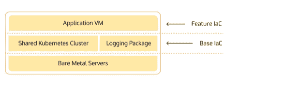

# 我应该在哪里存放我的 IaC？

> 原文：<https://devops.com/where-should-i-store-my-iac/>

最成功的软件公司在构建解决方案时依赖于可重复性、可审计性和简单性。基础设施即代码(IaC)的出现使开发人员能够将这些 [实践应用于基础设施](https://cycode.com/blog/8-best-practices-for-securing-infrastructure-as-code/) 分配。存储 IaC 的最佳实践是什么？IaC 代码是否应该与应用程序和功能代码一起存储？是否应该将其单独存储在自己的特定于应用程序的回购中？或者一个组织中所有应用程序的所有 IaC 代码都应该驻留在同一个 repo 中吗？

让我们来探讨这些问题，确定每个解决方案之间的权衡，并创建考虑您组织需求的指导原则。

## 用特征码存储 IaC 的问题是

存储 IaC 的简单方法是将所有 IaC 代码保存在应用程序存储库中，该存储库将这些 IaC 代码作为其 CI/CD 管道的一部分。它很容易设置，不需要复杂的权限分配，并且对于在这个代码库上工作的开发人员来说，是完全可见的，从而使得检索上下文变得容易。这就是为什么 [20%的被调查开发者声称他们总是在同一个 repo](https://dev.to/n3wt0n/i-store-my-infra-as-code-this-way-you-should-too-1pa3) 中存储特性代码和 IaC。然而，将 IaC 代码与功能代码保持在一起存在许多问题。

软件开发最佳实践包括最小化冗余。将所有 IaC 代码存储在依赖应用程序的代码库中违反了最佳实践，因为它要求基础结构代码不仅包含特定于应用程序的分配信息，还包含所有基础基础结构。组织可以将跨多个应用程序 和生态系统共享的公共 [基础架构归类为基础基础架构。这种基础设施的例子包括 Kubernetes 集群和日志存储帐户。](https://devops.stackexchange.com/questions/12803/best-practices-for-app-and-infrastructure-code-repositories)

此外，将 IaC 代码与功能代码一起存储会带来风险。允许开发人员以管理员级别访问将代码投入生产所需的所有部署脚本违反了最低特权原则，并使那些试图劫持开发人员帐户 的 [攻击者更容易横向移动。](https://cycode.com/blog/lateral-movement-and-the-threat-to-software-supply-chains/)

组织受益于其部署过程的一定程度的保密性；部署管道及其配置是定制的，拥有组织使用的服务映射的攻击者可以更容易地设计供应链攻击。将 IaC 与功能代码一起存储使得代码泄漏不仅会暴露应用程序的所有 CI/CD 配置，还会暴露整个组织的配置。一个组织最不应该做的事情就是为他们执行 [攻击者的侦察](https://www.jigsawacademy.com/blogs/cyber-security/reconnaissance-in-hacking/) ，但上面的情况正是如此。

最初，将基础设施作为代码与产品代码一起存储可能更容易设置，但是违反了最小特权原则和 [零信任](https://en.wikipedia.org/wiki/Zero_trust_security_model) 原则。这种存储代码的方法引入了不必要的风险——必须有更好的解决方案。

## 将所有 IaC 代码存储在一起并不是解决办法

既然在一个公共回购中存储带有特性代码的 IaC 不是最佳解决方案，那么在一个专用的 IaC 回购中存储所有的 IaC 呢？这将允许开发运维人员和安全团队实施细粒度的访问控制，并使代码冗余易于识别和预防 。然而，这种组织结构引入了自身的问题。

当所有 IaC 都存储在一个单独的共享存储库中时，很难将特性变化与 IaC 变化相匹配。这个场景给开发过程带来了摩擦，降低了开发速度，增加了开发团队、开发运维团队和安全团队之间的紧张关系。

将所有 IaC 存储在一个公共存储库中，开发人员实际上无法控制影响其工作流的安全决策。由于缺乏所有权和修改任何特定于代码的部署脚本所需的额外步骤，将所有 IaC 存储在一起会阻止开发人员快速更改 IaC，并且会对组织造成不必要的伤害。

## IaC 分为两类:基本的和特定于功能的

IaC 等 CI/CD 剧本最终分为两类: [基础和特色](https://www.youtube.com/watch?v=Ub76JGoXzKI) 。

基本部署脚本可以被描述为组织广泛使用的代码，用于例行部署操作或与共享资源交互等。分离这些代码使组织能够将基础 IaC 所有权和维护责任分配给他们的 DevOps 团队，这非常适合于维护共享的基础设施。

功能 IaC 脚本是用于供应和管理与特定软件相关的资源的代码片段。开发人员经常与绑定到他们可交付成果的部署脚本进行交互；改变发布步骤、修改网关、更新服务器配置和许多其他需求需要针对功能 IaC 和基础 IaC 的不同处理协议。

既然我们理解了特性和基础 IaC 之间的区别，我们可以为每一个定义适当的管理策略。

## 解决方案:存储 IaC 的混合方法

最佳实践要求对功能 IaC 和基础 IaC 进行不同的分类，并将责任分配给不同的团队，以最大限度地提高安全性，同时不增加开发和发布过程中不必要的摩擦。基本 IaC 应由 DevOps 团队管理，而特定于功能的 IaC 应由托管软件的代码所有者处理。

对于您的组织，这从清点组织的系统和服务开始。了解这些资源是如何共享的，有助于做出有关 IaC 代码存储的业务决策，从而最大限度地减少部署协议中的冗余。可见性是定义哪个 IaC 是组织部署的软件的基础，哪个 IaC 是特定于某些应用程序、库和其他软件交付件的基础。

## 帮助开发团队管理 IaC 等

如果组织不能实施最佳实践，那么它们就没有多大意义。一些总结提示:

*   跟踪资源，包括注册管理机构、存储库、构建和云/IaC 部署
*   实施粒度访问控制，根据资源是共享的还是特定于应用程序的，实现适当的所有权分配
*   提供对资源使用的可见性，使组织能够遵守最小特权 的 [原则，而不会给开发过程增加不必要的摩擦](https://cycode.com/blog/using-the-principle-of-least-privilege-for-maximum-security/)
*   通过与您组织的软件供应链的组件直接集成，提供全面的 [资产清单](https://cycode.com/tag/asset-inventory/)

这些集成允许获得其他安全工具根本不可能获得的复杂见解。此外，这些集成允许持续监控安全更新，从而缩短了发现零日漏洞和修补漏洞之间的时间。