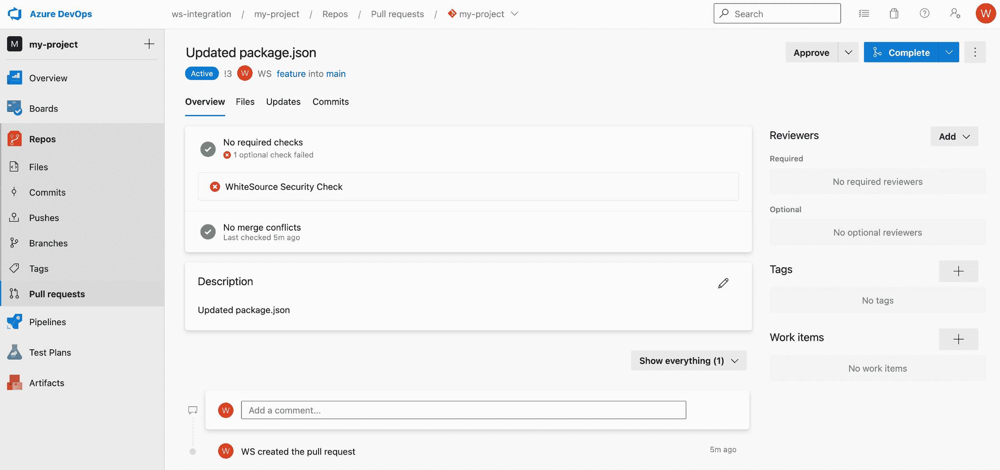

# WhiteSource 加强了代码扫描工具与 Azure DevOps 的集成

> 原文：<https://devops.com/whitesource-tightens-code-scanning-tool-integration-with-azure-devops/>

WhiteSource 已经[将微软 Azure DevOps 平台](https://www.prnewswire.com/news-releases/whitesource-launches-azure-repository-integration-301468699.html)添加到其开源漏洞扫描工具原生支持的持续集成/持续交付(CI/CD)平台列表中。

WhiteSource 的产品管理总监苏珊·圣克莱尔(Susan St. Clair)表示，虽然开发人员总是被鼓励扫描漏洞，但如果组织在每次有合并请求时都默认执行扫描，会更有效。她补充说，这种方法减少了摩擦，因为组织变得更加不依赖于开发人员在更大的 DevSecOps 工作流的上下文中扫描漏洞。

WhiteSource 还提供了一个合并信任特性，它使用众包数据来显示开源组件在不破坏构建的情况下进行更新的可能性。合并置信度包括关于升级年龄、采用和兼容性的数据，以创建置信度得分。

WhiteSource 集成使 DevOps 团队能够检测所有正在使用的开源组件，并直接从他们的存储库中自动执行安全策略。开发运维团队可获得漏洞和错误配置警报、许可证违规以及详细的补救指导，包括在现有工作流中建议的修复和优先顺序建议，而不需要切换到他们需要学习的具有独立用户界面(UI)的工具。

如果合并请求引入了新的错误，开发人员会得到即时反馈，以便在请求完成之前解决任何新引入的漏洞。这种分离特性分支和主线分支的方法防止了工作流的中断。WhiteSource 工具的企业版还会在存储库中自动生成 pull 请求，将易受攻击的开源组件更新到最低的非易受攻击版本。

WhiteSource 还支持 GitHub、GitHub 包、JFrog、Bitbucket 和 GitLab 等代码库。圣克莱尔指出，随着新冠肺炎疫情的出现，越来越多的应用程序开发项目通过云进行管理，Azure DevOps 平台正在获得牵引力。

随着越来越多的组织开始采用 DevSecOps 工作流，他们每个人都需要决定他们希望将应用程序安全性的责任转移到什么程度。理论上，每个开发人员现在都要对他们在生产环境中部署的每一个应用程序承担更多的责任。实际上，大多数开发人员缺乏确保应用程序安全所需的专业知识。

当然，在广泛使用的 Log4j 日志工具中的零日漏洞最近被披露后，对包括开源软件在内的软件供应链的安全性有了更多的[担忧。许多小型开源项目的维护者缺乏必要的资源来确保不存在可能被网络罪犯利用的意外漏洞。更具挑战性的是，许多开发人员可能使用了该软件的旧版本，该版本存在已知的漏洞。](https://devops.com/white-house-meeting-puts-spotlight-on-oss-sustainability/)

尚不清楚开源软件最终将如何变得更加安全。然而，与此同时，确保该软件安全性的责任显然落在了使用它的 DevOps 团队身上。