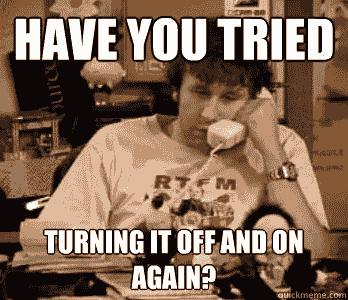

# 为什么开发人员应该关注弹性

> 原文：<https://devops.com/why-developers-should-care-about-resilience/>

最近，一个朋友让我想起了我们曾经开过的一个玩笑，当时我们都是一家大型软件公司的开发人员(我们不会提到名字，但在打印机还存在的时候，你可能拥有他们的一台打印机)。我们没有开发打印机。我们开发了性能测试和监控工具。

我们是开发团队，完全独立于 QA 团队和运营团队(是的，我已经很老了——当时我们甚至不叫它 DevOps)。支持是完全不同的组织的一部分，而“业务”是发生在完全不同的星系中的事情。也就是说，直到客户遇到问题。

当一个重要的客户有问题时，我们在研发部门肯定能感觉到。经理们每小时都会打电话来检查状态，我们会与支持团队进行激烈的对话，然后支持团队又会与客户进行激烈的讨论。如果我们，开发产品的软件工程师，结束了对支持和客户的同一个电话，这是一个明确的信号，事情很糟糕。你知道数百万美元危在旦夕，因此，压力很大。但最重要的是:你知道我们会尽我们所能来解决这个问题，因为我们需要支付那数百万美元，这样我们才能继续得到支付。所以，我们保持咖啡流动。

这就是笑话的来源。我们曾经有一个管理支持票、收集信息、跟踪时间并将其分配给相关软件或支持工程师的系统，因此每个人都知道谁在负责。今天，你可能会使用 Zendesk、ServiceNow 或它们的替代品。当然，我们用的是自己开发的系统。

我们的笑话是这样的:系统的目的不是跟踪、测量和传播客户问题的处理。该系统的目的是指示其他人现在负责解决问题。或者，如果你更愿意解释我最喜欢的一个道格拉斯·亚当斯笑话，这个问题现在是在一个[别人的问题](https://en.wikipedia.org/wiki/Somebody_else%27s_problem)领域。

因为解决客户问题是困难和令人沮丧的，而且来自业务的压力可能会毁掉一个软件工程师的一天。这是因为当你是一只快乐的[代码猴子](https://www.youtube.com/watch?v=qYodWEKCuGg)时，你想担心的只是写漂亮的代码、发布酷功能和喝点咖啡，解决客户问题会妨碍你。

你最终会花太多时间筛选无尽的日志，交叉手指，试图重现一个只发生在周五凌晨 2 点的问题，通常是一只蓝色斑马经过的时候。把时间花在热情的支持电话上不如和朋友安静地喝咖啡有趣。

作为 R&D 的经理，我们明白我们的开发人员不想参与解决客户问题。我们希望确保他们有动力、快乐、高效，并且他们可以自由地挑战自己，学习最新的热门技术，想办法将这些技术引入我们的产品，让我们的客户满意。

此外，作为 R&D 经理，我们更有可能理解拥有太多支持票证或支持票证需要太长时间才能解决的业务影响。我们知道这类案件的损失是双重的:

1.面临问题并等待解决方案的客户可能会变得沮丧，公司可能会失去他们的业务。
2。我们的工程师忙于解决客户问题，而不是为企业创造新价值。

因此，作为 R&D 的经理，我们有责任确保我们的工程师有工具尽可能高效地处理这些问题。我们有责任确保他们受到激励，并了解尽快解决客户问题的业务影响。只要有可能，我们的工作就是确保他们一开始就使我们的应用程序尽可能的可靠和稳定。

这确保了我们有测试覆盖面，以及正确的知识、实践和工具，以确保我们一开始就有尽可能少的客户问题。

令人高兴的是，开发文化的变化通常意味着“支持”和“业务”甚至“客户”不像过去那样遥远了。当开发一个 SaaS 平台时，你的开发者通常有一种近乎私密的实时能力来跟踪用户在做什么，以及它如何影响他们的体验。DevOps 的文化为打破过去将开发团队与支持团队分开的孤岛做了很多工作，并确保团队的所有成员都参与并理解他们编写的代码和他们解决的问题如何帮助我们的客户。

我希望你已经找到了激励你的团队解决这些问题的方法，并且他们有足够的时间喝咖啡。如果您和您的团队仍在苦苦挣扎，我们建议引入一个实时调试工具，通过确保他们手边有所需的所有数据，并且他们可以在实时的远程环境中立即重现任何问题，来帮助他们更快地解决客户问题。[实时调试工具](https://devops.com/?s=live%20debugging)为您的工程师提供了开发人员友好的体验，也让他们能够缩短解决问题的时间。现在，你需要担心的是你的工程师有足够的咖啡。