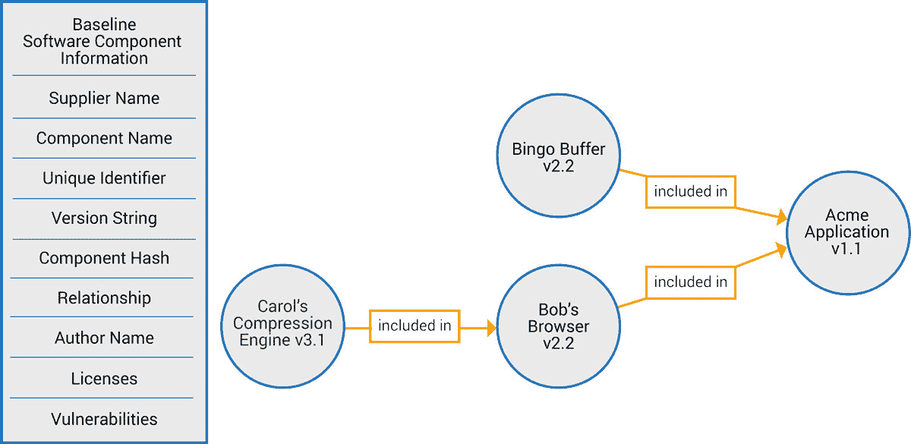

# 为什么我们需要一个软件物料清单行业标准

> 原文：<https://devops.com/why-we-need-a-software-bill-of-materials-industry-standard/>

***SBOM 概念是一个行业主导的、多利益相关方的过程的一部分，以提高软件组件的透明度***

你曾经收到过你驾驶的车辆的召回通知吗？也许你的汽车或卡车是几年前安全气囊大召回的一部分。汽车制造商的标准程序是，当某个部件有缺陷，需要修理或更换时，通知车主。即使部件是由第三方制造的，也是如此，因为它仍然是车辆整体组成的一部分。

这种召回是可能的，因为制造商保留了一份材料清单，以了解每辆汽车上的每一件原始物品，包括物理部件和内部软件。由政府机构保存的所有权登记记录跟踪车辆的当前所有者。当需要召回时，就有可能确定哪些车辆受到了影响，以及车主是谁。

现在，计算机软件行业正在进行类似的努力，以跟踪进入软件程序的单个组件，如库、可执行文件或源代码。由[国家电信和信息管理局](https://www.ntia.gov/) (NTIA)发起，这项工作是一个行业主导的、多利益相关方的过程，旨在提高软件组件的透明度。NTIA 工作组正在建立一个透明度和“[软件材料清单](https://www.ntia.gov/SBOM)”或 SBOM 的共同愿景。

## 什么是软件材料清单？

SBOM 实际上是组成软件程序或应用程序的成分列表。就像汽车行业一样，零部件来自成百上千的供应商，现代软件是由许多来源的代码和子程序拼接而成的，包括开源和商业解决方案。像这样重用软件代码意味着开发人员不必自己从头开始创建一切。这是一个很好的节省时间和非常有效的方法来开发应用程序。

Fig. 1: Software component relationships

来源:www.ntia.gov

软件材料清单确定并列出所有软件组件、关于这些组件的信息以及它们之间的关系。下面的图 1 说明了这个概念。左边的图表显示了被跟踪的信息，而右边的图表说明了软件组件之间的关系。

随着 NTIA 工作组经历他们的开发阶段，他们注意到构建和维护一个可验证的软件组件列表的内在复杂性。他们目前正在研究的问题包括如何自动生成 SBOM 并保持其更新；信息使用什么标准数据格式；如何将 SBOM 分发给获得软件程序或应用程序的人；以及如何验证组件列表中数据的真实性及其继承的依赖关系。其目的是定义可以被软件开发者和消费者在世界范围内使用的规范。编写开源软件的个人和公司采用 SBOM 将是该计划成功的关键。

## 对软件材料清单的需求

对软件中的代码组件建立更大的透明度有几个好处。最重要的是，它允许公司通过更早地识别和缓解易受攻击的系统或授权侵权源代码来控制风险。此外，通过使开发人员能够更好地审查他们嵌入到自己工作中的代码，它激励了安全的软件开发实践。对于软件消费者来说，更高的透明度有助于做出明智的购买决策，尤其是在遵守软件许可要求方面。

或许拥有经过验证的 SBOM 的最大价值在于网络安全和风险缓解领域。

根据行业研究，平均代码库包含数百个开源软件组件，其中大多数代码库至少包含一个漏洞。因此，深入了解代码组件及其漏洞至关重要。

一旦您准确地知道了您的软件中有哪些组件，您就可以清楚地看到这个特定的物料清单在运行时会给您的环境带来什么样的风险。此外，由于每天都会发现新的漏洞，因此无论软件材料清单中的某些内容是否发生变化，风险因素都会发生变化。知道自己是否受到影响的唯一方法就是拥有这种程度的透明度。

当变更归因于内部或外部威胁时，这种风险评估方法尤其重要。当内部员工在不了解变更对整体风险的全面影响的情况下变更某些东西时，就会发生内部威胁；例如，安装一个外国应用程序到 SBOM 被认为是影子 IT。当攻击者将恶意软件注入您的服务器或设备，并试图通过替换或引入新的软件组件来使其看起来像是您系统的合法组件时，就会发生外部威胁。无论哪种方式，期望拥有一个组件而实际拥有另一个组件都会给系统带来很大的风险。

网络安全公司将能够开发能够以标准方式使用 SBOM 的解决方案，并将其与系统上运行的一切进行交叉引用，包括引用列出的软件组件中已知或新的漏洞，并通过威胁情报进行增强。然后可以提出缓解建议，如软件修补。这通常被称为愈合过程。在某些情况下，可以采取自动补救步骤，例如阻止恶意软件运行，直到将其删除。

通过采用 SBOM，可以改善对软件许可证的管理。每一个软件都有一个许可证，规定了软件的合法使用和分发。组成一个完整应用程序的供应链中的代码片段对于单个组件可以有许多不同的许可证。任何部署该应用程序的公司都有遵守许可证的法律义务。如果没有软件材料清单，可能就没有办法知道许可证要求什么，或者如何遵守它们。

## 除了软件，还有设备

除了软件之外，还有一个概念叫做数字材料清单，或 DBOM。DBOM 扩展到硬件配置及其嵌入式固件，并包括组件之间的交互，即行为上下文。DBOM 将收集关于硬件设备和网络通信模式的同类知识，以了解设备上运行的软件材料的上下文。这将主要适用于难以监控、更新和保护的物联网设备。

当你购买一个设备时，你实际上是在购买一个黑盒子，因为你不知道里面到底发生了什么。如果你把它安装在你的网络上，你不知道这个黑匣子会带来什么风险。如果你知道风险，你可以采取适当的缓解措施。因此，激励设备制造商支持 SBOM 和 DBOM 规范的采用，并帮助他们认识到这可以如何改善他们的运营和安全状况是非常重要的。遵守安全认证要求是有价值的，例如 [ETSI](https://www.ntia.gov/files/ntia/publications/framingsbom_20191112.pdf) ，允许他们的最终用户了解他们承担的风险，并赋予他们减轻这些风险的能力。

医疗技术行业一直处于 2019 年创建概念验证计划的前沿，以了解 SBOMs 在管理与医疗设备相关的运营和网络风险方面可以发挥的作用。设备制造商和医疗保健提供商携手合作，通过生成、共享和使用数据来改进预定义用例中的安全实践，展示了 SBOMs 的可行性。NTIA 正在应用 PoC 的经验教训，为软件物料清单的应用程序开发与行业无关的规范。