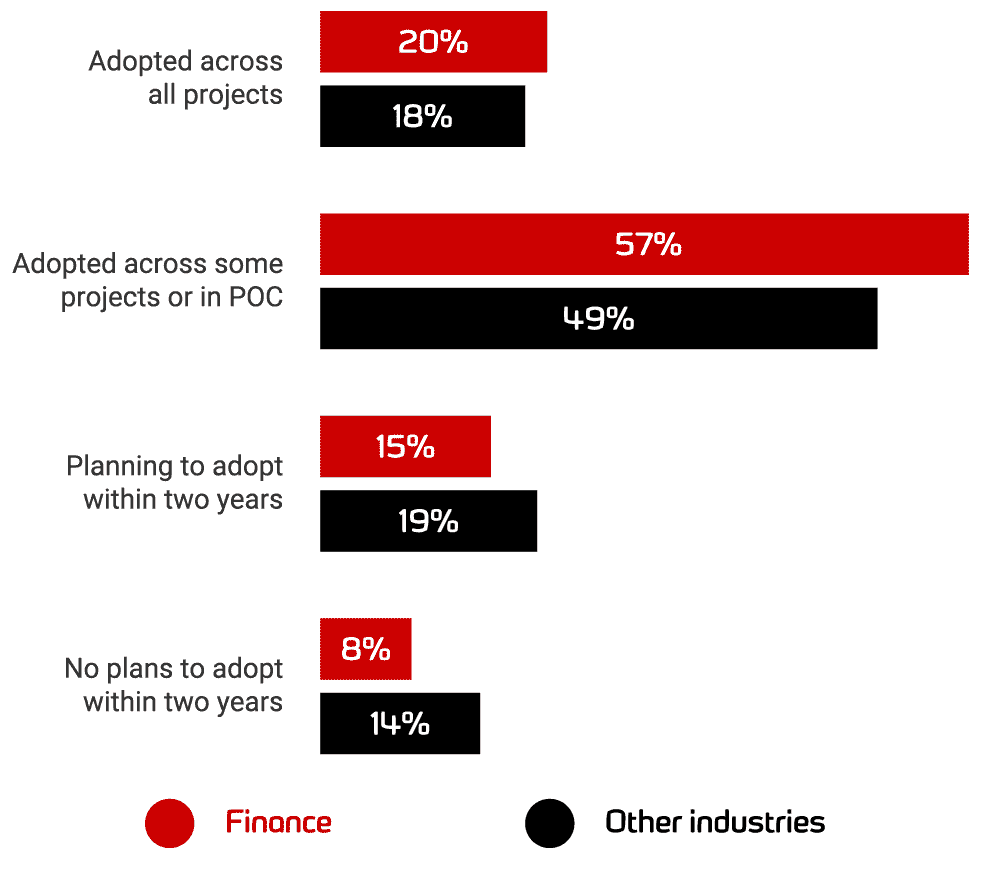

# 在金融行业赢得 DevOps

> 原文：<https://devops.com/winning-devops-in-the-finance-industry/>

如今，DevOps 正在对几乎每一家软件公司产生影响。然而，[金融领域](https://devops.com/?s=finance)的公司可能是接受 DevOps 最慢的，因为他们担心治理、安全、合规和监管法规。但可以肯定地说，他们目前正在这个云原生技术时代引领数字创新。

## **为什么要为金融行业开发运维服务？**

更高的客户参与度和持续的交易使金融业成为最繁忙的行业之一，自然需要不间断的基础设施。 DevOps 实施 帮助公司快速发展、快速失败和快速学习，以便他们能够满足客户的期望，并比竞争对手更快地将功能推向市场。金融领域的技术没有太大的发展，因为许多公司认为采用 DevOps 风险太大，因为大量遗留代码和旧方法仍在实践中。结果，数字创新滞后了。 

## **在金融领域实施 DevOps 的挑战**

与其他行业不同，受监管的行业意味着几个挑战:

*   对安全网络的严格限制。

*   精细的审计跟踪。 
*   强 ACLs 模型。 
*   全生命周期治理。 
*   与第三方整合。

安全性和合规性 是金融公司最关心的问题，而 开发运维实践 实际上被视为安全风险因素。此外，DevOps 中软件发布频率的增加被视为对治理和监管控制的威胁。

### 指针在向 DevOps 移动吗？

根据 Redgate 发布的 " [2020 年数据库开发运维状况报告](https://www.red-gate.com/blog/database-devops/adoption-rates-and-key-drivers-for-database-devops-in-financial-services) " ，金融服务机构报告今年数据库开发运维采用率最高，比例高于其他任何行业。这显示了金融业在数字创新方面的成熟。

***图片来源出处:*** [Redgate](https://www.red-gate.com/blog/database-devops/adoption-rates-and-key-drivers-for-database-devops-in-financial-services)

## **金融公司及其发展历程的案例研究**

### **巴克莱 DevOps 采用**

2015 年， [巴克莱宣布](https://www.reuters.com/article/barclays-banking-employment-idUSL8N13J5G720151124) 采用 DevOps 进行数字化转型之旅。巴克莱处理的付款相当于英国国内生产总值的 30%左右。DevOps 提高了开发人员的士气和代码质量，Barclays 的领导团队认为 DevOps 显著降低了代码的复杂性，使公司降低了交付风险，并最终提高了服务质量。

### **开发月球之路**

Lunar Way 的旅程表明，使用 Kubernetes 并不需要很大。该公司通过将其庞大的 monolith 应用程序拆分为较小的微服务，开始了其云原生 DevOps 之旅。为了启动这些微服务，Lunar Way 使用了 Ansible、Terraform 和 Jenkins，并将这些微服务作为一个整体进行部署。

然后，Lunar Way 开始遇到微服务的扩展问题，并且没有体验到微服务的任何好处。

该公司开始寻找克服这种复杂性的方法，将重心从面向机器转向面向应用的架构。它选择 Kubernetes 和 AWS 作为抽象层，而不用担心 [容器](https://jfrog.com/knowledge-base/what-are-containers/) 在哪里运行，这就是它如何能够管理和释放微服务的速度。Lunar Way 还从安全角度选择了 Kubernetes，并指定应用程序应该如何运行。现在，在 Kubernetes 的帮助下，该公司在生产中运行着大约 80 多项微服务。观看并学习 Lunar Way 是如何做到的:“ [与 Kubernetes](https://youtu.be/q6Nvm2Jhf1s) 合作两年。”

### **意大利最大的银行接受 DevOps**

一家传统银行在如此年轻的技术上经营真正的业务？不可能，你在开玩笑吗？不，我没开玩笑。

意大利的银行集团联合圣保罗银行已经完成了这一转变。银行仍然使用 30 年前的大型机技术运行他们的 ATM 网络，所以拥抱最热门的趋势和技术几乎是不可思议的。

尽管银行和金融公司 ING 很早就通过升级 Kubernetes 和 DevOps 实践改变了人们对银行的看法，但在高度监管和控制的环境(包括医疗保健和金融服务)中采用 Kubernetes 仍然是一种耻辱。该银行的工程团队在 2018 年提出了一项倡议战略，抛弃旧的思维方式，开始拥抱、容器架构以及从单片到多层应用的迁移。如今，该银行运行着 3，000 多个应用程序。其中，超过 120 个现在使用新的微服务架构在生产中运行，包括该银行 10 个最关键业务中的两个。

### **汇丰走上发展之路**

随着 成为谷歌云服务平台的早期用户，为其企业客户提供核心银行服务，汇丰银行正在改变典型的银行业使用云原生技术和 DevOps 的方式。

汇丰银行计划利用谷歌的工具集，在 T2 由 Kubernetes 管理的 T4 基础设施上建立全新的商业银行服务。汇丰还与 AWS 和微软建立了良好的合作关系，支持多云战略。该公司的工程团队认为，转移到 Kubernetes 旗下的容器模型意义重大，因为这意味着不同云之间的环境是相似的。汇丰还从银行部门之外招聘人员，因为它希望从内部改变其文化。据说，汇丰银行迄今已在其 DevOps 计划中投资 1000 万美元。 

### **大写的敏捷到 DevOps 之旅**

Capital One 的敏捷之旅始于 2011 年末，当时只有两个团队，随着更多的团队接受敏捷开发培训，这个团队发展缓慢。Capital One 的开发人员遵循可扩展的敏捷框架(SAFe)。最初，由于团队对自动化方法是陌生的，集成测试、安全测试、单元和性能测试都是由独立的测试团队在开发冲刺之外完成的。后来，一旦他们理解了拥有协作文化的重要性，他们就将测试集成到专门的 DevOps 团队中，并很好地实现了自动化。然后慢慢地，他们将所有测试转移到开发冲刺阶段，采用 DevOps 和一致性的文化，将布线集成、安全性和性能测试转移到一个连续的交付管道中。截至 2016 年，该公司拥有超过 700 个持续交付的敏捷团队。

### **美国银行的开发人员**

美国银行是遵循 DevOps 实践的全球最大的金融机构之一，其数字企业运营支持全球近 4，300 个零售金融中心和约 16，600 台 ATM。屡获殊荣的数字银行拥有近 3800 万活跃用户和约 2900 万移动用户。

## **自动化安全性和合规性**

随着 DevOps 继续发展并成为主流，它将继续引起金融服务领域许多高级经理的兴趣。上述案例研究表明，他们已经将开发运维作为优先事项。但是安全性和合规性仍然是阻碍金融公司创新的障碍。

组织应该从小处着手，保持安全性的高优先级，首先使用持续集成，然后使用市场上可用的 工具添加持续交付和部署。随着时间的推移，公司自动化程度越高，投资回报就越高。

自动化安全许可和控制将帮助金融公司消除一些最常见的软件障碍，比以前更快地发布产品，同时仍然保持必要的治理和合规性。

### **向前迈一步**

金融服务公司需要复杂而严格的软件开发流程来满足严格的公司和法规要求。然而，人们期望他们比以往更快地发布软件，以满足期望并击败竞争对手。通过从小处着手并牢记安全性和合规性，金融业的 DevOps 可以取得巨大成功。