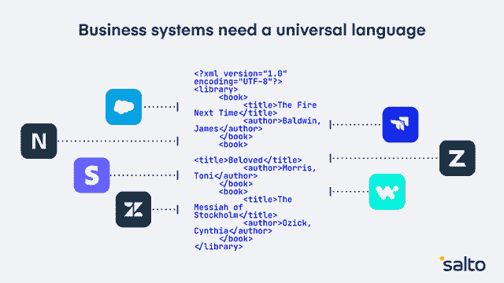

# 没有一种通用语言，商业系统注定要失败

> 原文：<https://devops.com/without-a-universal-language-business-systems-are-doomed/>

想象一个没有 DevOps 的世界。所有可以自动化的东西都不是。你梦想的任何工作都是不可能的，相反，你必须在友好但压抑的软件界面上点击 10 到 15 次才能做出每一个改变。哦，也没有办法进行搜索。

想象一下，你就能很好地理解如今管理大多数业务系统(CRM、ERP、HCM、MAP 和其他三个字母的缩写)是什么样的。它们的设计是为了方便用户，而不是提高管理员的效率，并且迫使管理员在一个没有代码约定的图解孤岛——界面——上工作。

是的，有开发者模式，但它们不是你想象的万灵药。你的企业可能有 [800 多个业务应用](https://www.mulesoft.com/lp/reports/connectivity-benchmark) ，无论你在其中构建什么，你都必须重新构建。不是所有的都有开发模式，也没有两个开发模式使用相同的语言。

这就是说，除非商业系统有一种通用的语言，可以在所有系统上工作，否则商业将会陷入困境。我和许多公司谈过这个问题，许多公司已经这样做了。

## 混乱的代价

如果你把所有的业务系统放在一起考虑，它们就构成了一种“产品”,整个业务就是在这种产品上运行的。当该产品是由 800 多个只能单独治理的服务构建而成时，就会有很多问题。

举例来说，我交谈过的公司都经历过以下可怕的事情:一个小小的变化导致销售线索中断 6 个月。这些线索变得陈旧，该公司既浪费了获得这些线索的资金，又在潜在业务中损失了数百万美元。另一家公司发现，他们 CRM 中的变化在 ERP 中造成了一个错误，发票直到季度结束后才发出。(你应该已经看到投资者的反应了)。另一个人犯了一个小错误，触发了一个休眠的电子邮件活动，用过期的报价覆盖了他们的数据库。

这个清单可以一直列下去，而且效果是真实的。从那些因为人力资源系统正在进行维护而失去 rockstar 候选人的经理，到神秘的基于 DOS 的内部系统，这些系统已经变得不可替代——业务系统是至关重要的，其中大多数都是一团糟。

事实上，业务应用程序团队面临着与软件开发人员相同的挑战，但是却没有从他们的工具中获益。他们不能搜索所有应用程序代码的一种形式表示。(更不用说跨应用程序搜索了。)除非在每个系统令人沮丧的隔离开发模式下，否则他们无法轻松备份、保存版本、协作或评估 PRs。

因此，他们往往不能:

*   简单地看一下今天如何设置的蓝图(特别是跨应用程序)
*   分析跨系统的影响(有工具，但它们总是特定于应用)
*   保存版本并恢复到以前的状态
*   运行“查找和替换”搜索埋藏在 10 到 15 次点击深处的设置
*   弄清楚谁做了什么，在哪里做了什么，为什么做(这是 SOX 法规遵从性的一个真正问题)

如果商业系统应该进行突然而快速的整合，这当然很好，但事实并非如此。他们是*所以*不是。SaaS 市场仍以 19%的年增长率增长，一些子市场增长更快，如 MarTech、 [以 25%](https://www.statista.com/statistics/1134342/number-martech-solutions-type-growth/#:~:text=Marketing%2520technology%2520tool%2520were%2520the,13.6%2520percent%2520compared%2520to%25202019.) 的年增长率增长。它引发了悲喜剧式的图表，比如 Chiefmartec 的 Scott Brinker 的这张图。公司正在购买和依赖史诗级的 SaaS。

此外，今天的业务系统是垂直堆积的。财务应用程序团队拥有 ERP 和其他财务应用程序，如 Stripe 和 Zuora。Salesforce 团队拥有 Salesforce。但是生意是横向发生的。线索从市场营销到销售再到财务再到客户成功。所有这些孤立的应用程序都不是真正为了让管理员从所有这些应用程序中创建一个可靠的无错误“产品”而构建的。当然，除非我们有一种通用语言。

## 恳求:是时候制定标准了

我发现，任何一家 SaaS 厂商都不太可能领导管理和配置业务应用程序的通用惯例。每家 SaaS 公司都将自己视为自己宇宙的中心，所有其他应用都围绕着它运转。他们的应用商店强化了这一观点。

构建这样一个系统需要一个开源的第三方，但这意味着拥有一个管理你的业务系统的通用语言:你可以在你所有的业务应用中使用 DevOps。

对于不关心 NetSuite 的 Salesforce 开发人员来说，这是公平的。但是如果我告诉你，有了这种标准化的语言，你所知道的关于管理 Salesforce *的一切都可以应用到 NetSuite 中，如果你参与到那个项目中，会怎么样呢？还是反过来？这很像突然能够说一种全新的语言。*

对于那些权限跨越应用程序的部门负责人，以及那些已经在重新安排他们的团队以找出如何更加敏捷和支持业务的人来说，这(可能)适合您。它并不连接您的应用程序(例如，您仍然需要 Workato 或 Boomi)，但它将为您和您的团队提供一个如何配置多个应用程序的视图，以及无需深入界面 10 到 15 次点击即可进行更改并将其推向生产的能力。

本质上，它允许您在多个系统的每个开发模式中应用您已经习惯的所有 DevOps 实践。您可以运行搜索、使用 Git 版本管理工具、实践 CI/CD、自动化文档、进行影响分析和扩展您的工作。

想象一个拥有 DevOps 的商业系统世界*。这是可能的，我很乐意让你[检查一下并给我们反馈](https://docs.salto.io/docs)。*