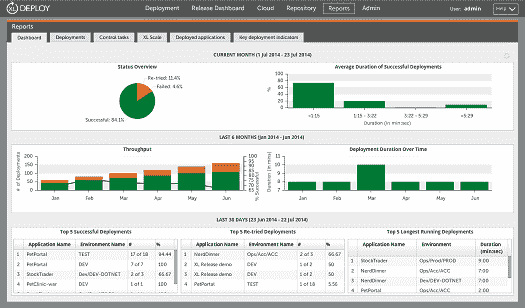

# XebiaLabs 提供 XL Deploy 和 XL Release 的免费社区版

> 原文：<https://devops.com/xebialabs-offers-free-community-edition-xl-deploy-xl-release/>

**波士顿–2014 年 11 月 18 日** —为了向 DevOps 社区介绍通过自动化向市场推出应用的强大优势，XebiaLabs 今天宣布将提供 XL Deploy 和 XL Release 的免费社区版。该公司是支持开发运维及持续交付的企业软件的领先提供商，致力于通过交付自动化解决方案帮助软件开发人员将敏捷性应用于其应用发布流程，从而提高流程的可见性和速度。XL Deploy 和 XL Release 的全功能社区版可通过访问 XebiaLabs.com[获得，并将提供 30 天的全面技术支持。](http://xebialabs.com)

通用电气、Expedia、Xerox、KLM 和 Société Générale 等国际公司使用 XL Deploy 和 XL Release 将应用程序送到客户手中，同时减少代价高昂的错误和停机时间。这些组织的首席信息官、开发经理以及质量保证、测试和运营方面的专业人士认为，将好想法快速转化为可销售的软件是推动企业成功的关键要素。

**关于 XL Deploy–无代理部署自动化**

XL Deploy 是领先的应用程序发布自动化软件，帮助组织更快地交付更高质量的软件。XL Deploy 是无代理的、基于模型的，通过消除对脚本的需求，完全自动化了连续交付流程的最后一英里。

XL Deploy 还具有与所有领先的构建、配置、中间件和云解决方案的现成集成。该解决方案结合了智能部署自动化、涵盖从 Docker 到 WebSphere 的丰富内容集，以及与应用交付生态系统的无缝集成。

 **关于 XL 发布-连续交付管道编排**

XL Release 允许用户编排他们端到端的连续交付管道。用户可以分析并逐步自动化他们的发布流程，同时获得企业安全性和控制，处理管道依赖性、风险和影响。XL Release 是为企业构建的，具有安全性、访问控制、LDAP 集成和日历集成，这是人们期望开箱即用的。该解决方案为整个发布过程提供了完整的审计跟踪。

XL Release 可以跟踪和测量发布进度，并随着情况的发展尽早发现挑战，根据需要重复或跳过任务或阶段。团队可以向连续交付发展，并最终集成发布管理和执行，同时提供一条通向完全自动化交付管道的道路，从而更快地交付软件。

**XL Deploy、XL Release 社区版的技术支持**

与大多数社区版本不同，XebiaLabs 将提供长达 30 天的免费技术支持。用户可以在 15 分钟内启动并运行。欲了解更多信息，请访问[http://xebialabs.com/products/](http://xebialabs.com/products/)或致电(866) 656-4408 或写信给[【电子邮件保护】](/cdn-cgi/l/email-protection)

XebiaLabs 首席执行官 Coert Baart 表示:“当前的软件开发流程无法满足更快交付软件的需求。“虽然由于敏捷、scrum 和其他方法，应用程序开发时间已经加快，但部署最佳实践并没有跟上步伐，导致应用程序发布时出现重大瓶颈。”