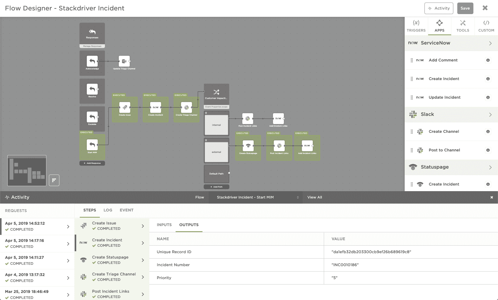

# xMatters 期待融合 DevOps 和 ITIL

> 原文：<https://devops.com/xmatters-looks-to-meld-devops-and-itil/>

随着今天来自 xMatters 的流设计工具的发布，DevOps 和基于 ITIL 的方法之间的鸿沟正在缩小。

xMatters Flow Designer 是一个拖放式图形工具，开发人员或 IT 运营团队可以使用它在 xMatters 事件管理软件的基础上创建事件管理工作流。xMatters 首席产品官道格·皮特(Doug Peete)表示，这些工作流将数据输入各种第三方 IT 管理工具，使 IT 运营和开发运维团队能够在不同的工具中使用相同的数据，例如，在面向 IT 运营的 ServiceNow 实例中，以及作为面向开发运维团队的吉拉或 Slack 中的消息。

Peete 说，目标是使组织能够开发更一致的事件管理方法。xMatters 和 Atlassian 最近对 1000 多名 IT 专业人员进行的调查发现，虽然 81%的开发人员和运营团队共享信息和工具，但只有 17%的人提供不受时间限制的开放信息访问。调查还发现，50%的受访者表示，他们使用的工具、流程和步骤因事件而异。

Peete 补充说，这些组织中的大多数几乎没有工具来有效地对这些事件进行事后分析。

xMatters Flow Designer 工具的出现正值组织试图寻找方法来融合当今大多数 IT 组织所依赖的高度结构化的 ITIL 过程和基于最佳 DevOps 实践的固有的更加敏捷的方法。itIL 框架的最新版本包含了一些 DevOps 原则，但很明显，在未来的许多年里，这两种管理 IT 的方法将在许多组织中同时使用。如今，开发人员倾向于选择 DevOps 方法，而 IT 管理员倾向于欣赏旨在解决 IT 治理问题的 ITIL 框架的一致性。Peete 说，通过提供一套跨越这两种方法的工作流工具，IT 组织可以更容易地根据自己的条件融合这两种方法。

同时，一种可扩展的事件管理方法使 it 组织能够随着其 IT 环境的发展将新工具纳入这些工作流。这种能力还应该使跨多个组织集成事件管理工作流以及在收购另一家公司后整合新的 it 环境变得更加容易。

无论选择哪条道路，很明显，随着组织越来越意识到他们的业务流程在数字业务转型时代对软件的依赖性，他们越有可能接受 DevOps 实践。然而，这并不意味着组织需要放弃 ITIL；有许多 IT 流程受益于高度结构化的方法。事实上，可以说最重要的事情是不要让关于德沃普斯和 ITIL 孰优孰劣的哲学辩论成为一个主要的干扰，造成两种拒绝相互合作的孤立文化。

— [迈克·维扎德](https://devops.com/author/mike-vizard/)