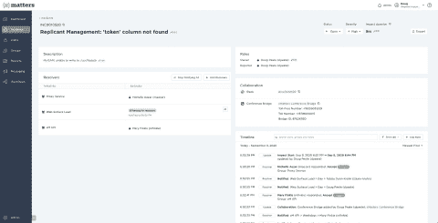

# xMatters 简化了事件管理

> 原文：<https://devops.com/xmatters-streamlines-incident-management/>

xMatters 今天宣布，它已经[扩展了其事件管理平台](https://www.businesswire.com/news/home/20200915005512/en/xMatters-Reveals-Platform-Advancements-Usher-New-Era)的功能，以更好地满足更复杂的 it 环境的要求。

新功能包括一个事件控制台，可更好地可视化和分类事件、自动响应、改进协作以及访问更丰富的分析以优化响应时间。现在，还可以从集成系统中自动收集事件指标，并随通知一起发布，以缩短解决时间。

IT 团队还可以使用 Flow Designer 工具来自动保持相关系统相互同步，包括问题跟踪系统、服务台和状态页面。

xMatters 首席执行官 Troy McAlpin 表示，在采用新应用程序和系统使组织能够让员工在家工作的情况越来越多的时候，这些更新是统一 IT 事件管理的努力的一部分。

xMatters 今天发布的一项针对 300 名 IT 领导者和业务专业人员的调查显示，近四分之三(72.3%)的受访者现在至少花一半的时间来解决事件，其中超过四分之一(27.3%)的受访者表示，他们的团队至少花 80%的时间来解决事件。共有 43%的受访者表示，他们的组织仍然依赖不太复杂的流程来管理 IT 事件，如警报、电子邮件、寻呼、会议桥和物理外联。

McAlpin 指出，IT 事故也开始对业务产生更大的影响。调查发现，20%拥有 1，001-5，000 名员工的公司在数字化转型计划上的预算超过 1，000 万美元。他指出，现在涉及这些应用程序的每个 IT 事件通常不仅涉及员工，还涉及最终客户。

他说，随着 IT 变得越来越复杂，实现 IT 环境现代化的需求变得至关重要。it 组织发现难以自动化 IT 管理的众多原因之一是，仍然有许多独特的平台在运行孤立的应用程序。IT 团队最好问问自己，平台的这些独特实例是否真正得到了保证。否则，该应用程序工作负载应该退役或转移到更容易自动化的平台上。

从长远来看，McAlpin 表示，人工智能(AI)将越来越多地用于 IT 运营，也称为 AIOps。这些进步不会取代对人类管理 it 的需求，但它将允许 IT 团队[更好地自动化对日常事件的响应，这些事件现在需要太多时间](https://www.businesswire.com/news/home/20200915005424/en/xMatters-Declares-Antiquated-Repetitive-Toil-Filled-Incident-Management)。

即使 IT 变得越来越复杂，简单的事实是大多数组织并不打算扩大 IT 部门的整体规模。事实上，随着新冠肺炎疫情带来的经济衰退，有许多组织需要缩小其 IT 组织的规模。不管动机如何，IT 团队每天都被要求执行大量令人麻木的任务，为了与最佳 DevOps 实践保持一致，这些任务应该被无情地自动化。