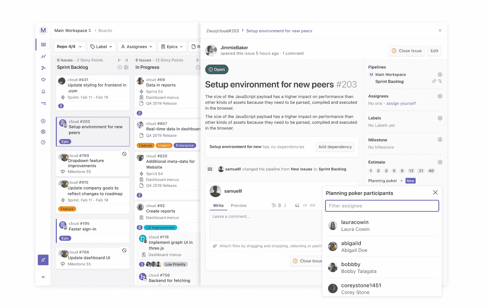

# ZenHub 为 Sprint 规划带来了更多的科学

> 原文：<https://devops.com/zenhub-brings-more-science-to-sprint-planning/>

ZenHub 今天透露，它已经为其管理[软件开发](https://devops.com/?s=software+development)项目的平台增加了规划扑克功能，旨在根据从应用开发团队成员那里收集的反馈来确定 sprints 的优先级。

该功能扩展了该公司今年添加到项目管理应用程序中的 sprint 规划功能，该项目管理应用程序是专门为使用 GitHub 软件库的软件开发团队设计的。这个 sprint 规划工具也自动化了日常任务，比如自动将未完成的工作转移到下一个 sprint。

ZenHub 战略客户负责人 Aaron Upright 表示，总体而言，这些功能将使开发团队能够以一种更少偏见的方式优先考虑他们的工作，这种方式使用基于团队成员先前预测的准确性来衡量团队成员意见的分数。例如，规划扑克将分配不同的权重给开发人员，该开发人员对于完成以前的项目所需的时间长度总是过于乐观或悲观。

规划扑克内置在 GitHub 中，Upright 指出，这使得开发人员无需退出他们已经花了一天很长时间的环境就可以进行估计。

主要由于组织发起的数字业务转型计划的增加和加速，DevOps 团队面临越来越多的时间限制。

许多组织的整个商业策略现在都围绕着软件开发项目的完成速度。这些项目中的许多元素在它所依赖的某个特定组件完成之前是无法进行的。投资者要求企业领导人对软件交付时间表承担更多责任，因为软件交付时间表对创收有直接影响。

毫不奇怪，现在访问项目管理应用程序来跟踪开发进度的最终用户的类型已经增加了。从销售团队到董事会的每个人现在都希望对软件开发项目的完成速度有更多的了解。DevOps 团队面临的挑战是软件开发是一门不精确的科学。基于个人的个性、严格的标准和加班的意愿，开发人员对于完成任何给定的 sprint 需要多长时间会有很大的分歧。

然而，规划扑克为组织提供了一个依靠比传统猜测更科学的方法的机会，直立说。事实很简单，所有的估计都是错误的。他补充说，目标是缩小误差幅度。

不管应用程序开发项目是如何管理的，DevOps 团队和组织的其余部分之间的关系已经发生了根本的变化。一些组织的整体完全依赖于高质量软件开发的速度。在许多情况下，期望与可用的开发资源不现实地一致。在一个组织中广泛使用的项目管理应用程序应该使所有感兴趣的利益相关者明白这一点，这至少在理论上应该导致雇佣额外的开发人员或者在现有的开发团队简单地决定完全放弃之前重新评估业务策略。