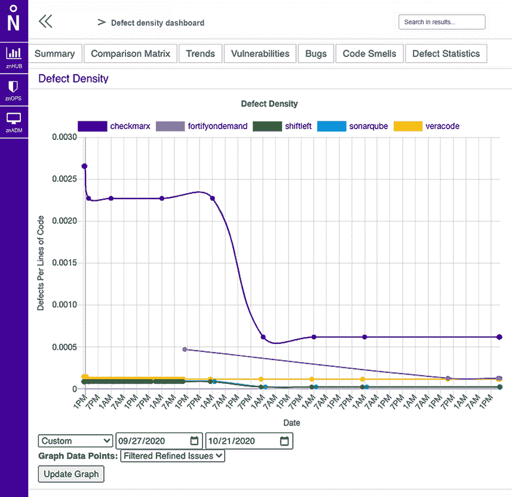

# ZeroNorth 增加了安全缺陷密度仪表板

> 原文：<https://devops.com/zeronorth-adds-security-defect-density-dashboard/>

ZeroNorth 今天宣布，它已经在其软件即服务(SaaS)平台中添加了一个[缺陷密度仪表板](https://www.zeronorth.io/press-releases/zeronorth-unveils-new-defect-density-dashboard-to-unite-security-and-devops-teams/)，用于管理和协调应用程序安全扫描。

公司首席执行官约翰·沃拉尔说，缺陷密度仪表板借用了用于测量软件质量的概念，并将其专门应用于应用程序安全。仪表板显示了在使用软件组成分析(SCA)和软件应用程序安全测试(SAST)工具扫描代码时发现的每千行代码中的应用程序安全缺陷的数量。

他说，该指标将创建一个关键的性能指标，DevOps 团队中的[应用安全冠军](https://devops.com/survey-finds-security-champions-fostering-devsecops/)和首席信息安全官(CISO)可以使用该指标来定量衡量在提高整体应用安全方面取得的进展。

Worral 说，随着组织开始采用最佳 DevSecOps 实践，IT 领导者面临的挑战之一是向董事会展示投资水平正在产生可衡量的结果。他指出，缺陷密度度量应用了一个已经被制造业和其他垂直行业的质量保证团队广泛应用于软件开发的概念。

作为一个用于协调跨多个第三方工具的安全扫描的 SaaS 平台的提供商，沃拉尔说 ZeroNorth 处于一个独特的位置，能够标准化工具生成的所有数据。

他补充说，缺陷密度仪表板还可以更容易地识别特定的薄弱领域，如大量的 SQL 注入漏洞，这些漏洞表明需要为软件开发团队提供额外的培训，他指出，这种方法可以让应用程序安全倡导者被视为盟友，而不是仅仅批评软件开发团队工作的人。

当然，鼓励开发人员在提交之前扫描他们的代码是任何将应用程序安全性的更多责任转移到左边的努力的核心。ZeroNorth 一直在为一个平台提供案例，该平台可以更容易地使用不同的工具在 DevOps 工作流程中实现多次扫描。这种方法使得一个工具没有发现的漏洞更有可能被另一个工具发现。

当然，挑战在于确保开发人员经常扫描他们的代码。以生产力的名义延迟扫描是一种自然的趋势。然而，需要扫描的代码基数越大，完成这些扫描所需的时间就越长。大多数开发人员应该更频繁地扫描少量代码。

无论采用何种扫描方法，开发人员都应该根据无意中引入到代码中的漏洞数量进行评估。网络安全团队已经跟不上应用程序代码部署和更新的速度。因此，许多组织已经开始共同努力，在代码部署到生产环境之前，尽可能多地消除漏洞。也许永远不可能消除 100%的漏洞，但至少可以大大减少网络犯罪分子在寻求危害应用程序时主动扫描的最常见的漏洞。